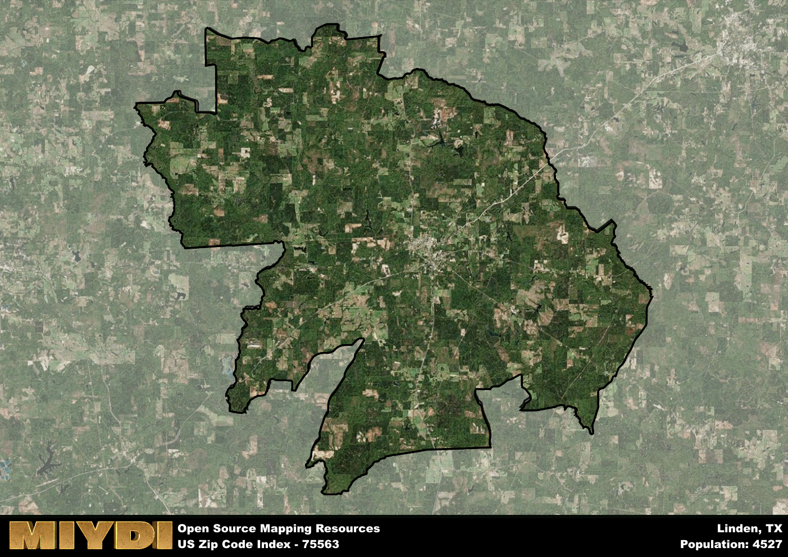

**Area Name:** Linden

**Zip Code:** 75563

**State:** TX

# Linden, Texas: A Historic and Vibrant Community in Zip Code 75563

Zip code 75563 encompasses the charming town of Linden, located in Cass County, Texas. Nestled in the northeastern part of the state, Linden is bordered by the city of Atlanta to the north and is approximately 45 miles southwest of Texarkana. The area is well-connected by major highways, including Highway 59 and Highway 8, facilitating easy access to neighboring towns and cities. Linden serves as a cultural and economic hub within the region, attracting visitors with its small-town charm and rich history.

Linden has a storied past that dates back to the mid-19th century when it was founded as a logging and sawmill town. The town experienced rapid growth during the timber industry boom, becoming a bustling center for trade and commerce. Over the years, Linden has preserved its historic architecture and landmarks, offering a glimpse into its prosperous past. The town's name is believed to have been inspired by the Linden tree, which once flourished in the area and symbolizes strength and resilience.

Today, Linden is a vibrant community that blends its historical roots with modern amenities and attractions. The town boasts a diverse economy supported by industries such as agriculture, tourism, and small businesses. Residents and visitors alike can enjoy a variety of recreational activities, including fishing and boating at nearby Caddo Lake or exploring the quaint shops and restaurants in the downtown area. Linden is also home to cultural institutions like the Music City Texas Theater, which hosts live performances and events, adding to the town's unique charm and appeal.

# Linden Demographics

The population of Linden is 4527.  
Linden has a population density of 25.19 per square mile.  
The area of Linden is 179.74 square miles.  

## Linden Income and Economic Data

These demographic numbers are sourced from IRS return data, providing comprehensive insights into the population dynamics and economic trends within Linden.

**Breakdown of return types for Linden**

The table offers insight into the composition of tax returns filed with the IRS, categorizing them into three main types. Single returns represent filings by individuals, joint returns by married couples, and head of household returns by individuals who qualify as heads of households, typically having dependents. This breakdown provides an understanding of the different filing statuses adopted by taxpayers when submitting their tax documentation.

| Return Types filed for Linden                              | Percentage          |
|----------------------------------------------------------|---------------------|
| Single Returns                                            | 0.42 |
| Joint Returns                                             | 0.41 |
| Head Household Returns                                    | 0.15 |

The income and economic data presented here is sourced from the IRS income brackets, utilized for categorizing tax returns by income levels. This table displays income ranges for both single filers and married couples, along with the corresponding number of returns and the percentage within each bracket, providing valuable insight into the distribution of taxes across various income groups.

| Bracket Name       | Single Filer Income Range | Married Couple Range | Number of Returns | Percentage of Returns |
|--------------------|----------------------------|----------------------|-------------------|-----------------------|
| 10% Bracket        | Up to $10,275              | Up to $20,550        | 710 | 0.4% |
| 12% Bracket        | $10,276 - $41,775          | $20,551 - $83,550    | 460 | 0.26% |
| 22% Bracket        | $41,776 - $89,075          | $83,551 - $178,150   | 240 | 0.14% |
| 24% Bracket        | $89,076 - $170,050         | $178,151 - $340,100  | 160 | 0.09% |
| 32% Bracket        | $170,051 - $215,950        | $340,101 - $431,900  | 170 | 0.1% |
| 35% Bracket        | $215,951 - $539,900        | $431,901 - $647,850  | 30 | 0.02% |

### Exploring Taxpayer Diversity: A Breakdown of Different Types of Tax Returns in Linden

The table offers insights into various types of tax returns filed, reflecting different aspects of taxpayer activities and demographics. Categories include charitable returns for donations, dependent returns for claimed dependents, educator population, elderly population, real estate returns, self-employment returns, student loan returns, and unemployment returns, providing valuable insights into taxpayer behavior and demographics.

| Linden Filing Types                    | Count | Percentage |
|--------------------------------------|-------|------------|
| Charitable Donations                 | 50 | 0.028% |
| Dependents Claimed                   | 30 | 0.017% |
| Educator Residents                   | 70 | 0.04% |
| Elderly Population                   | 600 | 0.34% |
| Farming Population                   | 170 | 0.096% |
| Real Estate Transactions             | 50 | 0.028% |
| Self-Employed Individuals            | 220 | 0.124% |
| Student Loan Cases                   | 50 | 0.028% |
| Unemployment Benefit Filings         | 260 | 0.15% |

## Linden AI and Census Variables

The values presented in this dataset for Linden are AI-optimized, streamlined, and categorized into relevant buckets for enhanced utility in AI and mapping programs. These simplified values have been optimized to facilitate efficient analysis and integration into various technological applications, offering users accessible and actionable insights into demographics within the Linden area.

| AI Variables for Linden | Value |
|-------------|-------|
| Shape Area | 663825254.625 |
| Shape Length | 175234.757476983 |

## How to use this free AI optimized Geo-Spatial Data for Linden, TX

This data is made freely available under the Creative Commons license, allowing for unrestricted use for any purpose. Users can access static resources directly from GitHub or leverage more advanced functionalities by utilizing the GeoJSON files. All datasets originate from official government or private sector sources and are meticulously compiled into relevant datasets within QGIS. However, the versatility of the data ensures compatibility with any mapping application.

## Data Accuracy Disclaimer
It's important to note that the data provided here may contain errors or discrepancies and should be considered as 'close enough' for business applications and AI rather than a definitive source of truth. This data is aggregated from multiple sources, some of which publish information on wildly different intervals, leading to potential inconsistencies. Additionally, certain data points may not be corrected for Covid-related changes, further impacting accuracy. Moreover, the assumption that demographic trends are consistent throughout a region may lead to discrepancies, as trends often concentrate in areas of highest population density. As a result, dense areas may be slightly underrepresented, while rural areas may be slightly overrepresented, resulting in a more conservative dataset. Furthermore, the focus primarily on areas within US Major and Minor Statistical areas means that approximately 40 million Americans living outside of these areas may not be fully represented. Lastly, the historical background and area descriptions generated using AI are susceptible to potential mistakes, so users should exercise caution when interpreting the information provided.
