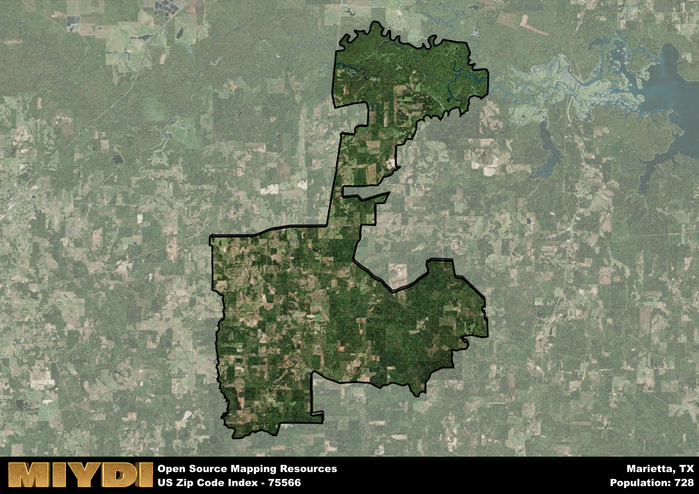

**Area Name:** Marietta

**Zip Code:** 75566

**State:** TX

Marietta is a part of the Texarkana - TX-AR Metro Area, and makes up  of the Metro's population.  

# Marietta: A Charming Community in Northeast Texas  

Located in the northeastern region of Texas, Marietta is a quaint neighborhood nestled within the larger city of Texarkana. Zip code 75566 encompasses the area bounded by State Highway 77 to the east and Farm to Market Road 251 to the west. Marietta seamlessly integrates with the surrounding neighborhoods of Redwater and New Boston, offering residents a peaceful suburban setting while still being in close proximity to the amenities of Texarkana.

Founded in the mid-19th century, Marietta has a rich history as a farming community that grew alongside the expansion of the railroad. The area was named after the wife of a prominent local landowner, reflecting the strong sense of community and family values that have characterized Marietta throughout its development. Over the years, Marietta has evolved into a close-knit neighborhood with a mix of historic homes and modern developments, preserving its small-town charm while accommodating growth and change.

Today, Marietta boasts a thriving local economy supported by agriculture, small businesses, and a strong sense of community pride. Residents enjoy access to neighborhood schools, parks, and recreational facilities, making it an ideal place to raise a family. The area also features historic sites such as the Marietta Depot Museum, showcasing the community's railroad heritage. With its blend of rural tranquility and urban convenience, Marietta continues to be a sought-after neighborhood in Northeast Texas.

# Marietta Demographics

The population of Marietta is 728.  
Marietta has a population density of 11.92 per square mile.  
The area of Marietta is 61.07 square miles.  

## Marietta Income and Economic Data

These demographic numbers are sourced from IRS return data, providing comprehensive insights into the population dynamics and economic trends within Marietta.

**Breakdown of return types for Marietta**

The table offers insight into the composition of tax returns filed with the IRS, categorizing them into three main types. Single returns represent filings by individuals, joint returns by married couples, and head of household returns by individuals who qualify as heads of households, typically having dependents. This breakdown provides an understanding of the different filing statuses adopted by taxpayers when submitting their tax documentation.

| Return Types filed for Marietta                              | Percentage          |
|----------------------------------------------------------|---------------------|
| Single Returns                                            | 0.45 |
| Joint Returns                                             | 0.39 |
| Head Household Returns                                    | 0.16 |

The income and economic data presented here is sourced from the IRS income brackets, utilized for categorizing tax returns by income levels. This table displays income ranges for both single filers and married couples, along with the corresponding number of returns and the percentage within each bracket, providing valuable insight into the distribution of taxes across various income groups.

| Bracket Name       | Single Filer Income Range | Married Couple Range | Number of Returns | Percentage of Returns |
|--------------------|----------------------------|----------------------|-------------------|-----------------------|
| 10% Bracket        | Up to $10,275              | Up to $20,550        | 120 | 0.39% |
| 12% Bracket        | $10,276 - $41,775          | $20,551 - $83,550    | 90 | 0.29% |
| 22% Bracket        | $41,776 - $89,075          | $83,551 - $178,150   | 50 | 0.16% |
| 24% Bracket        | $89,076 - $170,050         | $178,151 - $340,100  | 30 | 0.1% |
| 32% Bracket        | $170,051 - $215,950        | $340,101 - $431,900  | 20 | 0.06% |
| 35% Bracket        | $215,951 - $539,900        | $431,901 - $647,850  | 0 | 0% |

### Exploring Taxpayer Diversity: A Breakdown of Different Types of Tax Returns in Marietta

The table offers insights into various types of tax returns filed, reflecting different aspects of taxpayer activities and demographics. Categories include charitable returns for donations, dependent returns for claimed dependents, educator population, elderly population, real estate returns, self-employment returns, student loan returns, and unemployment returns, providing valuable insights into taxpayer behavior and demographics.

| Marietta Filing Types                    | Count | Percentage |
|--------------------------------------|-------|------------|
| Charitable Donations                 | 0 | 0% |
| Dependents Claimed                   | 0 | 0% |
| Educator Residents                   | 0 | 0% |
| Elderly Population                   | 100 | 0.32% |
| Farming Population                   | 30 | 0.097% |
| Real Estate Transactions             | 0 | 0% |
| Self-Employed Individuals            | 20 | 0.065% |
| Student Loan Cases                   | 0 | 0% |
| Unemployment Benefit Filings         | 50 | 0.16% |

## Marietta AI and Census Variables

The values presented in this dataset for Marietta are AI-optimized, streamlined, and categorized into relevant buckets for enhanced utility in AI and mapping programs. These simplified values have been optimized to facilitate efficient analysis and integration into various technological applications, offering users accessible and actionable insights into demographics within the Marietta area.

| AI Variables for Marietta | Value |
|-------------|-------|
| Shape Area | 226406083.703125 |
| Shape Length | 129965.833839015 |
| CBSA Federal Processing Standard Code | 45500 |

## How to use this free AI optimized Geo-Spatial Data for Marietta, TX

This data is made freely available under the Creative Commons license, allowing for unrestricted use for any purpose. Users can access static resources directly from GitHub or leverage more advanced functionalities by utilizing the GeoJSON files. All datasets originate from official government or private sector sources and are meticulously compiled into relevant datasets within QGIS. However, the versatility of the data ensures compatibility with any mapping application.

## Data Accuracy Disclaimer
It's important to note that the data provided here may contain errors or discrepancies and should be considered as 'close enough' for business applications and AI rather than a definitive source of truth. This data is aggregated from multiple sources, some of which publish information on wildly different intervals, leading to potential inconsistencies. Additionally, certain data points may not be corrected for Covid-related changes, further impacting accuracy. Moreover, the assumption that demographic trends are consistent throughout a region may lead to discrepancies, as trends often concentrate in areas of highest population density. As a result, dense areas may be slightly underrepresented, while rural areas may be slightly overrepresented, resulting in a more conservative dataset. Furthermore, the focus primarily on areas within US Major and Minor Statistical areas means that approximately 40 million Americans living outside of these areas may not be fully represented. Lastly, the historical background and area descriptions generated using AI are susceptible to potential mistakes, so users should exercise caution when interpreting the information provided.
