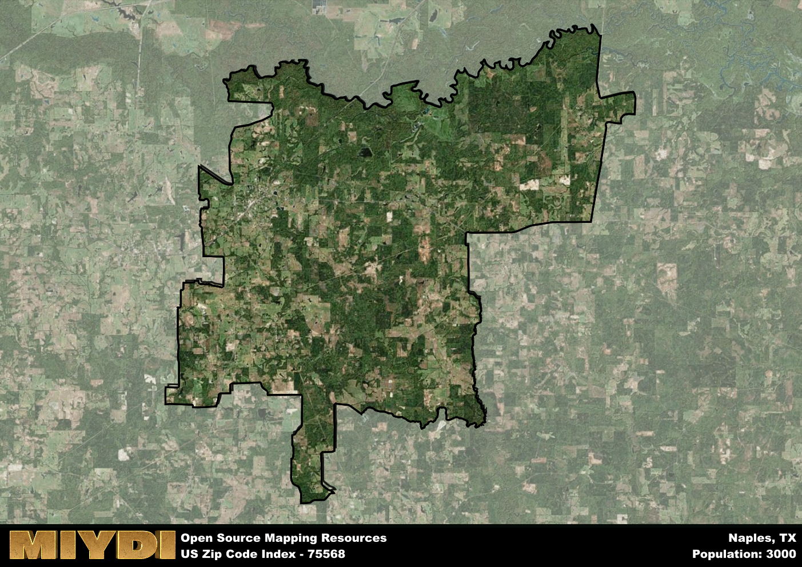

**Area Name:** Naples

**Zip Code:** 75568

**State:** TX

Naples is a part of the Texarkana - TX-AR Metro Area, and makes up  of the Metro's population.  

# The Charming Neighborhood of Naples, TX (Zip Code 75568)

Naples, Texas, located within the zip code 75568, is a quaint and charming neighborhood situated in the northeastern part of the state. Bordered by the city of Texarkana to the north and Mount Pleasant to the south, Naples serves as a rural retreat within the larger metropolitan area. Its close proximity to major population centers allows for easy access to urban amenities while maintaining a distinct small-town feel.

The history of Naples dates back to the mid-19th century when it was first settled by pioneers seeking fertile land for farming and ranching. Over the years, the area experienced steady growth, attracting more residents drawn to its peaceful atmosphere and natural beauty. The name "Naples" is said to have been inspired by the rolling hills and lush landscape reminiscent of the Italian city.

Today, Naples is a thriving community known for its agricultural industry, with farms and ranches dotting the surrounding countryside. The neighborhood boasts a variety of local businesses, from family-owned shops to cozy cafes, providing residents with essential services and a strong sense of community. In addition, Naples offers recreational opportunities such as parks, hiking trails, and historic sites that showcase the area's rich heritage.

# Naples Demographics

The population of Naples is 3000.  
Naples has a population density of 26.95 per square mile.  
The area of Naples is 111.32 square miles.  

## Naples Income and Economic Data

These demographic numbers are sourced from IRS return data, providing comprehensive insights into the population dynamics and economic trends within Naples.

**Breakdown of return types for Naples**

The table offers insight into the composition of tax returns filed with the IRS, categorizing them into three main types. Single returns represent filings by individuals, joint returns by married couples, and head of household returns by individuals who qualify as heads of households, typically having dependents. This breakdown provides an understanding of the different filing statuses adopted by taxpayers when submitting their tax documentation.

| Return Types filed for Naples                              | Percentage          |
|----------------------------------------------------------|---------------------|
| Single Returns                                            | 0.41 |
| Joint Returns                                             | 0.4 |
| Head Household Returns                                    | 0.18 |

The income and economic data presented here is sourced from the IRS income brackets, utilized for categorizing tax returns by income levels. This table displays income ranges for both single filers and married couples, along with the corresponding number of returns and the percentage within each bracket, providing valuable insight into the distribution of taxes across various income groups.

| Bracket Name       | Single Filer Income Range | Married Couple Range | Number of Returns | Percentage of Returns |
|--------------------|----------------------------|----------------------|-------------------|-----------------------|
| 10% Bracket        | Up to $10,275              | Up to $20,550        | 470 | 0.39% |
| 12% Bracket        | $10,276 - $41,775          | $20,551 - $83,550    | 350 | 0.29% |
| 22% Bracket        | $41,776 - $89,075          | $83,551 - $178,150   | 180 | 0.15% |
| 24% Bracket        | $89,076 - $170,050         | $178,151 - $340,100  | 110 | 0.09% |
| 32% Bracket        | $170,051 - $215,950        | $340,101 - $431,900  | 110 | 0.09% |
| 35% Bracket        | $215,951 - $539,900        | $431,901 - $647,850  | 0 | 0% |

### Exploring Taxpayer Diversity: A Breakdown of Different Types of Tax Returns in Naples

The table offers insights into various types of tax returns filed, reflecting different aspects of taxpayer activities and demographics. Categories include charitable returns for donations, dependent returns for claimed dependents, educator population, elderly population, real estate returns, self-employment returns, student loan returns, and unemployment returns, providing valuable insights into taxpayer behavior and demographics.

| Naples Filing Types                    | Count | Percentage |
|--------------------------------------|-------|------------|
| Charitable Donations                 | 20 | 0.016% |
| Dependents Claimed                   | 0 | 0% |
| Educator Residents                   | 50 | 0.041% |
| Elderly Population                   | 370 | 0.3% |
| Farming Population                   | 150 | 0.123% |
| Real Estate Transactions             | 0 | 0% |
| Self-Employed Individuals            | 140 | 0.115% |
| Student Loan Cases                   | 20 | 0.016% |
| Unemployment Benefit Filings         | 170 | 0.14% |

## Naples AI and Census Variables

The values presented in this dataset for Naples are AI-optimized, streamlined, and categorized into relevant buckets for enhanced utility in AI and mapping programs. These simplified values have been optimized to facilitate efficient analysis and integration into various technological applications, offering users accessible and actionable insights into demographics within the Naples area.

| AI Variables for Naples | Value |
|-------------|-------|
| Shape Area | 412780646.6875 |
| Shape Length | 156442.597819076 |
| CBSA Federal Processing Standard Code | 45500 |

## How to use this free AI optimized Geo-Spatial Data for Naples, TX

This data is made freely available under the Creative Commons license, allowing for unrestricted use for any purpose. Users can access static resources directly from GitHub or leverage more advanced functionalities by utilizing the GeoJSON files. All datasets originate from official government or private sector sources and are meticulously compiled into relevant datasets within QGIS. However, the versatility of the data ensures compatibility with any mapping application.

## Data Accuracy Disclaimer
It's important to note that the data provided here may contain errors or discrepancies and should be considered as 'close enough' for business applications and AI rather than a definitive source of truth. This data is aggregated from multiple sources, some of which publish information on wildly different intervals, leading to potential inconsistencies. Additionally, certain data points may not be corrected for Covid-related changes, further impacting accuracy. Moreover, the assumption that demographic trends are consistent throughout a region may lead to discrepancies, as trends often concentrate in areas of highest population density. As a result, dense areas may be slightly underrepresented, while rural areas may be slightly overrepresented, resulting in a more conservative dataset. Furthermore, the focus primarily on areas within US Major and Minor Statistical areas means that approximately 40 million Americans living outside of these areas may not be fully represented. Lastly, the historical background and area descriptions generated using AI are susceptible to potential mistakes, so users should exercise caution when interpreting the information provided.
