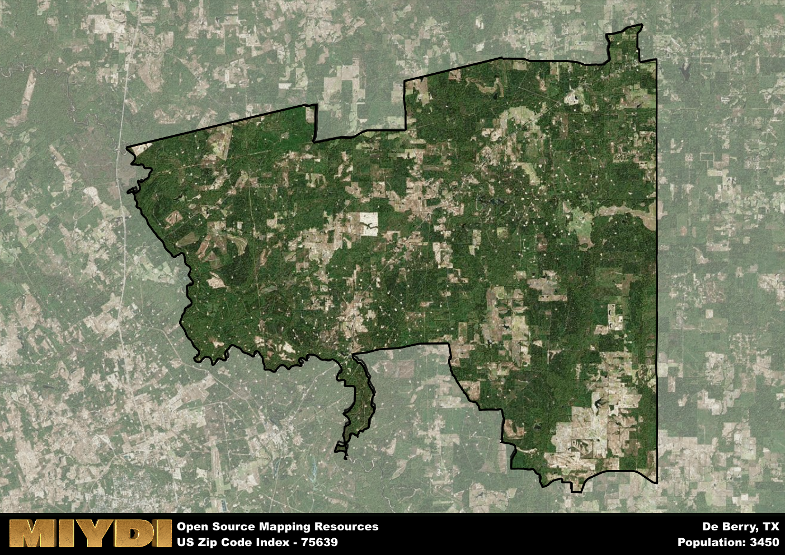

**Area Name:** De Berry

**Zip Code:** 75639

**State:** TX

De Berry is a part of the Longview - TX Metro Area, and makes up  of the Metro's population.  

# De Berry: A Historic Gem in East Texas

Located in the heart of East Texas, zip code 75639 encompasses the charming community of De Berry. Bordered by the city of Carthage to the east and Marshall to the west, De Berry serves as a peaceful residential area within close proximity to major population centers. The zip code area is known for its tranquil rural setting, surrounded by lush forests and rolling hills.

De Berry traces its roots back to the early 19th century when it was established as a small farming community. The area experienced significant growth with the arrival of the railroad in the late 1800s, attracting settlers looking to capitalize on the burgeoning timber industry. The town was officially incorporated in 1955 and has since maintained its quaint, historic charm. The name "De Berry" is rumored to have originated from a prominent local family in the area during the town's early days.

Today, De Berry is a close-knit community that prides itself on its strong sense of community and rich history. The area is predominantly residential, with a focus on agriculture and small businesses. Residents enjoy a variety of local services and amenities, including family-owned shops, parks, and historic sites. De Berry is a hidden gem in East Texas, offering a peaceful retreat from the hustle and bustle of nearby urban centers.

# De Berry Demographics

The population of De Berry is 3450.  
De Berry has a population density of 20.01 per square mile.  
The area of De Berry is 172.44 square miles.  

## De Berry Income and Economic Data

These demographic numbers are sourced from IRS return data, providing comprehensive insights into the population dynamics and economic trends within De Berry.

**Breakdown of return types for De Berry**

The table offers insight into the composition of tax returns filed with the IRS, categorizing them into three main types. Single returns represent filings by individuals, joint returns by married couples, and head of household returns by individuals who qualify as heads of households, typically having dependents. This breakdown provides an understanding of the different filing statuses adopted by taxpayers when submitting their tax documentation.

| Return Types filed for De Berry                              | Percentage          |
|----------------------------------------------------------|---------------------|
| Single Returns                                            | 0.42 |
| Joint Returns                                             | 0.38 |
| Head Household Returns                                    | 0.18 |

The income and economic data presented here is sourced from the IRS income brackets, utilized for categorizing tax returns by income levels. This table displays income ranges for both single filers and married couples, along with the corresponding number of returns and the percentage within each bracket, providing valuable insight into the distribution of taxes across various income groups.

| Bracket Name       | Single Filer Income Range | Married Couple Range | Number of Returns | Percentage of Returns |
|--------------------|----------------------------|----------------------|-------------------|-----------------------|
| 10% Bracket        | Up to $10,275              | Up to $20,550        | 390 | 0.35% |
| 12% Bracket        | $10,276 - $41,775          | $20,551 - $83,550    | 320 | 0.29% |
| 22% Bracket        | $41,776 - $89,075          | $83,551 - $178,150   | 150 | 0.13% |
| 24% Bracket        | $89,076 - $170,050         | $178,151 - $340,100  | 100 | 0.09% |
| 32% Bracket        | $170,051 - $215,950        | $340,101 - $431,900  | 130 | 0.12% |
| 35% Bracket        | $215,951 - $539,900        | $431,901 - $647,850  | 30 | 0.03% |

### Exploring Taxpayer Diversity: A Breakdown of Different Types of Tax Returns in De Berry

The table offers insights into various types of tax returns filed, reflecting different aspects of taxpayer activities and demographics. Categories include charitable returns for donations, dependent returns for claimed dependents, educator population, elderly population, real estate returns, self-employment returns, student loan returns, and unemployment returns, providing valuable insights into taxpayer behavior and demographics.

| De Berry Filing Types                    | Count | Percentage |
|--------------------------------------|-------|------------|
| Charitable Donations                 | 30 | 0.027% |
| Dependents Claimed                   | 30 | 0.027% |
| Educator Residents                   | 0 | 0% |
| Elderly Population                   | 350 | 0.31% |
| Farming Population                   | 100 | 0.089% |
| Real Estate Transactions             | 20 | 0.018% |
| Self-Employed Individuals            | 110 | 0.098% |
| Student Loan Cases                   | 40 | 0.036% |
| Unemployment Benefit Filings         | 160 | 0.14% |

## De Berry AI and Census Variables

The values presented in this dataset for De Berry are AI-optimized, streamlined, and categorized into relevant buckets for enhanced utility in AI and mapping programs. These simplified values have been optimized to facilitate efficient analysis and integration into various technological applications, offering users accessible and actionable insights into demographics within the De Berry area.

| AI Variables for De Berry | Value |
|-------------|-------|
| Shape Area | 626644346.15625 |
| Shape Length | 154955.233492837 |
| CBSA Federal Processing Standard Code | 30980 |

## How to use this free AI optimized Geo-Spatial Data for De Berry, TX

This data is made freely available under the Creative Commons license, allowing for unrestricted use for any purpose. Users can access static resources directly from GitHub or leverage more advanced functionalities by utilizing the GeoJSON files. All datasets originate from official government or private sector sources and are meticulously compiled into relevant datasets within QGIS. However, the versatility of the data ensures compatibility with any mapping application.

## Data Accuracy Disclaimer
It's important to note that the data provided here may contain errors or discrepancies and should be considered as 'close enough' for business applications and AI rather than a definitive source of truth. This data is aggregated from multiple sources, some of which publish information on wildly different intervals, leading to potential inconsistencies. Additionally, certain data points may not be corrected for Covid-related changes, further impacting accuracy. Moreover, the assumption that demographic trends are consistent throughout a region may lead to discrepancies, as trends often concentrate in areas of highest population density. As a result, dense areas may be slightly underrepresented, while rural areas may be slightly overrepresented, resulting in a more conservative dataset. Furthermore, the focus primarily on areas within US Major and Minor Statistical areas means that approximately 40 million Americans living outside of these areas may not be fully represented. Lastly, the historical background and area descriptions generated using AI are susceptible to potential mistakes, so users should exercise caution when interpreting the information provided.
