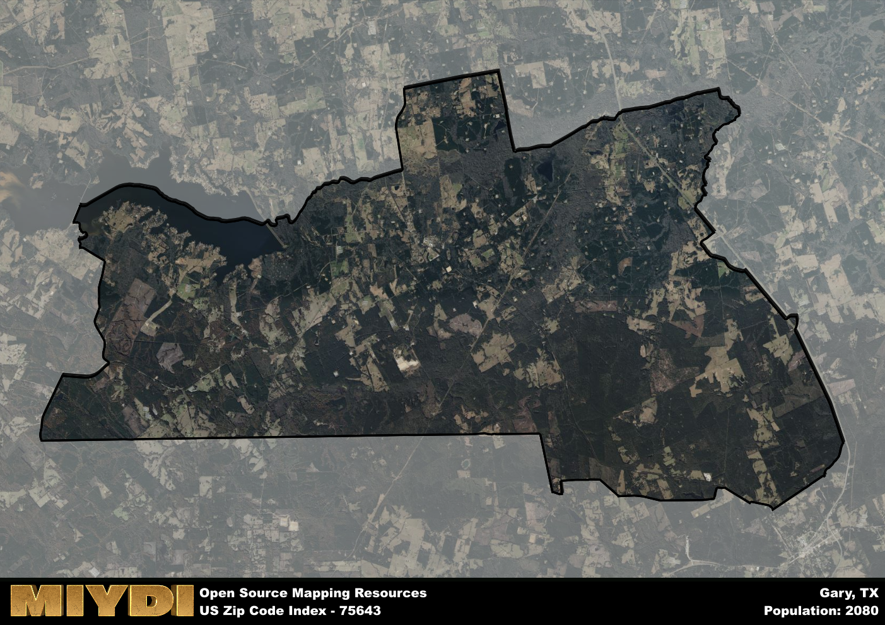

**Area Name:** Gary

**Zip Code:** 75643

**State:** TX

# Gary: A Vibrant Community in East Texas

Located in the heart of East Texas, zip code 75643 encompasses the charming community of Gary. Bordered by the towns of Carthage to the north and Timpson to the south, Gary is part of the larger metropolitan area that includes Longview and Tyler. This zip code area is known for its rolling hills, lush forests, and proximity to the Sabine National Forest, offering residents a blend of rural tranquility and urban convenience.

Established in the mid-19th century, Gary has a rich history rooted in agriculture and timber industries. The area experienced significant growth during the oil boom of the early 20th century, attracting new residents and businesses to the region. Named after prominent local landowners, Gary has retained its small-town charm while adapting to modern developments, making it an attractive destination for both families and retirees seeking a peaceful lifestyle in a scenic setting.

Today, Gary boasts a thriving community with a mix of agricultural and small businesses supporting the local economy. Residents can enjoy recreational activities such as fishing, hunting, and hiking in the nearby national forest. The area is home to historic landmarks like the Gary City Cemetery and the Gary Volunteer Fire Department, showcasing the town's commitment to preserving its heritage. With a strong sense of community and access to essential services, Gary continues to be a welcoming and vibrant neighborhood in East Texas.

# Gary Demographics

The population of Gary is 2080.  
Gary has a population density of 27.39 per square mile.  
The area of Gary is 75.94 square miles.  

## Gary Income and Economic Data

These demographic numbers are sourced from IRS return data, providing comprehensive insights into the population dynamics and economic trends within Gary.

**Breakdown of return types for Gary**

The table offers insight into the composition of tax returns filed with the IRS, categorizing them into three main types. Single returns represent filings by individuals, joint returns by married couples, and head of household returns by individuals who qualify as heads of households, typically having dependents. This breakdown provides an understanding of the different filing statuses adopted by taxpayers when submitting their tax documentation.

| Return Types filed for Gary                              | Percentage          |
|----------------------------------------------------------|---------------------|
| Single Returns                                            | 0.4 |
| Joint Returns                                             | 0.46 |
| Head Household Returns                                    | 0.12 |

The income and economic data presented here is sourced from the IRS income brackets, utilized for categorizing tax returns by income levels. This table displays income ranges for both single filers and married couples, along with the corresponding number of returns and the percentage within each bracket, providing valuable insight into the distribution of taxes across various income groups.

| Bracket Name       | Single Filer Income Range | Married Couple Range | Number of Returns | Percentage of Returns |
|--------------------|----------------------------|----------------------|-------------------|-----------------------|
| 10% Bracket        | Up to $10,275              | Up to $20,550        | 300 | 0.36% |
| 12% Bracket        | $10,276 - $41,775          | $20,551 - $83,550    | 200 | 0.24% |
| 22% Bracket        | $41,776 - $89,075          | $83,551 - $178,150   | 120 | 0.14% |
| 24% Bracket        | $89,076 - $170,050         | $178,151 - $340,100  | 90 | 0.11% |
| 32% Bracket        | $170,051 - $215,950        | $340,101 - $431,900  | 110 | 0.13% |
| 35% Bracket        | $215,951 - $539,900        | $431,901 - $647,850  | 20 | 0.02% |

### Exploring Taxpayer Diversity: A Breakdown of Different Types of Tax Returns in Gary

The table offers insights into various types of tax returns filed, reflecting different aspects of taxpayer activities and demographics. Categories include charitable returns for donations, dependent returns for claimed dependents, educator population, elderly population, real estate returns, self-employment returns, student loan returns, and unemployment returns, providing valuable insights into taxpayer behavior and demographics.

| Gary Filing Types                    | Count | Percentage |
|--------------------------------------|-------|------------|
| Charitable Donations                 | 30 | 0.036% |
| Dependents Claimed                   | 0 | 0% |
| Educator Residents                   | 0 | 0% |
| Elderly Population                   | 260 | 0.31% |
| Farming Population                   | 80 | 0.095% |
| Real Estate Transactions             | 30 | 0.036% |
| Self-Employed Individuals            | 120 | 0.143% |
| Student Loan Cases                   | 20 | 0.024% |
| Unemployment Benefit Filings         | 110 | 0.13% |

## Gary AI and Census Variables

The values presented in this dataset for Gary are AI-optimized, streamlined, and categorized into relevant buckets for enhanced utility in AI and mapping programs. These simplified values have been optimized to facilitate efficient analysis and integration into various technological applications, offering users accessible and actionable insights into demographics within the Gary area.

| AI Variables for Gary | Value |
|-------------|-------|
| Shape Area | 274340609.410156 |
| Shape Length | 93849.9192910112 |

## How to use this free AI optimized Geo-Spatial Data for Gary, TX

This data is made freely available under the Creative Commons license, allowing for unrestricted use for any purpose. Users can access static resources directly from GitHub or leverage more advanced functionalities by utilizing the GeoJSON files. All datasets originate from official government or private sector sources and are meticulously compiled into relevant datasets within QGIS. However, the versatility of the data ensures compatibility with any mapping application.

## Data Accuracy Disclaimer
It's important to note that the data provided here may contain errors or discrepancies and should be considered as 'close enough' for business applications and AI rather than a definitive source of truth. This data is aggregated from multiple sources, some of which publish information on wildly different intervals, leading to potential inconsistencies. Additionally, certain data points may not be corrected for Covid-related changes, further impacting accuracy. Moreover, the assumption that demographic trends are consistent throughout a region may lead to discrepancies, as trends often concentrate in areas of highest population density. As a result, dense areas may be slightly underrepresented, while rural areas may be slightly overrepresented, resulting in a more conservative dataset. Furthermore, the focus primarily on areas within US Major and Minor Statistical areas means that approximately 40 million Americans living outside of these areas may not be fully represented. Lastly, the historical background and area descriptions generated using AI are susceptible to potential mistakes, so users should exercise caution when interpreting the information provided.
