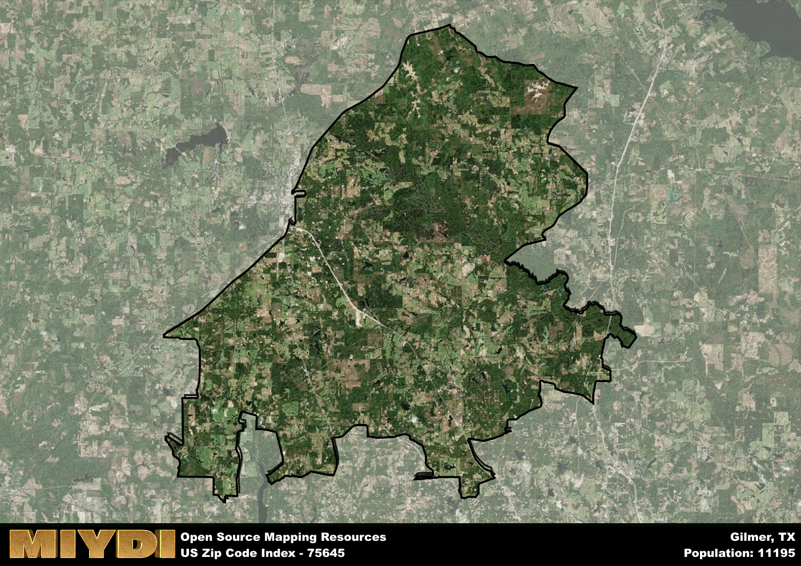

**Area Name:** Gilmer

**Zip Code:** 75645

**State:** TX

Gilmer is a part of the Longview - TX Metro Area, and makes up  of the Metro's population.  

# Discover the Charming Community of Gilmer in Zip Code 75645

Nestled in the heart of East Texas, the zip code 75645 corresponds to the quaint town of Gilmer. This area is bordered by scenic countryside and is located just a short drive from larger cities such as Longview and Tyler. Gilmer is known for its peaceful residential neighborhoods, friendly community atmosphere, and easy access to the natural beauty of the surrounding landscape.

Gilmer has a rich history dating back to its establishment in the mid-19th century. Originally settled as a farming community, Gilmer quickly grew into a bustling town with the arrival of the railroad. The town was named after Thomas W. Gilmer, a former Secretary of the Navy. Over the years, Gilmer has maintained its small-town charm while adapting to modern times, making it a desirable place to live for both families and retirees.

Today, Gilmer offers a mix of local businesses, restaurants, and services to meet the needs of its residents. The town is home to a variety of recreational facilities, including parks, sports fields, and community centers. Residents and visitors alike can also explore the town's historic sites, such as the Upshur County Courthouse and the Gilmer Yamboree, an annual festival celebrating the town's agricultural heritage. With its strong sense of community and idyllic setting, Gilmer in zip code 75645 is a hidden gem waiting to be discovered in East Texas.

# Gilmer Demographics

The population of Gilmer is 11195.  
Gilmer has a population density of 76.38 per square mile.  
The area of Gilmer is 146.57 square miles.  

## Gilmer Income and Economic Data

These demographic numbers are sourced from IRS return data, providing comprehensive insights into the population dynamics and economic trends within Gilmer.

**Breakdown of return types for Gilmer**

The table offers insight into the composition of tax returns filed with the IRS, categorizing them into three main types. Single returns represent filings by individuals, joint returns by married couples, and head of household returns by individuals who qualify as heads of households, typically having dependents. This breakdown provides an understanding of the different filing statuses adopted by taxpayers when submitting their tax documentation.

| Return Types filed for Gilmer                              | Percentage          |
|----------------------------------------------------------|---------------------|
| Single Returns                                            | 0.38 |
| Joint Returns                                             | 0.47 |
| Head Household Returns                                    | 0.14 |

The income and economic data presented here is sourced from the IRS income brackets, utilized for categorizing tax returns by income levels. This table displays income ranges for both single filers and married couples, along with the corresponding number of returns and the percentage within each bracket, providing valuable insight into the distribution of taxes across various income groups.

| Bracket Name       | Single Filer Income Range | Married Couple Range | Number of Returns | Percentage of Returns |
|--------------------|----------------------------|----------------------|-------------------|-----------------------|
| 10% Bracket        | Up to $10,275              | Up to $20,550        | 1540 | 0.35% |
| 12% Bracket        | $10,276 - $41,775          | $20,551 - $83,550    | 1100 | 0.25% |
| 22% Bracket        | $41,776 - $89,075          | $83,551 - $178,150   | 640 | 0.15% |
| 24% Bracket        | $89,076 - $170,050         | $178,151 - $340,100  | 410 | 0.09% |
| 32% Bracket        | $170,051 - $215,950        | $340,101 - $431,900  | 630 | 0.14% |
| 35% Bracket        | $215,951 - $539,900        | $431,901 - $647,850  | 90 | 0.02% |

### Exploring Taxpayer Diversity: A Breakdown of Different Types of Tax Returns in Gilmer

The table offers insights into various types of tax returns filed, reflecting different aspects of taxpayer activities and demographics. Categories include charitable returns for donations, dependent returns for claimed dependents, educator population, elderly population, real estate returns, self-employment returns, student loan returns, and unemployment returns, providing valuable insights into taxpayer behavior and demographics.

| Gilmer Filing Types                    | Count | Percentage |
|--------------------------------------|-------|------------|
| Charitable Donations                 | 190 | 0.043% |
| Dependents Claimed                   | 110 | 0.025% |
| Educator Residents                   | 120 | 0.027% |
| Elderly Population                   | 1130 | 0.26% |
| Farming Population                   | 350 | 0.079% |
| Real Estate Transactions             | 180 | 0.041% |
| Self-Employed Individuals            | 630 | 0.143% |
| Student Loan Cases                   | 170 | 0.039% |
| Unemployment Benefit Filings         | 710 | 0.16% |

## Gilmer AI and Census Variables

The values presented in this dataset for Gilmer are AI-optimized, streamlined, and categorized into relevant buckets for enhanced utility in AI and mapping programs. These simplified values have been optimized to facilitate efficient analysis and integration into various technological applications, offering users accessible and actionable insights into demographics within the Gilmer area.

| AI Variables for Gilmer | Value |
|-------------|-------|
| Shape Area | 537442106.566406 |
| Shape Length | 161470.127429478 |
| CBSA Federal Processing Standard Code | 30980 |

## How to use this free AI optimized Geo-Spatial Data for Gilmer, TX

This data is made freely available under the Creative Commons license, allowing for unrestricted use for any purpose. Users can access static resources directly from GitHub or leverage more advanced functionalities by utilizing the GeoJSON files. All datasets originate from official government or private sector sources and are meticulously compiled into relevant datasets within QGIS. However, the versatility of the data ensures compatibility with any mapping application.

## Data Accuracy Disclaimer
It's important to note that the data provided here may contain errors or discrepancies and should be considered as 'close enough' for business applications and AI rather than a definitive source of truth. This data is aggregated from multiple sources, some of which publish information on wildly different intervals, leading to potential inconsistencies. Additionally, certain data points may not be corrected for Covid-related changes, further impacting accuracy. Moreover, the assumption that demographic trends are consistent throughout a region may lead to discrepancies, as trends often concentrate in areas of highest population density. As a result, dense areas may be slightly underrepresented, while rural areas may be slightly overrepresented, resulting in a more conservative dataset. Furthermore, the focus primarily on areas within US Major and Minor Statistical areas means that approximately 40 million Americans living outside of these areas may not be fully represented. Lastly, the historical background and area descriptions generated using AI are susceptible to potential mistakes, so users should exercise caution when interpreting the information provided.
