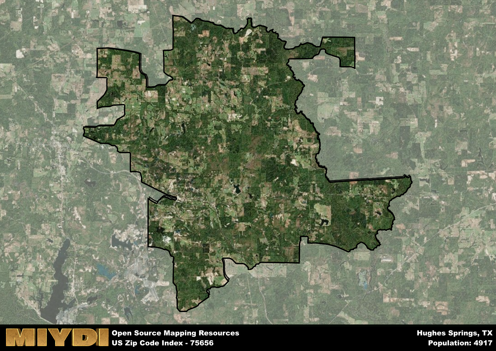

**Area Name:** Hughes Springs

**Zip Code:** 75656

**State:** TX

# Hughes Springs: A Charming East Texas Community  
Located in the heart of East Texas, the zip code 75656 area encompasses the charming town of Hughes Springs. Situated in Cass County, Hughes Springs is surrounded by the natural beauty of the Piney Woods region. The town is conveniently located near major highways, providing easy access to nearby cities such as Longview and Texarkana. Despite its small size, Hughes Springs plays an integral role within the regional urban fabric, offering a peaceful retreat from the hustle and bustle of larger metropolitan areas.

Hughes Springs has a rich historical narrative dating back to its founding in the late 19th century. Named after the Hughes family who were early settlers in the area, the town quickly grew due to the timber industry and the arrival of the railroad. Over the years, Hughes Springs has maintained its small-town charm while adapting to modern times. The town has preserved many historic buildings and landmarks, serving as a reminder of its past while embracing future growth and development.

Today, Hughes Springs is a thriving community with a mix of residential neighborhoods, local businesses, and recreational opportunities. The town's economy is supported by agriculture, small businesses, and a growing tourism industry. Residents and visitors alike can enjoy the picturesque scenery at Lake O' the Pines or explore the quaint downtown area with its shops and restaurants. Hughes Springs also hosts various community events and festivals throughout the year, highlighting its vibrant culture and tight-knit community spirit.

# Hughes Springs Demographics

The population of Hughes Springs is 4917.  
Hughes Springs has a population density of 53.01 per square mile.  
The area of Hughes Springs is 92.76 square miles.  

## Hughes Springs Income and Economic Data

These demographic numbers are sourced from IRS return data, providing comprehensive insights into the population dynamics and economic trends within Hughes Springs.

**Breakdown of return types for Hughes Springs**

The table offers insight into the composition of tax returns filed with the IRS, categorizing them into three main types. Single returns represent filings by individuals, joint returns by married couples, and head of household returns by individuals who qualify as heads of households, typically having dependents. This breakdown provides an understanding of the different filing statuses adopted by taxpayers when submitting their tax documentation.

| Return Types filed for Hughes Springs                              | Percentage          |
|----------------------------------------------------------|---------------------|
| Single Returns                                            | 0.38 |
| Joint Returns                                             | 0.42 |
| Head Household Returns                                    | 0.18 |

The income and economic data presented here is sourced from the IRS income brackets, utilized for categorizing tax returns by income levels. This table displays income ranges for both single filers and married couples, along with the corresponding number of returns and the percentage within each bracket, providing valuable insight into the distribution of taxes across various income groups.

| Bracket Name       | Single Filer Income Range | Married Couple Range | Number of Returns | Percentage of Returns |
|--------------------|----------------------------|----------------------|-------------------|-----------------------|
| 10% Bracket        | Up to $10,275              | Up to $20,550        | 750 | 0.38% |
| 12% Bracket        | $10,276 - $41,775          | $20,551 - $83,550    | 510 | 0.26% |
| 22% Bracket        | $41,776 - $89,075          | $83,551 - $178,150   | 270 | 0.14% |
| 24% Bracket        | $89,076 - $170,050         | $178,151 - $340,100  | 190 | 0.1% |
| 32% Bracket        | $170,051 - $215,950        | $340,101 - $431,900  | 200 | 0.1% |
| 35% Bracket        | $215,951 - $539,900        | $431,901 - $647,850  | 30 | 0.02% |

### Exploring Taxpayer Diversity: A Breakdown of Different Types of Tax Returns in Hughes Springs

The table offers insights into various types of tax returns filed, reflecting different aspects of taxpayer activities and demographics. Categories include charitable returns for donations, dependent returns for claimed dependents, educator population, elderly population, real estate returns, self-employment returns, student loan returns, and unemployment returns, providing valuable insights into taxpayer behavior and demographics.

| Hughes Springs Filing Types                    | Count | Percentage |
|--------------------------------------|-------|------------|
| Charitable Donations                 | 40 | 0.021% |
| Dependents Claimed                   | 50 | 0.026% |
| Educator Residents                   | 50 | 0.026% |
| Elderly Population                   | 490 | 0.25% |
| Farming Population                   | 170 | 0.087% |
| Real Estate Transactions             | 40 | 0.021% |
| Self-Employed Individuals            | 230 | 0.118% |
| Student Loan Cases                   | 70 | 0.036% |
| Unemployment Benefit Filings         | 350 | 0.18% |

## Hughes Springs AI and Census Variables

The values presented in this dataset for Hughes Springs are AI-optimized, streamlined, and categorized into relevant buckets for enhanced utility in AI and mapping programs. These simplified values have been optimized to facilitate efficient analysis and integration into various technological applications, offering users accessible and actionable insights into demographics within the Hughes Springs area.

| AI Variables for Hughes Springs | Value |
|-------------|-------|
| Shape Area | 342699637.441406 |
| Shape Length | 142873.009424955 |

## How to use this free AI optimized Geo-Spatial Data for Hughes Springs, TX

This data is made freely available under the Creative Commons license, allowing for unrestricted use for any purpose. Users can access static resources directly from GitHub or leverage more advanced functionalities by utilizing the GeoJSON files. All datasets originate from official government or private sector sources and are meticulously compiled into relevant datasets within QGIS. However, the versatility of the data ensures compatibility with any mapping application.

## Data Accuracy Disclaimer
It's important to note that the data provided here may contain errors or discrepancies and should be considered as 'close enough' for business applications and AI rather than a definitive source of truth. This data is aggregated from multiple sources, some of which publish information on wildly different intervals, leading to potential inconsistencies. Additionally, certain data points may not be corrected for Covid-related changes, further impacting accuracy. Moreover, the assumption that demographic trends are consistent throughout a region may lead to discrepancies, as trends often concentrate in areas of highest population density. As a result, dense areas may be slightly underrepresented, while rural areas may be slightly overrepresented, resulting in a more conservative dataset. Furthermore, the focus primarily on areas within US Major and Minor Statistical areas means that approximately 40 million Americans living outside of these areas may not be fully represented. Lastly, the historical background and area descriptions generated using AI are susceptible to potential mistakes, so users should exercise caution when interpreting the information provided.
