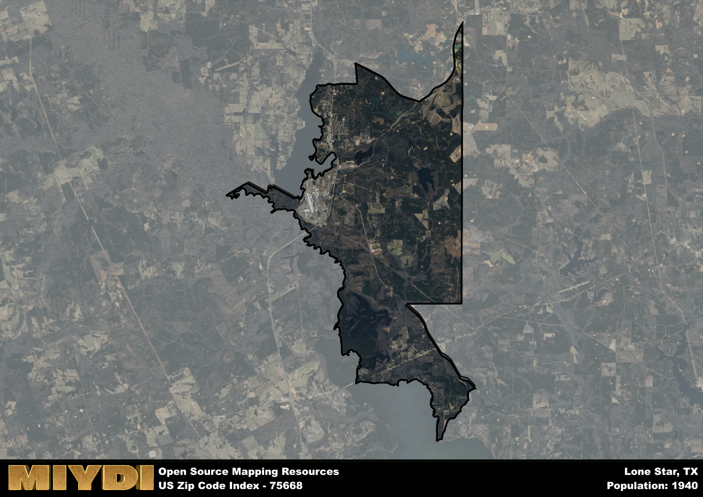

**Area Name:** Lone Star

**Zip Code:** 75668

**State:** TX

Lone Star is a part of the Longview - TX Metro Area, and makes up  of the Metro's population.  

# Lone Star, TX 75668: A Historic Neighborhood in East Texas  

Located in the heart of East Texas, zip code 75668 corresponds to the charming neighborhood of Lone Star. Situated within the larger metropolitan area of Longview, Lone Star is bordered by the cities of Hughes Springs to the north and Daingerfield to the south. This area seamlessly integrates with surrounding districts through a network of highways, providing easy access to major population centers such as Tyler and Shreveport.

Lone Star has a rich historical narrative dating back to its settlement in the late 19th century. The area was originally known for its lumber industry, with the Lone Star Lumber Company playing a significant role in its growth. Over the years, the neighborhood evolved into a thriving community with a distinct identity, eventually adopting the name Lone Star as a nod to its Lone Star State roots.

Today, Lone Star boasts a mix of residential neighborhoods, local businesses, and recreational amenities. The area is known for its friendly atmosphere and close-knit community, with residents enjoying access to parks, schools, and small-town charm. Visitors can explore historic sites such as the Lone Star Depot Museum, which showcases the neighborhood's heritage. With a variety of services and activities available, Lone Star continues to be a vibrant and welcoming neighborhood within the East Texas region.

# Lone Star Demographics

The population of Lone Star is 1940.  
Lone Star has a population density of 73.48 per square mile.  
The area of Lone Star is 26.4 square miles.  

## Lone Star Income and Economic Data

These demographic numbers are sourced from IRS return data, providing comprehensive insights into the population dynamics and economic trends within Lone Star.

**Breakdown of return types for Lone Star**

The table offers insight into the composition of tax returns filed with the IRS, categorizing them into three main types. Single returns represent filings by individuals, joint returns by married couples, and head of household returns by individuals who qualify as heads of households, typically having dependents. This breakdown provides an understanding of the different filing statuses adopted by taxpayers when submitting their tax documentation.

| Return Types filed for Lone Star                              | Percentage          |
|----------------------------------------------------------|---------------------|
| Single Returns                                            | 0.48 |
| Joint Returns                                             | 0.27 |
| Head Household Returns                                    | 0.21 |

The income and economic data presented here is sourced from the IRS income brackets, utilized for categorizing tax returns by income levels. This table displays income ranges for both single filers and married couples, along with the corresponding number of returns and the percentage within each bracket, providing valuable insight into the distribution of taxes across various income groups.

| Bracket Name       | Single Filer Income Range | Married Couple Range | Number of Returns | Percentage of Returns |
|--------------------|----------------------------|----------------------|-------------------|-----------------------|
| 10% Bracket        | Up to $10,275              | Up to $20,550        | 370 | 0.44% |
| 12% Bracket        | $10,276 - $41,775          | $20,551 - $83,550    | 250 | 0.3% |
| 22% Bracket        | $41,776 - $89,075          | $83,551 - $178,150   | 100 | 0.12% |
| 24% Bracket        | $89,076 - $170,050         | $178,151 - $340,100  | 50 | 0.06% |
| 32% Bracket        | $170,051 - $215,950        | $340,101 - $431,900  | 70 | 0.08% |
| 35% Bracket        | $215,951 - $539,900        | $431,901 - $647,850  | 0 | 0% |

### Exploring Taxpayer Diversity: A Breakdown of Different Types of Tax Returns in Lone Star

The table offers insights into various types of tax returns filed, reflecting different aspects of taxpayer activities and demographics. Categories include charitable returns for donations, dependent returns for claimed dependents, educator population, elderly population, real estate returns, self-employment returns, student loan returns, and unemployment returns, providing valuable insights into taxpayer behavior and demographics.

| Lone Star Filing Types                    | Count | Percentage |
|--------------------------------------|-------|------------|
| Charitable Donations                 | 20 | 0.024% |
| Dependents Claimed                   | 0 | 0% |
| Educator Residents                   | 0 | 0% |
| Elderly Population                   | 210 | 0.25% |
| Farming Population                   | 40 | 0.048% |
| Real Estate Transactions             | 0 | 0% |
| Self-Employed Individuals            | 80 | 0.095% |
| Student Loan Cases                   | 0 | 0% |
| Unemployment Benefit Filings         | 150 | 0.18% |

## Lone Star AI and Census Variables

The values presented in this dataset for Lone Star are AI-optimized, streamlined, and categorized into relevant buckets for enhanced utility in AI and mapping programs. These simplified values have been optimized to facilitate efficient analysis and integration into various technological applications, offering users accessible and actionable insights into demographics within the Lone Star area.

| AI Variables for Lone Star | Value |
|-------------|-------|
| Shape Area | 97285101.1953125 |
| Shape Length | 79709.4217603175 |
| CBSA Federal Processing Standard Code | 30980 |

## How to use this free AI optimized Geo-Spatial Data for Lone Star, TX

This data is made freely available under the Creative Commons license, allowing for unrestricted use for any purpose. Users can access static resources directly from GitHub or leverage more advanced functionalities by utilizing the GeoJSON files. All datasets originate from official government or private sector sources and are meticulously compiled into relevant datasets within QGIS. However, the versatility of the data ensures compatibility with any mapping application.

## Data Accuracy Disclaimer
It's important to note that the data provided here may contain errors or discrepancies and should be considered as 'close enough' for business applications and AI rather than a definitive source of truth. This data is aggregated from multiple sources, some of which publish information on wildly different intervals, leading to potential inconsistencies. Additionally, certain data points may not be corrected for Covid-related changes, further impacting accuracy. Moreover, the assumption that demographic trends are consistent throughout a region may lead to discrepancies, as trends often concentrate in areas of highest population density. As a result, dense areas may be slightly underrepresented, while rural areas may be slightly overrepresented, resulting in a more conservative dataset. Furthermore, the focus primarily on areas within US Major and Minor Statistical areas means that approximately 40 million Americans living outside of these areas may not be fully represented. Lastly, the historical background and area descriptions generated using AI are susceptible to potential mistakes, so users should exercise caution when interpreting the information provided.
