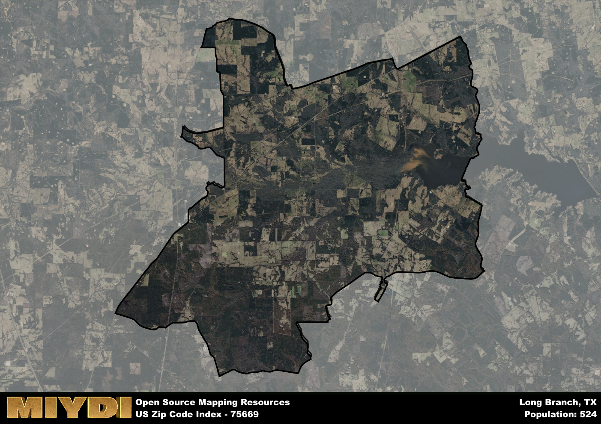

**Area Name:** Long Branch

**Zip Code:** 75669

**State:** TX

Long Branch is a part of the Longview - TX Metro Area, and makes up  of the Metro's population.  

# Long Branch, 75669: A Charming Neighborhood in East Texas  

Located in East Texas, zip code 75669 encompasses the quaint neighborhood of Long Branch. Situated within the larger city of Carthage, Long Branch is bordered by the Sabine National Forest to the east, providing residents with easy access to outdoor recreational activities. The zip code area is well-connected to major highways, allowing for convenient travel to nearby cities such as Marshall and Shreveport.

Long Branch has a rich historical narrative, dating back to its establishment in the mid-19th century. Named after a nearby creek, the area was initially settled by pioneers drawn to the fertile land and abundant natural resources. Over the years, Long Branch grew into a vibrant community, with agriculture and timber industries playing a significant role in its development. Today, remnants of its past can be seen in the historic buildings and landmarks scattered throughout the neighborhood.

Presently, Long Branch is a thriving community with a mix of residential and commercial properties. The area is known for its friendly atmosphere and tight-knit community, offering essential services such as schools, grocery stores, and local businesses. Residents and visitors alike can enjoy a variety of recreational amenities, including parks, hiking trails, and fishing spots. Long Branch also boasts a rich cultural heritage, with events and festivals celebrating its unique history and traditions.

# Long Branch Demographics

The population of Long Branch is 524.  
Long Branch has a population density of 8.05 per square mile.  
The area of Long Branch is 65.11 square miles.  

## Long Branch Income and Economic Data

These demographic numbers are sourced from IRS return data, providing comprehensive insights into the population dynamics and economic trends within Long Branch.

**Breakdown of return types for Long Branch**

The table offers insight into the composition of tax returns filed with the IRS, categorizing them into three main types. Single returns represent filings by individuals, joint returns by married couples, and head of household returns by individuals who qualify as heads of households, typically having dependents. This breakdown provides an understanding of the different filing statuses adopted by taxpayers when submitting their tax documentation.

| Return Types filed for Long Branch                              | Percentage          |
|----------------------------------------------------------|---------------------|
| Single Returns                                            | 0.36 |
| Joint Returns                                             | 0.5 |
| Head Household Returns                                    | 0.14 |

The income and economic data presented here is sourced from the IRS income brackets, utilized for categorizing tax returns by income levels. This table displays income ranges for both single filers and married couples, along with the corresponding number of returns and the percentage within each bracket, providing valuable insight into the distribution of taxes across various income groups.

| Bracket Name       | Single Filer Income Range | Married Couple Range | Number of Returns | Percentage of Returns |
|--------------------|----------------------------|----------------------|-------------------|-----------------------|
| 10% Bracket        | Up to $10,275              | Up to $20,550        | 90 | 0.32% |
| 12% Bracket        | $10,276 - $41,775          | $20,551 - $83,550    | 70 | 0.25% |
| 22% Bracket        | $41,776 - $89,075          | $83,551 - $178,150   | 50 | 0.18% |
| 24% Bracket        | $89,076 - $170,050         | $178,151 - $340,100  | 30 | 0.11% |
| 32% Bracket        | $170,051 - $215,950        | $340,101 - $431,900  | 40 | 0.14% |
| 35% Bracket        | $215,951 - $539,900        | $431,901 - $647,850  | 0 | 0% |

### Exploring Taxpayer Diversity: A Breakdown of Different Types of Tax Returns in Long Branch

The table offers insights into various types of tax returns filed, reflecting different aspects of taxpayer activities and demographics. Categories include charitable returns for donations, dependent returns for claimed dependents, educator population, elderly population, real estate returns, self-employment returns, student loan returns, and unemployment returns, providing valuable insights into taxpayer behavior and demographics.

| Long Branch Filing Types                    | Count | Percentage |
|--------------------------------------|-------|------------|
| Charitable Donations                 | 0 | 0% |
| Dependents Claimed                   | 0 | 0% |
| Educator Residents                   | 0 | 0% |
| Elderly Population                   | 100 | 0.36% |
| Farming Population                   | 40 | 0.143% |
| Real Estate Transactions             | 0 | 0% |
| Self-Employed Individuals            | 40 | 0.143% |
| Student Loan Cases                   | 0 | 0% |
| Unemployment Benefit Filings         | 40 | 0.14% |

## Long Branch AI and Census Variables

The values presented in this dataset for Long Branch are AI-optimized, streamlined, and categorized into relevant buckets for enhanced utility in AI and mapping programs. These simplified values have been optimized to facilitate efficient analysis and integration into various technological applications, offering users accessible and actionable insights into demographics within the Long Branch area.

| AI Variables for Long Branch | Value |
|-------------|-------|
| Shape Area | 235315517.078125 |
| Shape Length | 91372.1614103068 |
| CBSA Federal Processing Standard Code | 30980 |

## How to use this free AI optimized Geo-Spatial Data for Long Branch, TX

This data is made freely available under the Creative Commons license, allowing for unrestricted use for any purpose. Users can access static resources directly from GitHub or leverage more advanced functionalities by utilizing the GeoJSON files. All datasets originate from official government or private sector sources and are meticulously compiled into relevant datasets within QGIS. However, the versatility of the data ensures compatibility with any mapping application.

## Data Accuracy Disclaimer
It's important to note that the data provided here may contain errors or discrepancies and should be considered as 'close enough' for business applications and AI rather than a definitive source of truth. This data is aggregated from multiple sources, some of which publish information on wildly different intervals, leading to potential inconsistencies. Additionally, certain data points may not be corrected for Covid-related changes, further impacting accuracy. Moreover, the assumption that demographic trends are consistent throughout a region may lead to discrepancies, as trends often concentrate in areas of highest population density. As a result, dense areas may be slightly underrepresented, while rural areas may be slightly overrepresented, resulting in a more conservative dataset. Furthermore, the focus primarily on areas within US Major and Minor Statistical areas means that approximately 40 million Americans living outside of these areas may not be fully represented. Lastly, the historical background and area descriptions generated using AI are susceptible to potential mistakes, so users should exercise caution when interpreting the information provided.
