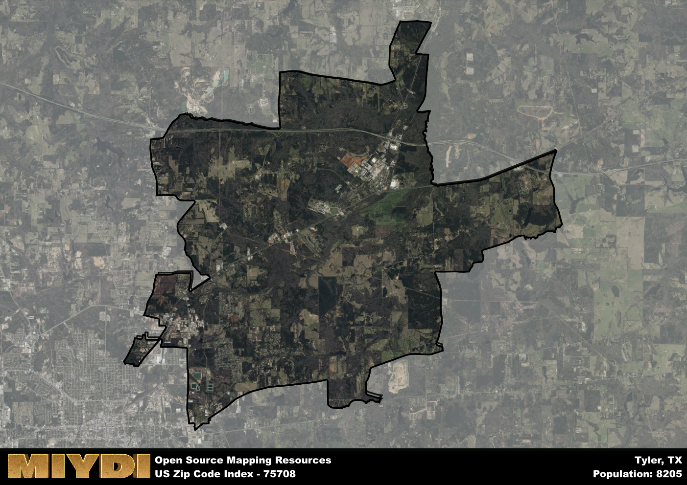

**Area Name:** Tyler

**Zip Code:** 75708

**State:** TX

Tyler is a part of the Tyler - TX Metro Area, and makes up  of the Metro's population.  

# Exploring the Charm of Tyler's 75708 Neighborhood

Located in the northeastern region of Tyler, Texas, the 75708 zip code area is bordered by Highway 271 to the east and Highway 64 to the south. This vibrant neighborhood seamlessly integrates with the larger metropolitan area of Tyler, offering easy access to downtown amenities, shopping centers, and educational institutions. Nestled within the lush landscapes of East Texas, 75708 is known for its peaceful residential streets and close-knit community atmosphere.

The 75708 neighborhood in Tyler has a rich historical legacy dating back to its early settlement in the mid-19th century. Originally inhabited by Native American tribes, the area saw a wave of European settlers in the 1860s, drawn by the fertile soil and abundant natural resources. As the community grew, it became a hub for agriculture and timber industries, shaping its identity as a rural retreat with a strong sense of tradition and heritage. Over the years, 75708 has evolved into a modern suburban enclave while preserving its historical roots.

Today, the 75708 neighborhood in Tyler boasts a diverse economy driven by small businesses, agriculture, and healthcare services. Residents enjoy a range of neighborhood-specific amenities, including local parks, community centers, and family-owned eateries. The area is home to several historic sites, such as the Old Mill Pond Museum, offering visitors a glimpse into the region's past. With its tranquil ambiance, thriving economy, and strong community spirit, 75708 continues to be a sought-after destination for those seeking a blend of rural charm and urban convenience in the heart of East Texas.

# Tyler Demographics

The population of Tyler is 8205.  
Tyler has a population density of 165.62 per square mile.  
The area of Tyler is 49.54 square miles.  

## Tyler Income and Economic Data

These demographic numbers are sourced from IRS return data, providing comprehensive insights into the population dynamics and economic trends within Tyler.

**Breakdown of return types for Tyler**

The table offers insight into the composition of tax returns filed with the IRS, categorizing them into three main types. Single returns represent filings by individuals, joint returns by married couples, and head of household returns by individuals who qualify as heads of households, typically having dependents. This breakdown provides an understanding of the different filing statuses adopted by taxpayers when submitting their tax documentation.

| Return Types filed for Tyler                              | Percentage          |
|----------------------------------------------------------|---------------------|
| Single Returns                                            | 0.45 |
| Joint Returns                                             | 0.32 |
| Head Household Returns                                    | 0.2 |

The income and economic data presented here is sourced from the IRS income brackets, utilized for categorizing tax returns by income levels. This table displays income ranges for both single filers and married couples, along with the corresponding number of returns and the percentage within each bracket, providing valuable insight into the distribution of taxes across various income groups.

| Bracket Name       | Single Filer Income Range | Married Couple Range | Number of Returns | Percentage of Returns |
|--------------------|----------------------------|----------------------|-------------------|-----------------------|
| 10% Bracket        | Up to $10,275              | Up to $20,550        | 1440 | 0.43% |
| 12% Bracket        | $10,276 - $41,775          | $20,551 - $83,550    | 1110 | 0.33% |
| 22% Bracket        | $41,776 - $89,075          | $83,551 - $178,150   | 440 | 0.13% |
| 24% Bracket        | $89,076 - $170,050         | $178,151 - $340,100  | 170 | 0.05% |
| 32% Bracket        | $170,051 - $215,950        | $340,101 - $431,900  | 160 | 0.05% |
| 35% Bracket        | $215,951 - $539,900        | $431,901 - $647,850  | 0 | 0% |

### Exploring Taxpayer Diversity: A Breakdown of Different Types of Tax Returns in Tyler

The table offers insights into various types of tax returns filed, reflecting different aspects of taxpayer activities and demographics. Categories include charitable returns for donations, dependent returns for claimed dependents, educator population, elderly population, real estate returns, self-employment returns, student loan returns, and unemployment returns, providing valuable insights into taxpayer behavior and demographics.

| Tyler Filing Types                    | Count | Percentage |
|--------------------------------------|-------|------------|
| Charitable Donations                 | 40 | 0.012% |
| Dependents Claimed                   | 60 | 0.018% |
| Educator Residents                   | 30 | 0.009% |
| Elderly Population                   | 540 | 0.16% |
| Farming Population                   | 70 | 0.021% |
| Real Estate Transactions             | 40 | 0.012% |
| Self-Employed Individuals            | 510 | 0.154% |
| Student Loan Cases                   | 80 | 0.024% |
| Unemployment Benefit Filings         | 450 | 0.14% |

## Tyler AI and Census Variables

The values presented in this dataset for Tyler are AI-optimized, streamlined, and categorized into relevant buckets for enhanced utility in AI and mapping programs. These simplified values have been optimized to facilitate efficient analysis and integration into various technological applications, offering users accessible and actionable insights into demographics within the Tyler area.

| AI Variables for Tyler | Value |
|-------------|-------|
| Shape Area | 180562449.589844 |
| Shape Length | 92364.9585579686 |
| CBSA Federal Processing Standard Code | 46340 |

## How to use this free AI optimized Geo-Spatial Data for Tyler, TX

This data is made freely available under the Creative Commons license, allowing for unrestricted use for any purpose. Users can access static resources directly from GitHub or leverage more advanced functionalities by utilizing the GeoJSON files. All datasets originate from official government or private sector sources and are meticulously compiled into relevant datasets within QGIS. However, the versatility of the data ensures compatibility with any mapping application.

## Data Accuracy Disclaimer
It's important to note that the data provided here may contain errors or discrepancies and should be considered as 'close enough' for business applications and AI rather than a definitive source of truth. This data is aggregated from multiple sources, some of which publish information on wildly different intervals, leading to potential inconsistencies. Additionally, certain data points may not be corrected for Covid-related changes, further impacting accuracy. Moreover, the assumption that demographic trends are consistent throughout a region may lead to discrepancies, as trends often concentrate in areas of highest population density. As a result, dense areas may be slightly underrepresented, while rural areas may be slightly overrepresented, resulting in a more conservative dataset. Furthermore, the focus primarily on areas within US Major and Minor Statistical areas means that approximately 40 million Americans living outside of these areas may not be fully represented. Lastly, the historical background and area descriptions generated using AI are susceptible to potential mistakes, so users should exercise caution when interpreting the information provided.
