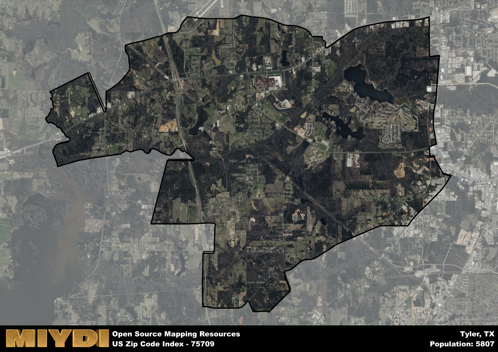

**Area Name:** Tyler

**Zip Code:** 75709

**State:** TX

Tyler is a part of the Tyler - TX Metro Area, and makes up  of the Metro's population.  

# Tyler, Texas 75709: A Vibrant Neighborhood in the Heart of East Texas

Located in the heart of East Texas, the zip code 75709 corresponds to the vibrant neighborhood of Tyler. Bordered by Loop 323 to the north and Highway 110 to the east, Tyler seamlessly integrates with surrounding districts and cities such as Whitehouse and Noonday. As part of the larger Tyler metropolitan area, the zip code area serves as a bustling residential and commercial hub for residents and visitors alike.

Dating back to the mid-19th century, Tyler has a rich historical narrative that has shaped its current identity. Originally settled by European immigrants, Tyler grew rapidly due to its prime location along major transportation routes. Over the years, the area has experienced significant growth and development, becoming known for its charming neighborhoods, thriving economy, and vibrant cultural scene. The name "Tyler" itself is said to have been chosen in honor of President John Tyler.

Today, the zip code 75709 area boasts a diverse array of economic activities, ranging from healthcare and education to retail and manufacturing. Residents enjoy access to a variety of neighborhood-specific services, including schools, grocery stores, and healthcare facilities. Additionally, the area is home to numerous recreational amenities and cultural attractions, such as parks, museums, and historic sites, making it a desirable place to live and visit within the larger urban fabric of Tyler.

# Tyler Demographics

The population of Tyler is 5807.  
Tyler has a population density of 265.77 per square mile.  
The area of Tyler is 21.85 square miles.  

## Tyler Income and Economic Data

These demographic numbers are sourced from IRS return data, providing comprehensive insights into the population dynamics and economic trends within Tyler.

**Breakdown of return types for Tyler**

The table offers insight into the composition of tax returns filed with the IRS, categorizing them into three main types. Single returns represent filings by individuals, joint returns by married couples, and head of household returns by individuals who qualify as heads of households, typically having dependents. This breakdown provides an understanding of the different filing statuses adopted by taxpayers when submitting their tax documentation.

| Return Types filed for Tyler                              | Percentage          |
|----------------------------------------------------------|---------------------|
| Single Returns                                            | 0.49 |
| Joint Returns                                             | 0.34 |
| Head Household Returns                                    | 0.15 |

The income and economic data presented here is sourced from the IRS income brackets, utilized for categorizing tax returns by income levels. This table displays income ranges for both single filers and married couples, along with the corresponding number of returns and the percentage within each bracket, providing valuable insight into the distribution of taxes across various income groups.

| Bracket Name       | Single Filer Income Range | Married Couple Range | Number of Returns | Percentage of Returns |
|--------------------|----------------------------|----------------------|-------------------|-----------------------|
| 10% Bracket        | Up to $10,275              | Up to $20,550        | 980 | 0.34% |
| 12% Bracket        | $10,276 - $41,775          | $20,551 - $83,550    | 800 | 0.27% |
| 22% Bracket        | $41,776 - $89,075          | $83,551 - $178,150   | 440 | 0.15% |
| 24% Bracket        | $89,076 - $170,050         | $178,151 - $340,100  | 270 | 0.09% |
| 32% Bracket        | $170,051 - $215,950        | $340,101 - $431,900  | 280 | 0.1% |
| 35% Bracket        | $215,951 - $539,900        | $431,901 - $647,850  | 150 | 0.05% |

### Exploring Taxpayer Diversity: A Breakdown of Different Types of Tax Returns in Tyler

The table offers insights into various types of tax returns filed, reflecting different aspects of taxpayer activities and demographics. Categories include charitable returns for donations, dependent returns for claimed dependents, educator population, elderly population, real estate returns, self-employment returns, student loan returns, and unemployment returns, providing valuable insights into taxpayer behavior and demographics.

| Tyler Filing Types                    | Count | Percentage |
|--------------------------------------|-------|------------|
| Charitable Donations                 | 180 | 0.062% |
| Dependents Claimed                   | 110 | 0.038% |
| Educator Residents                   | 60 | 0.021% |
| Elderly Population                   | 750 | 0.26% |
| Farming Population                   | 60 | 0.021% |
| Real Estate Transactions             | 150 | 0.051% |
| Self-Employed Individuals            | 400 | 0.137% |
| Student Loan Cases                   | 170 | 0.058% |
| Unemployment Benefit Filings         | 420 | 0.14% |

## Tyler AI and Census Variables

The values presented in this dataset for Tyler are AI-optimized, streamlined, and categorized into relevant buckets for enhanced utility in AI and mapping programs. These simplified values have been optimized to facilitate efficient analysis and integration into various technological applications, offering users accessible and actionable insights into demographics within the Tyler area.

| AI Variables for Tyler | Value |
|-------------|-------|
| Shape Area | 79452342.3398438 |
| Shape Length | 50956.7015988783 |
| CBSA Federal Processing Standard Code | 46340 |

## How to use this free AI optimized Geo-Spatial Data for Tyler, TX

This data is made freely available under the Creative Commons license, allowing for unrestricted use for any purpose. Users can access static resources directly from GitHub or leverage more advanced functionalities by utilizing the GeoJSON files. All datasets originate from official government or private sector sources and are meticulously compiled into relevant datasets within QGIS. However, the versatility of the data ensures compatibility with any mapping application.

## Data Accuracy Disclaimer
It's important to note that the data provided here may contain errors or discrepancies and should be considered as 'close enough' for business applications and AI rather than a definitive source of truth. This data is aggregated from multiple sources, some of which publish information on wildly different intervals, leading to potential inconsistencies. Additionally, certain data points may not be corrected for Covid-related changes, further impacting accuracy. Moreover, the assumption that demographic trends are consistent throughout a region may lead to discrepancies, as trends often concentrate in areas of highest population density. As a result, dense areas may be slightly underrepresented, while rural areas may be slightly overrepresented, resulting in a more conservative dataset. Furthermore, the focus primarily on areas within US Major and Minor Statistical areas means that approximately 40 million Americans living outside of these areas may not be fully represented. Lastly, the historical background and area descriptions generated using AI are susceptible to potential mistakes, so users should exercise caution when interpreting the information provided.
