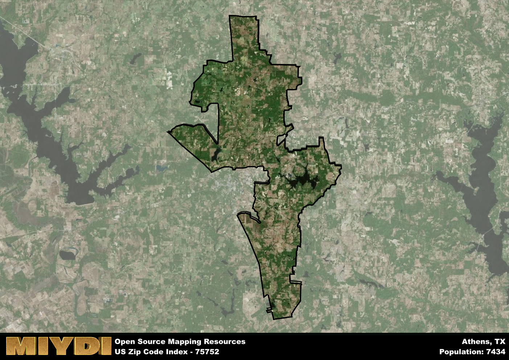

**Area Name:** Athens

**Zip Code:** 75752

**State:** TX

Athens is a part of the Athens - TX Micro Area, and makes up  of the Metro's population.  

# Athens, TX 75752: A Historic Gem in East Texas

Nestled in the heart of East Texas, zip code 75752 corresponds to the charming city of Athens. Bordered by Loop 7 to the north and south, this area seamlessly integrates with nearby communities such as Malakoff to the southeast and Brownsboro to the west. Athens serves as a vital hub within the larger metropolitan context, offering a mix of residential, commercial, and recreational opportunities for its residents and visitors.

With a rich historical legacy, Athens was established in the mid-19th century and quickly flourished as a center for agriculture and trade. The city earned its name from the ancient Greek city of Athens, reflecting its aspirations for culture and education. Over the years, Athens has witnessed significant growth, becoming known for its vibrant downtown area, historic architecture, and annual events such as the Texas Fiddlers Contest and Reunion.

Today, Athens thrives as a dynamic community with a diverse economy that includes agriculture, manufacturing, and tourism. Residents of zip code 75752 enjoy a range of neighborhood-specific services, from local shops and restaurants to parks and recreational facilities. Visitors are drawn to the area's cultural and historic sites, such as the Henderson County Historical Museum and the Athens Scuba Park, making Athens a destination for both history buffs and outdoor enthusiasts alike.

# Athens Demographics

The population of Athens is 7434.  
Athens has a population density of 51.05 per square mile.  
The area of Athens is 145.62 square miles.  

## Athens Income and Economic Data

These demographic numbers are sourced from IRS return data, providing comprehensive insights into the population dynamics and economic trends within Athens.

**Breakdown of return types for Athens**

The table offers insight into the composition of tax returns filed with the IRS, categorizing them into three main types. Single returns represent filings by individuals, joint returns by married couples, and head of household returns by individuals who qualify as heads of households, typically having dependents. This breakdown provides an understanding of the different filing statuses adopted by taxpayers when submitting their tax documentation.

| Return Types filed for Athens                              | Percentage          |
|----------------------------------------------------------|---------------------|
| Single Returns                                            | 0.39 |
| Joint Returns                                             | 0.47 |
| Head Household Returns                                    | 0.12 |

The income and economic data presented here is sourced from the IRS income brackets, utilized for categorizing tax returns by income levels. This table displays income ranges for both single filers and married couples, along with the corresponding number of returns and the percentage within each bracket, providing valuable insight into the distribution of taxes across various income groups.

| Bracket Name       | Single Filer Income Range | Married Couple Range | Number of Returns | Percentage of Returns |
|--------------------|----------------------------|----------------------|-------------------|-----------------------|
| 10% Bracket        | Up to $10,275              | Up to $20,550        | 1070 | 0.34% |
| 12% Bracket        | $10,276 - $41,775          | $20,551 - $83,550    | 820 | 0.26% |
| 22% Bracket        | $41,776 - $89,075          | $83,551 - $178,150   | 430 | 0.14% |
| 24% Bracket        | $89,076 - $170,050         | $178,151 - $340,100  | 290 | 0.09% |
| 32% Bracket        | $170,051 - $215,950        | $340,101 - $431,900  | 430 | 0.14% |
| 35% Bracket        | $215,951 - $539,900        | $431,901 - $647,850  | 130 | 0.04% |

### Exploring Taxpayer Diversity: A Breakdown of Different Types of Tax Returns in Athens

The table offers insights into various types of tax returns filed, reflecting different aspects of taxpayer activities and demographics. Categories include charitable returns for donations, dependent returns for claimed dependents, educator population, elderly population, real estate returns, self-employment returns, student loan returns, and unemployment returns, providing valuable insights into taxpayer behavior and demographics.

| Athens Filing Types                    | Count | Percentage |
|--------------------------------------|-------|------------|
| Charitable Donations                 | 140 | 0.044% |
| Dependents Claimed                   | 70 | 0.022% |
| Educator Residents                   | 60 | 0.019% |
| Elderly Population                   | 1020 | 0.32% |
| Farming Population                   | 310 | 0.098% |
| Real Estate Transactions             | 140 | 0.044% |
| Self-Employed Individuals            | 470 | 0.148% |
| Student Loan Cases                   | 130 | 0.041% |
| Unemployment Benefit Filings         | 340 | 0.11% |

## Athens AI and Census Variables

The values presented in this dataset for Athens are AI-optimized, streamlined, and categorized into relevant buckets for enhanced utility in AI and mapping programs. These simplified values have been optimized to facilitate efficient analysis and integration into various technological applications, offering users accessible and actionable insights into demographics within the Athens area.

| AI Variables for Athens | Value |
|-------------|-------|
| Shape Area | 528758008.503906 |
| Shape Length | 205950.926648847 |
| CBSA Federal Processing Standard Code | 11980 |

## How to use this free AI optimized Geo-Spatial Data for Athens, TX

This data is made freely available under the Creative Commons license, allowing for unrestricted use for any purpose. Users can access static resources directly from GitHub or leverage more advanced functionalities by utilizing the GeoJSON files. All datasets originate from official government or private sector sources and are meticulously compiled into relevant datasets within QGIS. However, the versatility of the data ensures compatibility with any mapping application.

## Data Accuracy Disclaimer
It's important to note that the data provided here may contain errors or discrepancies and should be considered as 'close enough' for business applications and AI rather than a definitive source of truth. This data is aggregated from multiple sources, some of which publish information on wildly different intervals, leading to potential inconsistencies. Additionally, certain data points may not be corrected for Covid-related changes, further impacting accuracy. Moreover, the assumption that demographic trends are consistent throughout a region may lead to discrepancies, as trends often concentrate in areas of highest population density. As a result, dense areas may be slightly underrepresented, while rural areas may be slightly overrepresented, resulting in a more conservative dataset. Furthermore, the focus primarily on areas within US Major and Minor Statistical areas means that approximately 40 million Americans living outside of these areas may not be fully represented. Lastly, the historical background and area descriptions generated using AI are susceptible to potential mistakes, so users should exercise caution when interpreting the information provided.
