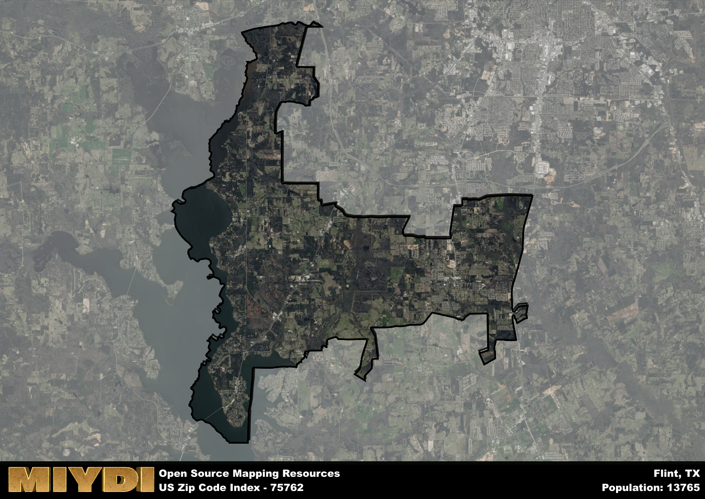

**Area Name:** Flint

**Zip Code:** 75762

**State:** TX

Flint is a part of the Tyler - TX Metro Area, and makes up  of the Metro's population.  

# Headline  
Flint, Texas: A Charming Community in the Heart of East Texas  

Flint, located in the zip code 75762, is a quaint community situated in the heart of East Texas. Bordered by Tyler to the north and Bullard to the south, Flint is part of the larger metropolitan area of Tyler, known for its vibrant cultural scene and strong economic base. The zip code area of 75762 seamlessly integrates with surrounding neighborhoods, offering residents easy access to major highways and amenities within the region.  

The history of Flint dates back to the early 19th century when it was originally settled as a farming community. Over the years, the area experienced steady growth due to its fertile land and strategic location along important trade routes. In the late 1800s, the town was officially named Flint, a nod to the abundance of flint rocks found in the area. Today, Flint maintains its small-town charm while embracing modern development, making it a sought-after residential destination in East Texas.  

Presently, Flint boasts a thriving community with a mix of residential neighborhoods and commercial establishments. The area is known for its family-friendly atmosphere, excellent schools, and a variety of recreational opportunities such as parks, lakes, and hiking trails. Residents of Flint enjoy a range of local services, including shops, restaurants, and community centers, creating a close-knit and welcoming environment for all who call this East Texas gem home.

# Flint Demographics

The population of Flint is 13765.  
Flint has a population density of 276.63 per square mile.  
The area of Flint is 49.76 square miles.  

## Flint Income and Economic Data

These demographic numbers are sourced from IRS return data, providing comprehensive insights into the population dynamics and economic trends within Flint.

**Breakdown of return types for Flint**

The table offers insight into the composition of tax returns filed with the IRS, categorizing them into three main types. Single returns represent filings by individuals, joint returns by married couples, and head of household returns by individuals who qualify as heads of households, typically having dependents. This breakdown provides an understanding of the different filing statuses adopted by taxpayers when submitting their tax documentation.

| Return Types filed for Flint                              | Percentage          |
|----------------------------------------------------------|---------------------|
| Single Returns                                            | 0.4 |
| Joint Returns                                             | 0.48 |
| Head Household Returns                                    | 0.1 |

The income and economic data presented here is sourced from the IRS income brackets, utilized for categorizing tax returns by income levels. This table displays income ranges for both single filers and married couples, along with the corresponding number of returns and the percentage within each bracket, providing valuable insight into the distribution of taxes across various income groups.

| Bracket Name       | Single Filer Income Range | Married Couple Range | Number of Returns | Percentage of Returns |
|--------------------|----------------------------|----------------------|-------------------|-----------------------|
| 10% Bracket        | Up to $10,275              | Up to $20,550        | 1790 | 0.27% |
| 12% Bracket        | $10,276 - $41,775          | $20,551 - $83,550    | 1440 | 0.22% |
| 22% Bracket        | $41,776 - $89,075          | $83,551 - $178,150   | 960 | 0.15% |
| 24% Bracket        | $89,076 - $170,050         | $178,151 - $340,100  | 750 | 0.12% |
| 32% Bracket        | $170,051 - $215,950        | $340,101 - $431,900  | 1180 | 0.18% |
| 35% Bracket        | $215,951 - $539,900        | $431,901 - $647,850  | 390 | 0.06% |

### Exploring Taxpayer Diversity: A Breakdown of Different Types of Tax Returns in Flint

The table offers insights into various types of tax returns filed, reflecting different aspects of taxpayer activities and demographics. Categories include charitable returns for donations, dependent returns for claimed dependents, educator population, elderly population, real estate returns, self-employment returns, student loan returns, and unemployment returns, providing valuable insights into taxpayer behavior and demographics.

| Flint Filing Types                    | Count | Percentage |
|--------------------------------------|-------|------------|
| Charitable Donations                 | 430 | 0.066% |
| Dependents Claimed                   | 340 | 0.052% |
| Educator Residents                   | 220 | 0.034% |
| Elderly Population                   | 1850 | 0.28% |
| Farming Population                   | 170 | 0.026% |
| Real Estate Transactions             | 460 | 0.071% |
| Self-Employed Individuals            | 1010 | 0.155% |
| Student Loan Cases                   | 460 | 0.071% |
| Unemployment Benefit Filings         | 910 | 0.14% |

## Flint AI and Census Variables

The values presented in this dataset for Flint are AI-optimized, streamlined, and categorized into relevant buckets for enhanced utility in AI and mapping programs. These simplified values have been optimized to facilitate efficient analysis and integration into various technological applications, offering users accessible and actionable insights into demographics within the Flint area.

| AI Variables for Flint | Value |
|-------------|-------|
| Shape Area | 180565478.148438 |
| Shape Length | 116889.035436861 |
| CBSA Federal Processing Standard Code | 46340 |

## How to use this free AI optimized Geo-Spatial Data for Flint, TX

This data is made freely available under the Creative Commons license, allowing for unrestricted use for any purpose. Users can access static resources directly from GitHub or leverage more advanced functionalities by utilizing the GeoJSON files. All datasets originate from official government or private sector sources and are meticulously compiled into relevant datasets within QGIS. However, the versatility of the data ensures compatibility with any mapping application.

## Data Accuracy Disclaimer
It's important to note that the data provided here may contain errors or discrepancies and should be considered as 'close enough' for business applications and AI rather than a definitive source of truth. This data is aggregated from multiple sources, some of which publish information on wildly different intervals, leading to potential inconsistencies. Additionally, certain data points may not be corrected for Covid-related changes, further impacting accuracy. Moreover, the assumption that demographic trends are consistent throughout a region may lead to discrepancies, as trends often concentrate in areas of highest population density. As a result, dense areas may be slightly underrepresented, while rural areas may be slightly overrepresented, resulting in a more conservative dataset. Furthermore, the focus primarily on areas within US Major and Minor Statistical areas means that approximately 40 million Americans living outside of these areas may not be fully represented. Lastly, the historical background and area descriptions generated using AI are susceptible to potential mistakes, so users should exercise caution when interpreting the information provided.
