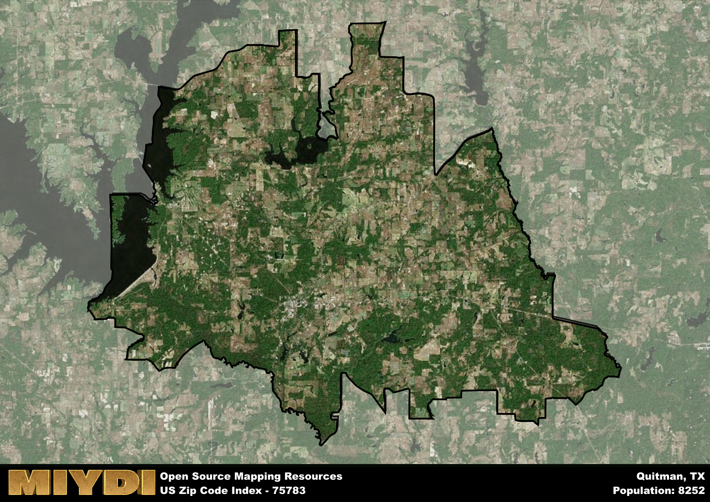

**Area Name:** Quitman

**Zip Code:** 75783

**State:** TX

# Tranquil Quitman: A Hidden Gem in East Texas  

Located in Wood County, Quitman is the charming neighborhood corresponding to the zip code 75783. Situated in the heart of East Texas, Quitman is surrounded by picturesque landscapes and lush greenery. It is conveniently located near major highways, providing easy access to nearby cities such as Tyler and Dallas. Quitman seamlessly integrates with the larger urban fabric of East Texas, offering a peaceful retreat for residents while still being in close proximity to urban amenities.

The history of Quitman dates back to the mid-19th century when it was founded as the seat of Wood County. Originally a small settlement, Quitman grew steadily over the years, attracting settlers with its fertile land and abundant natural resources. The neighborhood was named after John A. Quitman, a prominent Mississippi politician and Mexican-American War hero. Throughout its history, Quitman has maintained its small-town charm and close-knit community feel.

Today, Quitman is a thriving community with a mix of local businesses, restaurants, and shops. The area boasts a strong agricultural sector, with many residents engaged in farming and ranching. Residents and visitors alike can enjoy outdoor recreational activities at the nearby Lake Fork Reservoir, known for its excellent fishing and boating opportunities. Quitman also features historic sites such as the Governor Hogg Shrine Historic Site, offering a glimpse into the area's rich history and cultural heritage.

# Quitman Demographics

The population of Quitman is 8252.  
Quitman has a population density of 63.02 per square mile.  
The area of Quitman is 130.95 square miles.  

## Quitman Income and Economic Data

These demographic numbers are sourced from IRS return data, providing comprehensive insights into the population dynamics and economic trends within Quitman.

**Breakdown of return types for Quitman**

The table offers insight into the composition of tax returns filed with the IRS, categorizing them into three main types. Single returns represent filings by individuals, joint returns by married couples, and head of household returns by individuals who qualify as heads of households, typically having dependents. This breakdown provides an understanding of the different filing statuses adopted by taxpayers when submitting their tax documentation.

| Return Types filed for Quitman                              | Percentage          |
|----------------------------------------------------------|---------------------|
| Single Returns                                            | 0.42 |
| Joint Returns                                             | 0.46 |
| Head Household Returns                                    | 0.1 |

The income and economic data presented here is sourced from the IRS income brackets, utilized for categorizing tax returns by income levels. This table displays income ranges for both single filers and married couples, along with the corresponding number of returns and the percentage within each bracket, providing valuable insight into the distribution of taxes across various income groups.

| Bracket Name       | Single Filer Income Range | Married Couple Range | Number of Returns | Percentage of Returns |
|--------------------|----------------------------|----------------------|-------------------|-----------------------|
| 10% Bracket        | Up to $10,275              | Up to $20,550        | 1290 | 0.37% |
| 12% Bracket        | $10,276 - $41,775          | $20,551 - $83,550    | 900 | 0.26% |
| 22% Bracket        | $41,776 - $89,075          | $83,551 - $178,150   | 500 | 0.14% |
| 24% Bracket        | $89,076 - $170,050         | $178,151 - $340,100  | 320 | 0.09% |
| 32% Bracket        | $170,051 - $215,950        | $340,101 - $431,900  | 390 | 0.11% |
| 35% Bracket        | $215,951 - $539,900        | $431,901 - $647,850  | 90 | 0.03% |

### Exploring Taxpayer Diversity: A Breakdown of Different Types of Tax Returns in Quitman

The table offers insights into various types of tax returns filed, reflecting different aspects of taxpayer activities and demographics. Categories include charitable returns for donations, dependent returns for claimed dependents, educator population, elderly population, real estate returns, self-employment returns, student loan returns, and unemployment returns, providing valuable insights into taxpayer behavior and demographics.

| Quitman Filing Types                    | Count | Percentage |
|--------------------------------------|-------|------------|
| Charitable Donations                 | 110 | 0.032% |
| Dependents Claimed                   | 80 | 0.023% |
| Educator Residents                   | 90 | 0.026% |
| Elderly Population                   | 1310 | 0.38% |
| Farming Population                   | 230 | 0.066% |
| Real Estate Transactions             | 120 | 0.034% |
| Self-Employed Individuals            | 470 | 0.135% |
| Student Loan Cases                   | 120 | 0.034% |
| Unemployment Benefit Filings         | 390 | 0.11% |

## Quitman AI and Census Variables

The values presented in this dataset for Quitman are AI-optimized, streamlined, and categorized into relevant buckets for enhanced utility in AI and mapping programs. These simplified values have been optimized to facilitate efficient analysis and integration into various technological applications, offering users accessible and actionable insights into demographics within the Quitman area.

| AI Variables for Quitman | Value |
|-------------|-------|
| Shape Area | 481579167.6875 |
| Shape Length | 159152.103545655 |

## How to use this free AI optimized Geo-Spatial Data for Quitman, TX

This data is made freely available under the Creative Commons license, allowing for unrestricted use for any purpose. Users can access static resources directly from GitHub or leverage more advanced functionalities by utilizing the GeoJSON files. All datasets originate from official government or private sector sources and are meticulously compiled into relevant datasets within QGIS. However, the versatility of the data ensures compatibility with any mapping application.

## Data Accuracy Disclaimer
It's important to note that the data provided here may contain errors or discrepancies and should be considered as 'close enough' for business applications and AI rather than a definitive source of truth. This data is aggregated from multiple sources, some of which publish information on wildly different intervals, leading to potential inconsistencies. Additionally, certain data points may not be corrected for Covid-related changes, further impacting accuracy. Moreover, the assumption that demographic trends are consistent throughout a region may lead to discrepancies, as trends often concentrate in areas of highest population density. As a result, dense areas may be slightly underrepresented, while rural areas may be slightly overrepresented, resulting in a more conservative dataset. Furthermore, the focus primarily on areas within US Major and Minor Statistical areas means that approximately 40 million Americans living outside of these areas may not be fully represented. Lastly, the historical background and area descriptions generated using AI are susceptible to potential mistakes, so users should exercise caution when interpreting the information provided.
