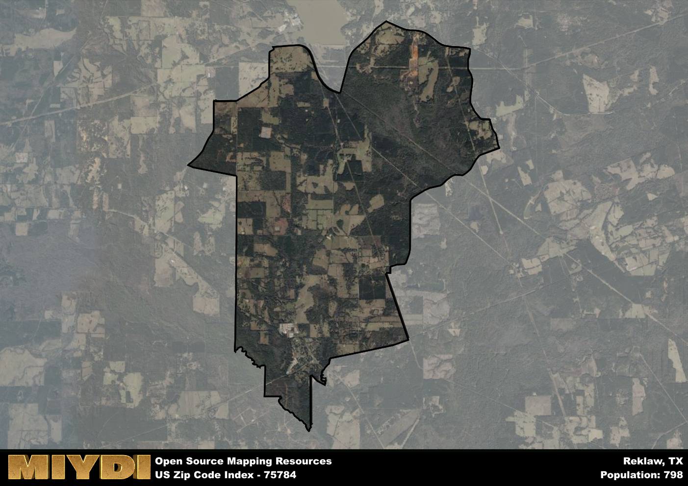

**Area Name:** Reklaw

**Zip Code:** 75784

**State:** TX

Reklaw is a part of the Longview - TX Metro Area, and makes up  of the Metro's population.  

# Reklaw: A Quaint Community in East Texas  

Reklaw, located within the 75784 zip code, is a small, rural community situated in East Texas. Surrounded by rolling hills and lush forests, Reklaw is bordered by the towns of New Summerfield to the east and Minden to the west. Despite its rural setting, Reklaw is just a short drive away from the larger city of Jacksonville, providing residents with access to urban amenities while still enjoying the peaceful charm of country living.

Originally settled in the late 1800s, Reklaw was established as a stop along the railroad line running through East Texas. The town grew steadily as more settlers were drawn to the area for its fertile land and opportunities for farming and ranching. The name "Reklaw" is actually "Walker" spelled backwards, in honor of a prominent local family who played a significant role in the town's development. Over the years, Reklaw has maintained its small-town feel, with a close-knit community that values its rich history and traditions.

Today, Reklaw continues to thrive as a tight-knit community with a strong agricultural presence. The town is home to several local businesses, including family-owned farms and specialty stores. Residents and visitors alike can enjoy the natural beauty of the area by exploring the nearby Davy Crockett National Forest or fishing in one of the many lakes and streams. Reklaw also boasts a historic downtown area with charming shops and cafes, as well as annual events that celebrate the town's heritage.

# Reklaw Demographics

The population of Reklaw is 798.  
Reklaw has a population density of 48.13 per square mile.  
The area of Reklaw is 16.58 square miles.  

## Reklaw Income and Economic Data

These demographic numbers are sourced from IRS return data, providing comprehensive insights into the population dynamics and economic trends within Reklaw.

**Breakdown of return types for Reklaw**

The table offers insight into the composition of tax returns filed with the IRS, categorizing them into three main types. Single returns represent filings by individuals, joint returns by married couples, and head of household returns by individuals who qualify as heads of households, typically having dependents. This breakdown provides an understanding of the different filing statuses adopted by taxpayers when submitting their tax documentation.

| Return Types filed for Reklaw                              | Percentage          |
|----------------------------------------------------------|---------------------|
| Single Returns                                            | 0.42 |
| Joint Returns                                             | 0.42 |
| Head Household Returns                                    | 0.13 |

The income and economic data presented here is sourced from the IRS income brackets, utilized for categorizing tax returns by income levels. This table displays income ranges for both single filers and married couples, along with the corresponding number of returns and the percentage within each bracket, providing valuable insight into the distribution of taxes across various income groups.

| Bracket Name       | Single Filer Income Range | Married Couple Range | Number of Returns | Percentage of Returns |
|--------------------|----------------------------|----------------------|-------------------|-----------------------|
| 10% Bracket        | Up to $10,275              | Up to $20,550        | 110 | 0.35% |
| 12% Bracket        | $10,276 - $41,775          | $20,551 - $83,550    | 100 | 0.32% |
| 22% Bracket        | $41,776 - $89,075          | $83,551 - $178,150   | 50 | 0.16% |
| 24% Bracket        | $89,076 - $170,050         | $178,151 - $340,100  | 20 | 0.06% |
| 32% Bracket        | $170,051 - $215,950        | $340,101 - $431,900  | 30 | 0.1% |
| 35% Bracket        | $215,951 - $539,900        | $431,901 - $647,850  | 0 | 0% |

### Exploring Taxpayer Diversity: A Breakdown of Different Types of Tax Returns in Reklaw

The table offers insights into various types of tax returns filed, reflecting different aspects of taxpayer activities and demographics. Categories include charitable returns for donations, dependent returns for claimed dependents, educator population, elderly population, real estate returns, self-employment returns, student loan returns, and unemployment returns, providing valuable insights into taxpayer behavior and demographics.

| Reklaw Filing Types                    | Count | Percentage |
|--------------------------------------|-------|------------|
| Charitable Donations                 | 0 | 0% |
| Dependents Claimed                   | 0 | 0% |
| Educator Residents                   | 0 | 0% |
| Elderly Population                   | 100 | 0.32% |
| Farming Population                   | 40 | 0.129% |
| Real Estate Transactions             | 0 | 0% |
| Self-Employed Individuals            | 20 | 0.065% |
| Student Loan Cases                   | 0 | 0% |
| Unemployment Benefit Filings         | 50 | 0.16% |

## Reklaw AI and Census Variables

The values presented in this dataset for Reklaw are AI-optimized, streamlined, and categorized into relevant buckets for enhanced utility in AI and mapping programs. These simplified values have been optimized to facilitate efficient analysis and integration into various technological applications, offering users accessible and actionable insights into demographics within the Reklaw area.

| AI Variables for Reklaw | Value |
|-------------|-------|
| Shape Area | 59773678.1953125 |
| Shape Length | 42324.0593371179 |
| CBSA Federal Processing Standard Code | 30980 |

## How to use this free AI optimized Geo-Spatial Data for Reklaw, TX

This data is made freely available under the Creative Commons license, allowing for unrestricted use for any purpose. Users can access static resources directly from GitHub or leverage more advanced functionalities by utilizing the GeoJSON files. All datasets originate from official government or private sector sources and are meticulously compiled into relevant datasets within QGIS. However, the versatility of the data ensures compatibility with any mapping application.

## Data Accuracy Disclaimer
It's important to note that the data provided here may contain errors or discrepancies and should be considered as 'close enough' for business applications and AI rather than a definitive source of truth. This data is aggregated from multiple sources, some of which publish information on wildly different intervals, leading to potential inconsistencies. Additionally, certain data points may not be corrected for Covid-related changes, further impacting accuracy. Moreover, the assumption that demographic trends are consistent throughout a region may lead to discrepancies, as trends often concentrate in areas of highest population density. As a result, dense areas may be slightly underrepresented, while rural areas may be slightly overrepresented, resulting in a more conservative dataset. Furthermore, the focus primarily on areas within US Major and Minor Statistical areas means that approximately 40 million Americans living outside of these areas may not be fully represented. Lastly, the historical background and area descriptions generated using AI are susceptible to potential mistakes, so users should exercise caution when interpreting the information provided.
