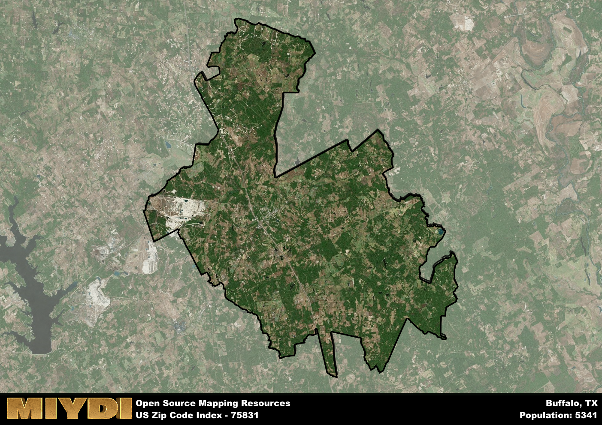

**Area Name:** Buffalo

**Zip Code:** 75831

**State:** TX

# Exploring the Charm of Buffalo, Texas

**Buffalo, Texas** is a picturesque small town located within the 75831 zip code area in Leon County. Situated in the heart of East Texas, Buffalo is surrounded by lush greenery and rolling hills, creating a serene and inviting atmosphere. The town is conveniently located near major highways, allowing for easy access to neighboring cities such as Dallas, Houston, and Austin. Buffalo seamlessly integrates with the larger metropolitan area while maintaining its distinct rural charm.

The history of Buffalo is deeply rooted in its beginnings as a trading post along the Old San Antonio Road in the 1800s. Originally inhabited by Native American tribes, the area saw an influx of settlers drawn to its fertile land and abundant natural resources. The town's growth was further spurred by the arrival of the railroad, solidifying its position as a vital hub for commerce and agriculture. Over the years, Buffalo has retained its small-town ambiance while embracing modern developments.

Today, Buffalo continues to thrive as a close-knit community with a strong focus on agriculture and ranching. The town boasts a variety of local businesses, charming boutiques, and family-owned restaurants that contribute to its unique identity. Residents and visitors alike can enjoy outdoor recreational activities at nearby parks and lakes, immersing themselves in the natural beauty of the region. Buffalo also takes pride in its rich history, with historic sites and museums offering insight into the town's past.

# Buffalo Demographics

The population of Buffalo is 5341.  
Buffalo has a population density of 22.69 per square mile.  
The area of Buffalo is 235.36 square miles.  

## Buffalo Income and Economic Data

These demographic numbers are sourced from IRS return data, providing comprehensive insights into the population dynamics and economic trends within Buffalo.

**Breakdown of return types for Buffalo**

The table offers insight into the composition of tax returns filed with the IRS, categorizing them into three main types. Single returns represent filings by individuals, joint returns by married couples, and head of household returns by individuals who qualify as heads of households, typically having dependents. This breakdown provides an understanding of the different filing statuses adopted by taxpayers when submitting their tax documentation.

| Return Types filed for Buffalo                              | Percentage          |
|----------------------------------------------------------|---------------------|
| Single Returns                                            | 0.4 |
| Joint Returns                                             | 0.45 |
| Head Household Returns                                    | 0.14 |

The income and economic data presented here is sourced from the IRS income brackets, utilized for categorizing tax returns by income levels. This table displays income ranges for both single filers and married couples, along with the corresponding number of returns and the percentage within each bracket, providing valuable insight into the distribution of taxes across various income groups.

| Bracket Name       | Single Filer Income Range | Married Couple Range | Number of Returns | Percentage of Returns |
|--------------------|----------------------------|----------------------|-------------------|-----------------------|
| 10% Bracket        | Up to $10,275              | Up to $20,550        | 820 | 0.38% |
| 12% Bracket        | $10,276 - $41,775          | $20,551 - $83,550    | 540 | 0.25% |
| 22% Bracket        | $41,776 - $89,075          | $83,551 - $178,150   | 300 | 0.14% |
| 24% Bracket        | $89,076 - $170,050         | $178,151 - $340,100  | 210 | 0.1% |
| 32% Bracket        | $170,051 - $215,950        | $340,101 - $431,900  | 260 | 0.12% |
| 35% Bracket        | $215,951 - $539,900        | $431,901 - $647,850  | 50 | 0.02% |

### Exploring Taxpayer Diversity: A Breakdown of Different Types of Tax Returns in Buffalo

The table offers insights into various types of tax returns filed, reflecting different aspects of taxpayer activities and demographics. Categories include charitable returns for donations, dependent returns for claimed dependents, educator population, elderly population, real estate returns, self-employment returns, student loan returns, and unemployment returns, providing valuable insights into taxpayer behavior and demographics.

| Buffalo Filing Types                    | Count | Percentage |
|--------------------------------------|-------|------------|
| Charitable Donations                 | 70 | 0.032% |
| Dependents Claimed                   | 30 | 0.014% |
| Educator Residents                   | 40 | 0.018% |
| Elderly Population                   | 630 | 0.29% |
| Farming Population                   | 240 | 0.11% |
| Real Estate Transactions             | 70 | 0.032% |
| Self-Employed Individuals            | 310 | 0.142% |
| Student Loan Cases                   | 70 | 0.032% |
| Unemployment Benefit Filings         | 240 | 0.11% |

## Buffalo AI and Census Variables

The values presented in this dataset for Buffalo are AI-optimized, streamlined, and categorized into relevant buckets for enhanced utility in AI and mapping programs. These simplified values have been optimized to facilitate efficient analysis and integration into various technological applications, offering users accessible and actionable insights into demographics within the Buffalo area.

| AI Variables for Buffalo | Value |
|-------------|-------|
| Shape Area | 840332138.15625 |
| Shape Length | 219262.453445167 |

## How to use this free AI optimized Geo-Spatial Data for Buffalo, TX

This data is made freely available under the Creative Commons license, allowing for unrestricted use for any purpose. Users can access static resources directly from GitHub or leverage more advanced functionalities by utilizing the GeoJSON files. All datasets originate from official government or private sector sources and are meticulously compiled into relevant datasets within QGIS. However, the versatility of the data ensures compatibility with any mapping application.

## Data Accuracy Disclaimer
It's important to note that the data provided here may contain errors or discrepancies and should be considered as 'close enough' for business applications and AI rather than a definitive source of truth. This data is aggregated from multiple sources, some of which publish information on wildly different intervals, leading to potential inconsistencies. Additionally, certain data points may not be corrected for Covid-related changes, further impacting accuracy. Moreover, the assumption that demographic trends are consistent throughout a region may lead to discrepancies, as trends often concentrate in areas of highest population density. As a result, dense areas may be slightly underrepresented, while rural areas may be slightly overrepresented, resulting in a more conservative dataset. Furthermore, the focus primarily on areas within US Major and Minor Statistical areas means that approximately 40 million Americans living outside of these areas may not be fully represented. Lastly, the historical background and area descriptions generated using AI are susceptible to potential mistakes, so users should exercise caution when interpreting the information provided.
