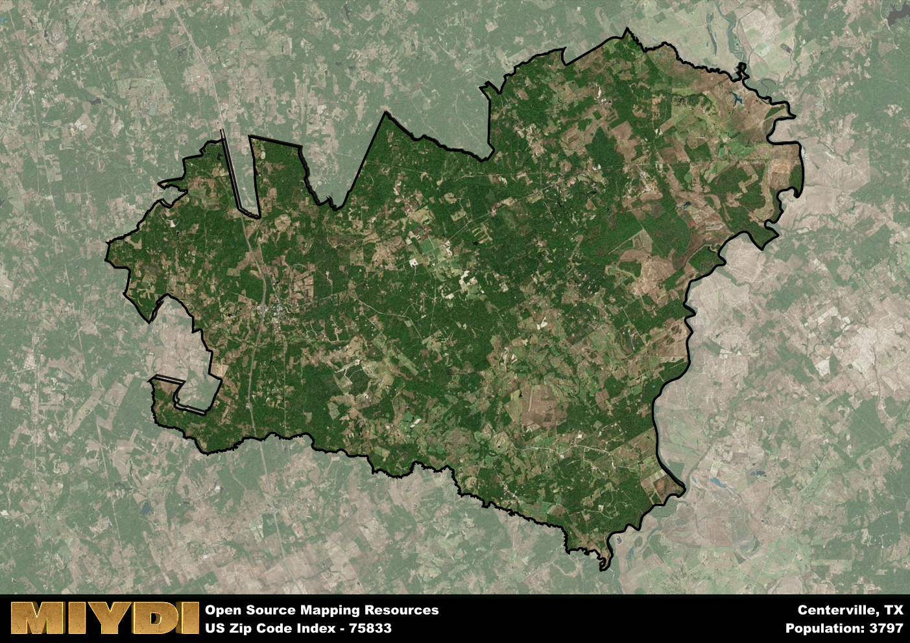

**Area Name:** Centerville

**Zip Code:** 75833

**State:** TX

# Centerville: A Charming Zip Code in East Texas

Located in East Texas, zip code 75833 encompasses the charming town of Centerville. The area is bordered by the Trinity River to the west and is situated within Leon County. Centerville is a quaint and historic town that is approximately an hour's drive from larger cities like Houston and Dallas. It serves as a hub for surrounding rural communities, offering a peaceful retreat from the hustle and bustle of urban life.

Centerville has a rich historical narrative that dates back to its founding in the early 19th century. The town was established as a trading post and grew steadily as settlers were drawn to the fertile lands and abundant natural resources in the area. Centerville played a significant role in the development of East Texas, serving as a center for agriculture, commerce, and community gatherings. The town's name reflects its central location within the county, making it a vital hub for transportation and trade.

Today, Centerville continues to thrive as a close-knit community with a strong sense of pride in its heritage. The area boasts a mix of small businesses, local eateries, and family-owned shops that cater to residents and visitors alike. Centerville is also known for its outdoor recreational opportunities, including fishing and boating on nearby lakes, hiking in scenic parks, and attending local festivals celebrating the town's history. With its picturesque Main Street lined with historic buildings and friendly residents, Centerville remains a hidden gem in East Texas.

# Centerville Demographics

The population of Centerville is 3797.  
Centerville has a population density of 14.03 per square mile.  
The area of Centerville is 270.67 square miles.  

## Centerville Income and Economic Data

These demographic numbers are sourced from IRS return data, providing comprehensive insights into the population dynamics and economic trends within Centerville.

**Breakdown of return types for Centerville**

The table offers insight into the composition of tax returns filed with the IRS, categorizing them into three main types. Single returns represent filings by individuals, joint returns by married couples, and head of household returns by individuals who qualify as heads of households, typically having dependents. This breakdown provides an understanding of the different filing statuses adopted by taxpayers when submitting their tax documentation.

| Return Types filed for Centerville                              | Percentage          |
|----------------------------------------------------------|---------------------|
| Single Returns                                            | 0.4 |
| Joint Returns                                             | 0.49 |
| Head Household Returns                                    | 0.1 |

The income and economic data presented here is sourced from the IRS income brackets, utilized for categorizing tax returns by income levels. This table displays income ranges for both single filers and married couples, along with the corresponding number of returns and the percentage within each bracket, providing valuable insight into the distribution of taxes across various income groups.

| Bracket Name       | Single Filer Income Range | Married Couple Range | Number of Returns | Percentage of Returns |
|--------------------|----------------------------|----------------------|-------------------|-----------------------|
| 10% Bracket        | Up to $10,275              | Up to $20,550        | 520 | 0.34% |
| 12% Bracket        | $10,276 - $41,775          | $20,551 - $83,550    | 360 | 0.24% |
| 22% Bracket        | $41,776 - $89,075          | $83,551 - $178,150   | 210 | 0.14% |
| 24% Bracket        | $89,076 - $170,050         | $178,151 - $340,100  | 150 | 0.1% |
| 32% Bracket        | $170,051 - $215,950        | $340,101 - $431,900  | 230 | 0.15% |
| 35% Bracket        | $215,951 - $539,900        | $431,901 - $647,850  | 50 | 0.03% |

### Exploring Taxpayer Diversity: A Breakdown of Different Types of Tax Returns in Centerville

The table offers insights into various types of tax returns filed, reflecting different aspects of taxpayer activities and demographics. Categories include charitable returns for donations, dependent returns for claimed dependents, educator population, elderly population, real estate returns, self-employment returns, student loan returns, and unemployment returns, providing valuable insights into taxpayer behavior and demographics.

| Centerville Filing Types                    | Count | Percentage |
|--------------------------------------|-------|------------|
| Charitable Donations                 | 60 | 0.039% |
| Dependents Claimed                   | 30 | 0.02% |
| Educator Residents                   | 50 | 0.033% |
| Elderly Population                   | 550 | 0.36% |
| Farming Population                   | 230 | 0.151% |
| Real Estate Transactions             | 70 | 0.046% |
| Self-Employed Individuals            | 250 | 0.164% |
| Student Loan Cases                   | 60 | 0.039% |
| Unemployment Benefit Filings         | 150 | 0.1% |

## Centerville AI and Census Variables

The values presented in this dataset for Centerville are AI-optimized, streamlined, and categorized into relevant buckets for enhanced utility in AI and mapping programs. These simplified values have been optimized to facilitate efficient analysis and integration into various technological applications, offering users accessible and actionable insights into demographics within the Centerville area.

| AI Variables for Centerville | Value |
|-------------|-------|
| Shape Area | 962568300.46875 |
| Shape Length | 239166.960024543 |

## How to use this free AI optimized Geo-Spatial Data for Centerville, TX

This data is made freely available under the Creative Commons license, allowing for unrestricted use for any purpose. Users can access static resources directly from GitHub or leverage more advanced functionalities by utilizing the GeoJSON files. All datasets originate from official government or private sector sources and are meticulously compiled into relevant datasets within QGIS. However, the versatility of the data ensures compatibility with any mapping application.

## Data Accuracy Disclaimer
It's important to note that the data provided here may contain errors or discrepancies and should be considered as 'close enough' for business applications and AI rather than a definitive source of truth. This data is aggregated from multiple sources, some of which publish information on wildly different intervals, leading to potential inconsistencies. Additionally, certain data points may not be corrected for Covid-related changes, further impacting accuracy. Moreover, the assumption that demographic trends are consistent throughout a region may lead to discrepancies, as trends often concentrate in areas of highest population density. As a result, dense areas may be slightly underrepresented, while rural areas may be slightly overrepresented, resulting in a more conservative dataset. Furthermore, the focus primarily on areas within US Major and Minor Statistical areas means that approximately 40 million Americans living outside of these areas may not be fully represented. Lastly, the historical background and area descriptions generated using AI are susceptible to potential mistakes, so users should exercise caution when interpreting the information provided.
