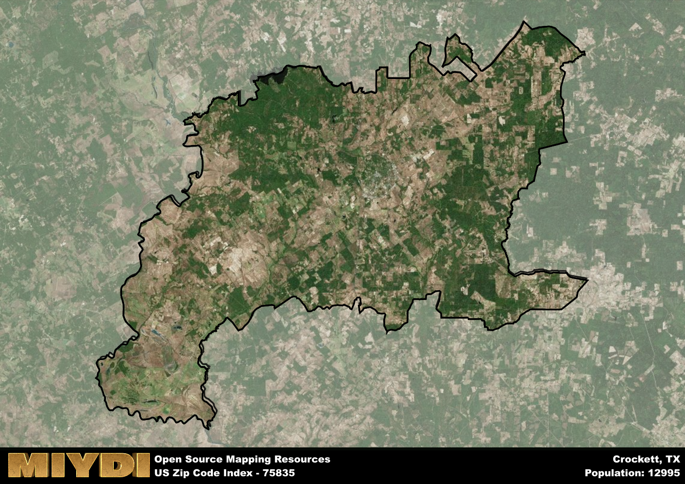

**Area Name:** Crockett

**Zip Code:** 75835

**State:** TX

# Crockett, TX (Zip Code: 75835)

Located in the heart of East Texas, the zip code 75835 corresponds to the charming town of Crockett. Situated within Houston County, Crockett is surrounded by the lush piney woods of the region and is approximately 30 miles southeast of the city of Palestine. The town serves as a vital hub for the surrounding rural communities and is connected to major highways for convenient access to nearby cities like Huntsville and Lufkin.

Crockett has a rich historical heritage dating back to its establishment in the early 19th century. Named after Davy Crockett, the town played a significant role in the Texas Revolution and has preserved many historic sites related to its early settlement. Over the years, Crockett has evolved into a vibrant community known for its hospitality, Southern charm, and strong sense of community pride.

Today, Crockett is a thriving town with a diverse economy supported by agriculture, manufacturing, and tourism. The area boasts a variety of local businesses, restaurants, and shops that cater to residents and visitors alike. Outdoor enthusiasts can enjoy the natural beauty of the area at Davy Crockett National Forest, while history buffs can explore landmarks such as the Monroe-Crook House Museum. Crockett's small-town charm and close-knit community make it a welcoming place to live, work, and visit in East Texas.

# Crockett Demographics

The population of Crockett is 12995.  
Crockett has a population density of 28.21 per square mile.  
The area of Crockett is 460.66 square miles.  

## Crockett Income and Economic Data

These demographic numbers are sourced from IRS return data, providing comprehensive insights into the population dynamics and economic trends within Crockett.

**Breakdown of return types for Crockett**

The table offers insight into the composition of tax returns filed with the IRS, categorizing them into three main types. Single returns represent filings by individuals, joint returns by married couples, and head of household returns by individuals who qualify as heads of households, typically having dependents. This breakdown provides an understanding of the different filing statuses adopted by taxpayers when submitting their tax documentation.

| Return Types filed for Crockett                              | Percentage          |
|----------------------------------------------------------|---------------------|
| Single Returns                                            | 0.45 |
| Joint Returns                                             | 0.33 |
| Head Household Returns                                    | 0.2 |

The income and economic data presented here is sourced from the IRS income brackets, utilized for categorizing tax returns by income levels. This table displays income ranges for both single filers and married couples, along with the corresponding number of returns and the percentage within each bracket, providing valuable insight into the distribution of taxes across various income groups.

| Bracket Name       | Single Filer Income Range | Married Couple Range | Number of Returns | Percentage of Returns |
|--------------------|----------------------------|----------------------|-------------------|-----------------------|
| 10% Bracket        | Up to $10,275              | Up to $20,550        | 2070 | 0.45% |
| 12% Bracket        | $10,276 - $41,775          | $20,551 - $83,550    | 1240 | 0.27% |
| 22% Bracket        | $41,776 - $89,075          | $83,551 - $178,150   | 550 | 0.12% |
| 24% Bracket        | $89,076 - $170,050         | $178,151 - $340,100  | 310 | 0.07% |
| 32% Bracket        | $170,051 - $215,950        | $340,101 - $431,900  | 390 | 0.08% |
| 35% Bracket        | $215,951 - $539,900        | $431,901 - $647,850  | 80 | 0.02% |

### Exploring Taxpayer Diversity: A Breakdown of Different Types of Tax Returns in Crockett

The table offers insights into various types of tax returns filed, reflecting different aspects of taxpayer activities and demographics. Categories include charitable returns for donations, dependent returns for claimed dependents, educator population, elderly population, real estate returns, self-employment returns, student loan returns, and unemployment returns, providing valuable insights into taxpayer behavior and demographics.

| Crockett Filing Types                    | Count | Percentage |
|--------------------------------------|-------|------------|
| Charitable Donations                 | 110 | 0.024% |
| Dependents Claimed                   | 90 | 0.019% |
| Educator Residents                   | 80 | 0.017% |
| Elderly Population                   | 1360 | 0.29% |
| Farming Population                   | 390 | 0.084% |
| Real Estate Transactions             | 120 | 0.026% |
| Self-Employed Individuals            | 560 | 0.121% |
| Student Loan Cases                   | 140 | 0.03% |
| Unemployment Benefit Filings         | 460 | 0.1% |

## Crockett AI and Census Variables

The values presented in this dataset for Crockett are AI-optimized, streamlined, and categorized into relevant buckets for enhanced utility in AI and mapping programs. These simplified values have been optimized to facilitate efficient analysis and integration into various technological applications, offering users accessible and actionable insights into demographics within the Crockett area.

| AI Variables for Crockett | Value |
|-------------|-------|
| Shape Area | 1638657171.85156 |
| Shape Length | 324778.204032759 |

## How to use this free AI optimized Geo-Spatial Data for Crockett, TX

This data is made freely available under the Creative Commons license, allowing for unrestricted use for any purpose. Users can access static resources directly from GitHub or leverage more advanced functionalities by utilizing the GeoJSON files. All datasets originate from official government or private sector sources and are meticulously compiled into relevant datasets within QGIS. However, the versatility of the data ensures compatibility with any mapping application.

## Data Accuracy Disclaimer
It's important to note that the data provided here may contain errors or discrepancies and should be considered as 'close enough' for business applications and AI rather than a definitive source of truth. This data is aggregated from multiple sources, some of which publish information on wildly different intervals, leading to potential inconsistencies. Additionally, certain data points may not be corrected for Covid-related changes, further impacting accuracy. Moreover, the assumption that demographic trends are consistent throughout a region may lead to discrepancies, as trends often concentrate in areas of highest population density. As a result, dense areas may be slightly underrepresented, while rural areas may be slightly overrepresented, resulting in a more conservative dataset. Furthermore, the focus primarily on areas within US Major and Minor Statistical areas means that approximately 40 million Americans living outside of these areas may not be fully represented. Lastly, the historical background and area descriptions generated using AI are susceptible to potential mistakes, so users should exercise caution when interpreting the information provided.
