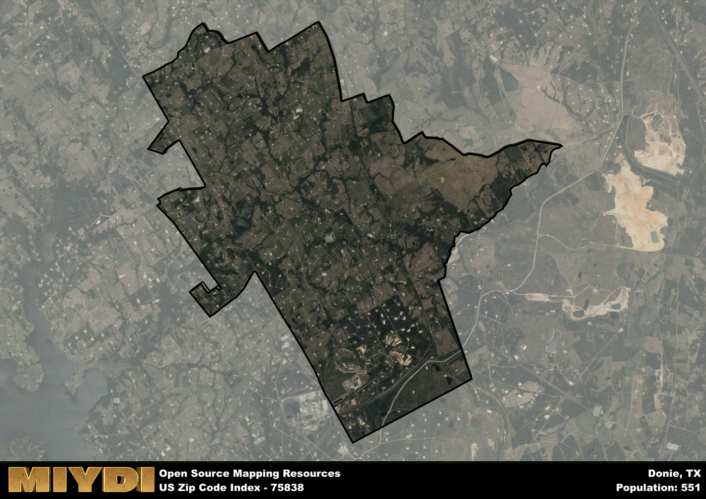

**Area Name:** Donie

**Zip Code:** 75838

**State:** TX

# Discover Donie: A Unique Community in Zip Code 75838  

Donie, located within the zip code 75838, is a small rural community nestled in Freestone County, Texas. The area is bordered by the towns of Teague to the north and Fairfield to the south, integrating seamlessly with the surrounding countryside and farmland. Donie is a part of the larger metropolitan context of the Dallas-Fort Worth metroplex, serving as a charming retreat from the hustle and bustle of city life while still maintaining close proximity to urban amenities.

The history of Donie dates back to the late 19th century when the town was established as a stop along the railroad line. Originally known as Donie Junction, the area flourished as a hub for trade and transportation, attracting settlers looking to capitalize on the booming economy. Over the years, Donie evolved into a tight-knit community with a rich cultural heritage, shaped by the contributions of its diverse residents and the enduring legacy of its pioneer past.

Today, Donie maintains its small-town charm while offering a range of modern conveniences and services to its residents. The area is home to a mix of agricultural and industrial businesses, providing employment opportunities for locals. Donie also boasts a variety of recreational amenities, including parks, community centers, and historic sites that showcase the town's unique character. With its picturesque surroundings and vibrant community spirit, Donie continues to be a hidden gem in the heart of Texas.

# Donie Demographics

The population of Donie is 551.  
Donie has a population density of 14.03 per square mile.  
The area of Donie is 39.28 square miles.  

## Donie Income and Economic Data

These demographic numbers are sourced from IRS return data, providing comprehensive insights into the population dynamics and economic trends within Donie.

**Breakdown of return types for Donie**

The table offers insight into the composition of tax returns filed with the IRS, categorizing them into three main types. Single returns represent filings by individuals, joint returns by married couples, and head of household returns by individuals who qualify as heads of households, typically having dependents. This breakdown provides an understanding of the different filing statuses adopted by taxpayers when submitting their tax documentation.

| Return Types filed for Donie                              | Percentage          |
|----------------------------------------------------------|---------------------|
| Single Returns                                            | 0.41 |
| Joint Returns                                             | 0.48 |
| Head Household Returns                                    | 0.07 |

The income and economic data presented here is sourced from the IRS income brackets, utilized for categorizing tax returns by income levels. This table displays income ranges for both single filers and married couples, along with the corresponding number of returns and the percentage within each bracket, providing valuable insight into the distribution of taxes across various income groups.

| Bracket Name       | Single Filer Income Range | Married Couple Range | Number of Returns | Percentage of Returns |
|--------------------|----------------------------|----------------------|-------------------|-----------------------|
| 10% Bracket        | Up to $10,275              | Up to $20,550        | 90 | 0.31% |
| 12% Bracket        | $10,276 - $41,775          | $20,551 - $83,550    | 70 | 0.24% |
| 22% Bracket        | $41,776 - $89,075          | $83,551 - $178,150   | 50 | 0.17% |
| 24% Bracket        | $89,076 - $170,050         | $178,151 - $340,100  | 40 | 0.14% |
| 32% Bracket        | $170,051 - $215,950        | $340,101 - $431,900  | 40 | 0.14% |
| 35% Bracket        | $215,951 - $539,900        | $431,901 - $647,850  | 0 | 0% |

### Exploring Taxpayer Diversity: A Breakdown of Different Types of Tax Returns in Donie

The table offers insights into various types of tax returns filed, reflecting different aspects of taxpayer activities and demographics. Categories include charitable returns for donations, dependent returns for claimed dependents, educator population, elderly population, real estate returns, self-employment returns, student loan returns, and unemployment returns, providing valuable insights into taxpayer behavior and demographics.

| Donie Filing Types                    | Count | Percentage |
|--------------------------------------|-------|------------|
| Charitable Donations                 | 0 | 0% |
| Dependents Claimed                   | 0 | 0% |
| Educator Residents                   | 0 | 0% |
| Elderly Population                   | 130 | 0.45% |
| Farming Population                   | 60 | 0.207% |
| Real Estate Transactions             | 0 | 0% |
| Self-Employed Individuals            | 50 | 0.172% |
| Student Loan Cases                   | 0 | 0% |
| Unemployment Benefit Filings         | 30 | 0.1% |

## Donie AI and Census Variables

The values presented in this dataset for Donie are AI-optimized, streamlined, and categorized into relevant buckets for enhanced utility in AI and mapping programs. These simplified values have been optimized to facilitate efficient analysis and integration into various technological applications, offering users accessible and actionable insights into demographics within the Donie area.

| AI Variables for Donie | Value |
|-------------|-------|
| Shape Area | 140317241.617188 |
| Shape Length | 70195.9470765772 |

## How to use this free AI optimized Geo-Spatial Data for Donie, TX

This data is made freely available under the Creative Commons license, allowing for unrestricted use for any purpose. Users can access static resources directly from GitHub or leverage more advanced functionalities by utilizing the GeoJSON files. All datasets originate from official government or private sector sources and are meticulously compiled into relevant datasets within QGIS. However, the versatility of the data ensures compatibility with any mapping application.

## Data Accuracy Disclaimer
It's important to note that the data provided here may contain errors or discrepancies and should be considered as 'close enough' for business applications and AI rather than a definitive source of truth. This data is aggregated from multiple sources, some of which publish information on wildly different intervals, leading to potential inconsistencies. Additionally, certain data points may not be corrected for Covid-related changes, further impacting accuracy. Moreover, the assumption that demographic trends are consistent throughout a region may lead to discrepancies, as trends often concentrate in areas of highest population density. As a result, dense areas may be slightly underrepresented, while rural areas may be slightly overrepresented, resulting in a more conservative dataset. Furthermore, the focus primarily on areas within US Major and Minor Statistical areas means that approximately 40 million Americans living outside of these areas may not be fully represented. Lastly, the historical background and area descriptions generated using AI are susceptible to potential mistakes, so users should exercise caution when interpreting the information provided.
