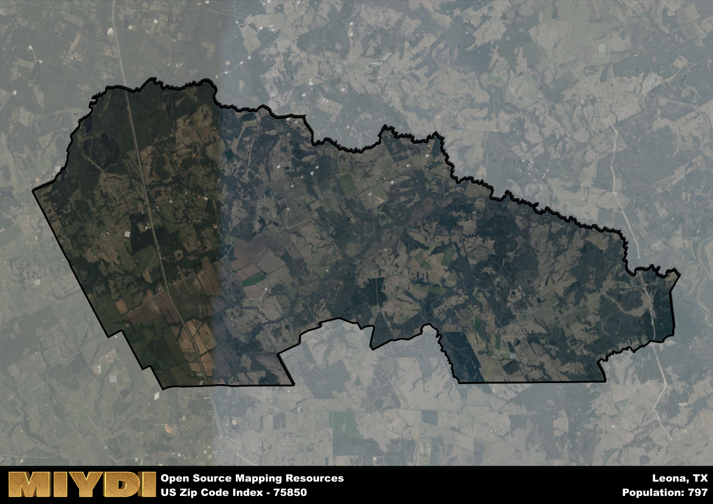

**Area Name:** Leona

**Zip Code:** 75850

**State:** TX

# Discover the Charming Community of Leona, 75850

Located in the heart of Texas, the zip code area 75850 corresponds to the quaint community of Leona. Situated in Leon County, Leona is surrounded by the cities of Centerville to the north and Madisonville to the south. This rural area is characterized by rolling hills, lush greenery, and a tight-knit community that values its peaceful surroundings.

Leona was founded in the late 19th century and quickly became a hub for farming and ranching activities. The area's growth was fueled by the arrival of the railroad, which facilitated the transportation of goods and people. Over the years, Leona has maintained its small-town charm while adapting to modern developments. The name "Leona" is believed to have been inspired by a local woman named Leona Bowman.

Today, Leona boasts a thriving agricultural industry, with many residents engaged in farming and livestock raising. The community offers essential services such as a post office, schools, and local shops. Outdoor enthusiasts can enjoy the nearby parks and recreational areas, while history buffs can explore the town's historic sites, including the Leona Railroad Depot. With its peaceful atmosphere and rich history, Leona continues to be a beloved destination in Leon County.

# Leona Demographics

The population of Leona is 797.  
Leona has a population density of 12.69 per square mile.  
The area of Leona is 62.82 square miles.  

## Leona Income and Economic Data

These demographic numbers are sourced from IRS return data, providing comprehensive insights into the population dynamics and economic trends within Leona.

**Breakdown of return types for Leona**

The table offers insight into the composition of tax returns filed with the IRS, categorizing them into three main types. Single returns represent filings by individuals, joint returns by married couples, and head of household returns by individuals who qualify as heads of households, typically having dependents. This breakdown provides an understanding of the different filing statuses adopted by taxpayers when submitting their tax documentation.

| Return Types filed for Leona                              | Percentage          |
|----------------------------------------------------------|---------------------|
| Single Returns                                            | 0.33 |
| Joint Returns                                             | 0.52 |
| Head Household Returns                                    | 0.19 |

The income and economic data presented here is sourced from the IRS income brackets, utilized for categorizing tax returns by income levels. This table displays income ranges for both single filers and married couples, along with the corresponding number of returns and the percentage within each bracket, providing valuable insight into the distribution of taxes across various income groups.

| Bracket Name       | Single Filer Income Range | Married Couple Range | Number of Returns | Percentage of Returns |
|--------------------|----------------------------|----------------------|-------------------|-----------------------|
| 10% Bracket        | Up to $10,275              | Up to $20,550        | 80 | 0.38% |
| 12% Bracket        | $10,276 - $41,775          | $20,551 - $83,550    | 50 | 0.24% |
| 22% Bracket        | $41,776 - $89,075          | $83,551 - $178,150   | 30 | 0.14% |
| 24% Bracket        | $89,076 - $170,050         | $178,151 - $340,100  | 20 | 0.1% |
| 32% Bracket        | $170,051 - $215,950        | $340,101 - $431,900  | 30 | 0.14% |
| 35% Bracket        | $215,951 - $539,900        | $431,901 - $647,850  | 0 | 0% |

### Exploring Taxpayer Diversity: A Breakdown of Different Types of Tax Returns in Leona

The table offers insights into various types of tax returns filed, reflecting different aspects of taxpayer activities and demographics. Categories include charitable returns for donations, dependent returns for claimed dependents, educator population, elderly population, real estate returns, self-employment returns, student loan returns, and unemployment returns, providing valuable insights into taxpayer behavior and demographics.

| Leona Filing Types                    | Count | Percentage |
|--------------------------------------|-------|------------|
| Charitable Donations                 | 0 | 0% |
| Dependents Claimed                   | 0 | 0% |
| Educator Residents                   | 0 | 0% |
| Elderly Population                   | 80 | 0.38% |
| Farming Population                   | 40 | 0.19% |
| Real Estate Transactions             | 0 | 0% |
| Self-Employed Individuals            | 30 | 0.143% |
| Student Loan Cases                   | 0 | 0% |
| Unemployment Benefit Filings         | 30 | 0.14% |

## Leona AI and Census Variables

The values presented in this dataset for Leona are AI-optimized, streamlined, and categorized into relevant buckets for enhanced utility in AI and mapping programs. These simplified values have been optimized to facilitate efficient analysis and integration into various technological applications, offering users accessible and actionable insights into demographics within the Leona area.

| AI Variables for Leona | Value |
|-------------|-------|
| Shape Area | 222765072.617188 |
| Shape Length | 94042.8748536313 |

## How to use this free AI optimized Geo-Spatial Data for Leona, TX

This data is made freely available under the Creative Commons license, allowing for unrestricted use for any purpose. Users can access static resources directly from GitHub or leverage more advanced functionalities by utilizing the GeoJSON files. All datasets originate from official government or private sector sources and are meticulously compiled into relevant datasets within QGIS. However, the versatility of the data ensures compatibility with any mapping application.

## Data Accuracy Disclaimer
It's important to note that the data provided here may contain errors or discrepancies and should be considered as 'close enough' for business applications and AI rather than a definitive source of truth. This data is aggregated from multiple sources, some of which publish information on wildly different intervals, leading to potential inconsistencies. Additionally, certain data points may not be corrected for Covid-related changes, further impacting accuracy. Moreover, the assumption that demographic trends are consistent throughout a region may lead to discrepancies, as trends often concentrate in areas of highest population density. As a result, dense areas may be slightly underrepresented, while rural areas may be slightly overrepresented, resulting in a more conservative dataset. Furthermore, the focus primarily on areas within US Major and Minor Statistical areas means that approximately 40 million Americans living outside of these areas may not be fully represented. Lastly, the historical background and area descriptions generated using AI are susceptible to potential mistakes, so users should exercise caution when interpreting the information provided.
