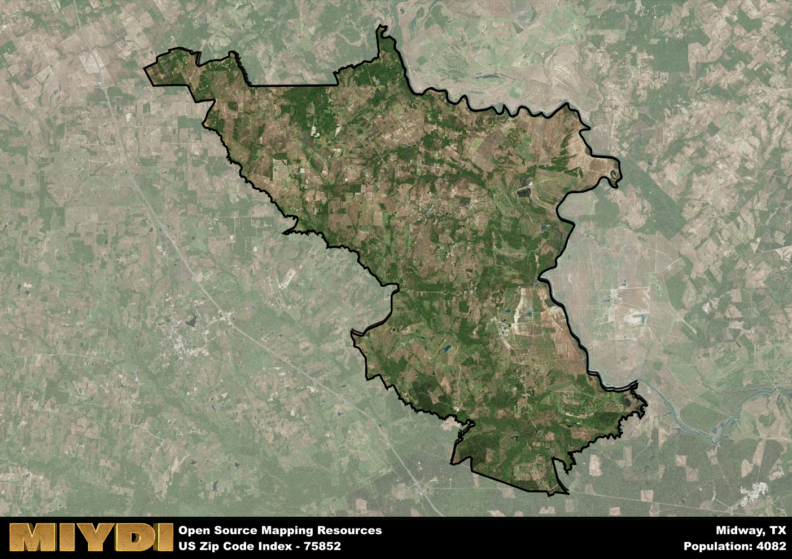

**Area Name:** Midway

**Zip Code:** 75852

**State:** TX

Midway is a part of the Huntsville - TX Micro Area, and makes up  of the Metro's population.  

# Midway: A Hidden Gem in East Texas  

Located in the heart of East Texas, zip code 75852 encompasses the charming neighborhood of Midway. Bordered by lush forests and rolling hills, Midway seamlessly integrates with the nearby cities of Palestine and Crockett, offering a peaceful retreat from the bustling urban centers. Situated within the larger metropolitan context, Midway serves as a gateway to the region's natural beauty, attracting visitors seeking outdoor adventures and a slower pace of life.

Midway has a rich historical narrative, dating back to its establishment in the mid-19th century. Initially a small settlement along the Old San Antonio Road, Midway flourished with the arrival of the railroad, becoming a thriving hub for trade and commerce. The area's name reflects its strategic location midway between Houston and Dallas, solidifying its importance as a key stop for travelers and settlers moving westward. Over the years, Midway has retained its small-town charm while embracing modern amenities and conveniences.

Today, Midway boasts a vibrant community with a mix of residential neighborhoods, local businesses, and recreational opportunities. The area's economy is driven by agriculture, with farms and ranches dotting the landscape, producing a variety of crops and livestock. Residents and visitors can enjoy the picturesque scenery at Midway Lake Park or explore the historic sites, such as the Midway Cemetery, which offer a glimpse into the area's past. With its friendly atmosphere and natural beauty, Midway remains a hidden gem in East Texas, inviting all to experience its unique charm.

# Midway Demographics

The population of Midway is 4082.  
Midway has a population density of 28.51 per square mile.  
The area of Midway is 143.2 square miles.  

## Midway Income and Economic Data

These demographic numbers are sourced from IRS return data, providing comprehensive insights into the population dynamics and economic trends within Midway.

**Breakdown of return types for Midway**

The table offers insight into the composition of tax returns filed with the IRS, categorizing them into three main types. Single returns represent filings by individuals, joint returns by married couples, and head of household returns by individuals who qualify as heads of households, typically having dependents. This breakdown provides an understanding of the different filing statuses adopted by taxpayers when submitting their tax documentation.

| Return Types filed for Midway                              | Percentage          |
|----------------------------------------------------------|---------------------|
| Single Returns                                            | 0.5 |
| Joint Returns                                             | 0.39 |
| Head Household Returns                                    | 0.12 |

The income and economic data presented here is sourced from the IRS income brackets, utilized for categorizing tax returns by income levels. This table displays income ranges for both single filers and married couples, along with the corresponding number of returns and the percentage within each bracket, providing valuable insight into the distribution of taxes across various income groups.

| Bracket Name       | Single Filer Income Range | Married Couple Range | Number of Returns | Percentage of Returns |
|--------------------|----------------------------|----------------------|-------------------|-----------------------|
| 10% Bracket        | Up to $10,275              | Up to $20,550        | 340 | 0.45% |
| 12% Bracket        | $10,276 - $41,775          | $20,551 - $83,550    | 180 | 0.24% |
| 22% Bracket        | $41,776 - $89,075          | $83,551 - $178,150   | 100 | 0.13% |
| 24% Bracket        | $89,076 - $170,050         | $178,151 - $340,100  | 50 | 0.07% |
| 32% Bracket        | $170,051 - $215,950        | $340,101 - $431,900  | 70 | 0.09% |
| 35% Bracket        | $215,951 - $539,900        | $431,901 - $647,850  | 20 | 0.03% |

### Exploring Taxpayer Diversity: A Breakdown of Different Types of Tax Returns in Midway

The table offers insights into various types of tax returns filed, reflecting different aspects of taxpayer activities and demographics. Categories include charitable returns for donations, dependent returns for claimed dependents, educator population, elderly population, real estate returns, self-employment returns, student loan returns, and unemployment returns, providing valuable insights into taxpayer behavior and demographics.

| Midway Filing Types                    | Count | Percentage |
|--------------------------------------|-------|------------|
| Charitable Donations                 | 20 | 0.026% |
| Dependents Claimed                   | 0 | 0% |
| Educator Residents                   | 0 | 0% |
| Elderly Population                   | 220 | 0.29% |
| Farming Population                   | 130 | 0.171% |
| Real Estate Transactions             | 20 | 0.026% |
| Self-Employed Individuals            | 90 | 0.118% |
| Student Loan Cases                   | 30 | 0.039% |
| Unemployment Benefit Filings         | 80 | 0.11% |

## Midway AI and Census Variables

The values presented in this dataset for Midway are AI-optimized, streamlined, and categorized into relevant buckets for enhanced utility in AI and mapping programs. These simplified values have been optimized to facilitate efficient analysis and integration into various technological applications, offering users accessible and actionable insights into demographics within the Midway area.

| AI Variables for Midway | Value |
|-------------|-------|
| Shape Area | 506456910.75 |
| Shape Length | 179476.128560409 |
| CBSA Federal Processing Standard Code | 26660 |

## How to use this free AI optimized Geo-Spatial Data for Midway, TX

This data is made freely available under the Creative Commons license, allowing for unrestricted use for any purpose. Users can access static resources directly from GitHub or leverage more advanced functionalities by utilizing the GeoJSON files. All datasets originate from official government or private sector sources and are meticulously compiled into relevant datasets within QGIS. However, the versatility of the data ensures compatibility with any mapping application.

## Data Accuracy Disclaimer
It's important to note that the data provided here may contain errors or discrepancies and should be considered as 'close enough' for business applications and AI rather than a definitive source of truth. This data is aggregated from multiple sources, some of which publish information on wildly different intervals, leading to potential inconsistencies. Additionally, certain data points may not be corrected for Covid-related changes, further impacting accuracy. Moreover, the assumption that demographic trends are consistent throughout a region may lead to discrepancies, as trends often concentrate in areas of highest population density. As a result, dense areas may be slightly underrepresented, while rural areas may be slightly overrepresented, resulting in a more conservative dataset. Furthermore, the focus primarily on areas within US Major and Minor Statistical areas means that approximately 40 million Americans living outside of these areas may not be fully represented. Lastly, the historical background and area descriptions generated using AI are susceptible to potential mistakes, so users should exercise caution when interpreting the information provided.
