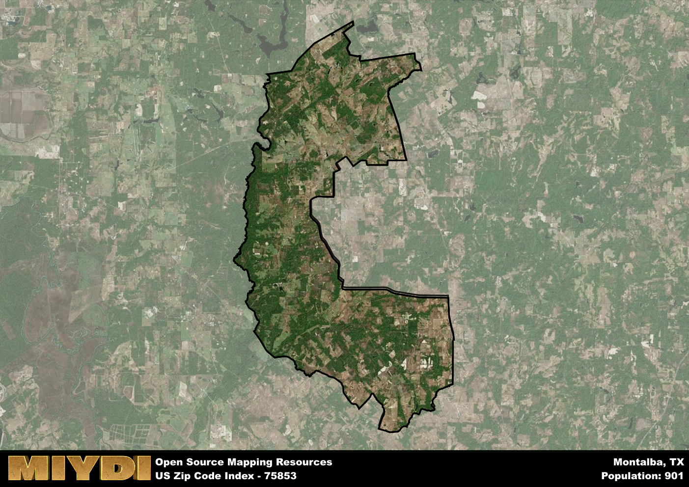

**Area Name:** Montalba

**Zip Code:** 75853

**State:** TX

Montalba is a part of the Palestine - TX Micro Area, and makes up  of the Metro's population.  

# Montalba: A Charming Rural Community in East Texas

Montalba, located in zip code 75853, is a quaint rural community nestled in East Texas. Bordered by rolling hills and lush forests, Montalba is surrounded by other small towns such as Tennessee Colony and Neches. Despite its rural setting, Montalba is within driving distance of larger cities like Tyler and Dallas, allowing residents to enjoy the peaceful countryside while still having access to urban amenities.

Originally settled in the 19th century, Montalba was named after a local landowner and has a rich history rooted in agriculture and ranching. The town experienced growth with the arrival of the railroad, which brought increased commerce and trade to the area. Today, Montalba maintains its small-town charm with historic buildings and family-owned businesses, making it a popular destination for those seeking a slower pace of life.

Montalba is a close-knit community that thrives on agriculture, with many residents working in farming or livestock production. The town offers a variety of services including a local grocery store, post office, and schools, providing essential resources for its residents. In addition to its agricultural roots, Montalba boasts several recreational opportunities such as fishing and hunting, as well as access to nearby state parks for outdoor enthusiasts. Visitors can explore the town's historic sites and enjoy the peaceful surroundings that make Montalba a hidden gem in East Texas.

# Montalba Demographics

The population of Montalba is 901.  
Montalba has a population density of 12.59 per square mile.  
The area of Montalba is 71.57 square miles.  

## Montalba Income and Economic Data

These demographic numbers are sourced from IRS return data, providing comprehensive insights into the population dynamics and economic trends within Montalba.

**Breakdown of return types for Montalba**

The table offers insight into the composition of tax returns filed with the IRS, categorizing them into three main types. Single returns represent filings by individuals, joint returns by married couples, and head of household returns by individuals who qualify as heads of households, typically having dependents. This breakdown provides an understanding of the different filing statuses adopted by taxpayers when submitting their tax documentation.

| Return Types filed for Montalba                              | Percentage          |
|----------------------------------------------------------|---------------------|
| Single Returns                                            | 0.45 |
| Joint Returns                                             | 0.45 |
| Head Household Returns                                    | 0.1 |

The income and economic data presented here is sourced from the IRS income brackets, utilized for categorizing tax returns by income levels. This table displays income ranges for both single filers and married couples, along with the corresponding number of returns and the percentage within each bracket, providing valuable insight into the distribution of taxes across various income groups.

| Bracket Name       | Single Filer Income Range | Married Couple Range | Number of Returns | Percentage of Returns |
|--------------------|----------------------------|----------------------|-------------------|-----------------------|
| 10% Bracket        | Up to $10,275              | Up to $20,550        | 130 | 0.27% |
| 12% Bracket        | $10,276 - $41,775          | $20,551 - $83,550    | 150 | 0.31% |
| 22% Bracket        | $41,776 - $89,075          | $83,551 - $178,150   | 80 | 0.16% |
| 24% Bracket        | $89,076 - $170,050         | $178,151 - $340,100  | 50 | 0.1% |
| 32% Bracket        | $170,051 - $215,950        | $340,101 - $431,900  | 80 | 0.16% |
| 35% Bracket        | $215,951 - $539,900        | $431,901 - $647,850  | 0 | 0% |

### Exploring Taxpayer Diversity: A Breakdown of Different Types of Tax Returns in Montalba

The table offers insights into various types of tax returns filed, reflecting different aspects of taxpayer activities and demographics. Categories include charitable returns for donations, dependent returns for claimed dependents, educator population, elderly population, real estate returns, self-employment returns, student loan returns, and unemployment returns, providing valuable insights into taxpayer behavior and demographics.

| Montalba Filing Types                    | Count | Percentage |
|--------------------------------------|-------|------------|
| Charitable Donations                 | 20 | 0.041% |
| Dependents Claimed                   | 0 | 0% |
| Educator Residents                   | 0 | 0% |
| Elderly Population                   | 190 | 0.39% |
| Farming Population                   | 110 | 0.224% |
| Real Estate Transactions             | 0 | 0% |
| Self-Employed Individuals            | 40 | 0.082% |
| Student Loan Cases                   | 0 | 0% |
| Unemployment Benefit Filings         | 50 | 0.1% |

## Montalba AI and Census Variables

The values presented in this dataset for Montalba are AI-optimized, streamlined, and categorized into relevant buckets for enhanced utility in AI and mapping programs. These simplified values have been optimized to facilitate efficient analysis and integration into various technological applications, offering users accessible and actionable insights into demographics within the Montalba area.

| AI Variables for Montalba | Value |
|-------------|-------|
| Shape Area | 258140367.949219 |
| Shape Length | 115285.461149221 |
| CBSA Federal Processing Standard Code | 37300 |

## How to use this free AI optimized Geo-Spatial Data for Montalba, TX

This data is made freely available under the Creative Commons license, allowing for unrestricted use for any purpose. Users can access static resources directly from GitHub or leverage more advanced functionalities by utilizing the GeoJSON files. All datasets originate from official government or private sector sources and are meticulously compiled into relevant datasets within QGIS. However, the versatility of the data ensures compatibility with any mapping application.

## Data Accuracy Disclaimer
It's important to note that the data provided here may contain errors or discrepancies and should be considered as 'close enough' for business applications and AI rather than a definitive source of truth. This data is aggregated from multiple sources, some of which publish information on wildly different intervals, leading to potential inconsistencies. Additionally, certain data points may not be corrected for Covid-related changes, further impacting accuracy. Moreover, the assumption that demographic trends are consistent throughout a region may lead to discrepancies, as trends often concentrate in areas of highest population density. As a result, dense areas may be slightly underrepresented, while rural areas may be slightly overrepresented, resulting in a more conservative dataset. Furthermore, the focus primarily on areas within US Major and Minor Statistical areas means that approximately 40 million Americans living outside of these areas may not be fully represented. Lastly, the historical background and area descriptions generated using AI are susceptible to potential mistakes, so users should exercise caution when interpreting the information provided.
