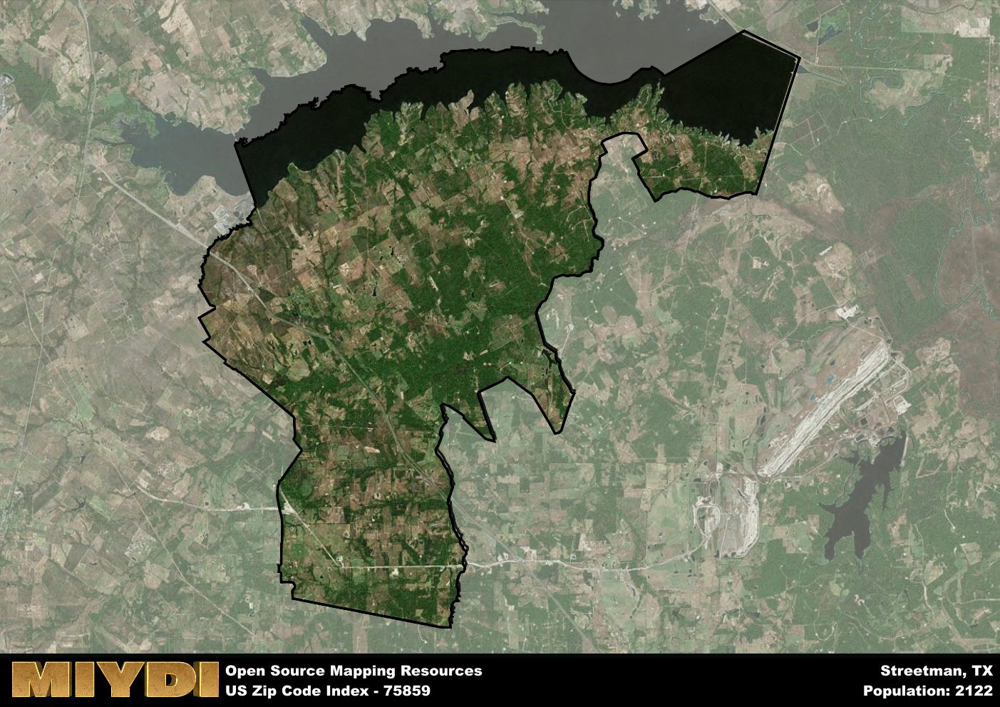

**Area Name:** Streetman

**Zip Code:** 75859

**State:** TX

Streetman is a part of the Corsicana - TX Micro Area, and makes up  of the Metro's population.  

# Discover the Charming Community of Streetman, Zip Code 75859

Nestled in the heart of Texas, the zip code 75859 area corresponds to the charming community of Streetman. Located in Navarro County, Streetman is surrounded by vast farmlands and tranquil countryside, offering residents a peaceful retreat from the hustle and bustle of nearby cities. The area is situated just south of Richland Chambers Lake, providing stunning views and recreational opportunities for locals and visitors alike. Streetman seamlessly integrates with neighboring towns such as Corsicana and Fairfield, contributing to the vibrant tapestry of the region.

The history of Streetman dates back to the late 19th century when the town was established as a hub for cotton production and agriculture. Named after a prominent local landowner, Streetman grew rapidly due to its strategic location along the railroad lines, becoming a vital center for commerce and trade in the region. Over the years, Streetman has maintained its small-town charm while adapting to modern times, preserving its rich heritage and community spirit. Today, the area is home to a close-knit population that takes pride in its historic roots and welcoming atmosphere.

Present-day Streetman offers a mix of residential neighborhoods, local businesses, and recreational facilities that cater to the diverse needs of its residents. Agriculture remains a key economic activity, with many farms and ranches dotting the landscape. The community boasts a range of services, including schools, parks, and small businesses that contribute to its liveliness and sense of community. Residents and visitors can explore the historic downtown area, attend local events, or enjoy outdoor activities such as fishing, boating, and hiking along the lake. Streetman's rich history, natural beauty, and strong sense of community make it a unique gem within the larger urban fabric of Navarro County.

# Streetman Demographics

The population of Streetman is 2122.  
Streetman has a population density of 16.64 per square mile.  
The area of Streetman is 127.53 square miles.  

## Streetman Income and Economic Data

These demographic numbers are sourced from IRS return data, providing comprehensive insights into the population dynamics and economic trends within Streetman.

**Breakdown of return types for Streetman**

The table offers insight into the composition of tax returns filed with the IRS, categorizing them into three main types. Single returns represent filings by individuals, joint returns by married couples, and head of household returns by individuals who qualify as heads of households, typically having dependents. This breakdown provides an understanding of the different filing statuses adopted by taxpayers when submitting their tax documentation.

| Return Types filed for Streetman                              | Percentage          |
|----------------------------------------------------------|---------------------|
| Single Returns                                            | 0.37 |
| Joint Returns                                             | 0.52 |
| Head Household Returns                                    | 0.1 |

The income and economic data presented here is sourced from the IRS income brackets, utilized for categorizing tax returns by income levels. This table displays income ranges for both single filers and married couples, along with the corresponding number of returns and the percentage within each bracket, providing valuable insight into the distribution of taxes across various income groups.

| Bracket Name       | Single Filer Income Range | Married Couple Range | Number of Returns | Percentage of Returns |
|--------------------|----------------------------|----------------------|-------------------|-----------------------|
| 10% Bracket        | Up to $10,275              | Up to $20,550        | 310 | 0.31% |
| 12% Bracket        | $10,276 - $41,775          | $20,551 - $83,550    | 200 | 0.2% |
| 22% Bracket        | $41,776 - $89,075          | $83,551 - $178,150   | 130 | 0.13% |
| 24% Bracket        | $89,076 - $170,050         | $178,151 - $340,100  | 110 | 0.11% |
| 32% Bracket        | $170,051 - $215,950        | $340,101 - $431,900  | 170 | 0.17% |
| 35% Bracket        | $215,951 - $539,900        | $431,901 - $647,850  | 80 | 0.08% |

### Exploring Taxpayer Diversity: A Breakdown of Different Types of Tax Returns in Streetman

The table offers insights into various types of tax returns filed, reflecting different aspects of taxpayer activities and demographics. Categories include charitable returns for donations, dependent returns for claimed dependents, educator population, elderly population, real estate returns, self-employment returns, student loan returns, and unemployment returns, providing valuable insights into taxpayer behavior and demographics.

| Streetman Filing Types                    | Count | Percentage |
|--------------------------------------|-------|------------|
| Charitable Donations                 | 70 | 0.07% |
| Dependents Claimed                   | 0 | 0% |
| Educator Residents                   | 0 | 0% |
| Elderly Population                   | 430 | 0.43% |
| Farming Population                   | 100 | 0.1% |
| Real Estate Transactions             | 80 | 0.08% |
| Self-Employed Individuals            | 170 | 0.17% |
| Student Loan Cases                   | 40 | 0.04% |
| Unemployment Benefit Filings         | 110 | 0.11% |

## Streetman AI and Census Variables

The values presented in this dataset for Streetman are AI-optimized, streamlined, and categorized into relevant buckets for enhanced utility in AI and mapping programs. These simplified values have been optimized to facilitate efficient analysis and integration into various technological applications, offering users accessible and actionable insights into demographics within the Streetman area.

| AI Variables for Streetman | Value |
|-------------|-------|
| Shape Area | 459472973.320313 |
| Shape Length | 148003.158875725 |
| CBSA Federal Processing Standard Code | 18620 |

## How to use this free AI optimized Geo-Spatial Data for Streetman, TX

This data is made freely available under the Creative Commons license, allowing for unrestricted use for any purpose. Users can access static resources directly from GitHub or leverage more advanced functionalities by utilizing the GeoJSON files. All datasets originate from official government or private sector sources and are meticulously compiled into relevant datasets within QGIS. However, the versatility of the data ensures compatibility with any mapping application.

## Data Accuracy Disclaimer
It's important to note that the data provided here may contain errors or discrepancies and should be considered as 'close enough' for business applications and AI rather than a definitive source of truth. This data is aggregated from multiple sources, some of which publish information on wildly different intervals, leading to potential inconsistencies. Additionally, certain data points may not be corrected for Covid-related changes, further impacting accuracy. Moreover, the assumption that demographic trends are consistent throughout a region may lead to discrepancies, as trends often concentrate in areas of highest population density. As a result, dense areas may be slightly underrepresented, while rural areas may be slightly overrepresented, resulting in a more conservative dataset. Furthermore, the focus primarily on areas within US Major and Minor Statistical areas means that approximately 40 million Americans living outside of these areas may not be fully represented. Lastly, the historical background and area descriptions generated using AI are susceptible to potential mistakes, so users should exercise caution when interpreting the information provided.
