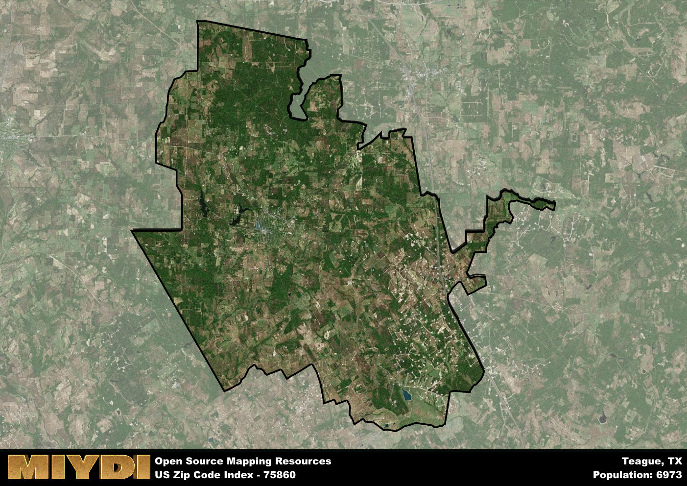

**Area Name:** Teague

**Zip Code:** 75860

**State:** TX

# Teague: A Charming Community in East Texas  
Located in the heart of East Texas, the zip code 75860 area corresponds to the city of Teague. Bordered by Fairfield to the north and Buffalo to the south, Teague is a close-knit community that thrives within the larger context of the East Texas region. It serves as a hub for surrounding rural areas, providing essential services and a sense of community for residents in the vicinity.

Teague has a rich historical background that dates back to its establishment in the late 19th century. Originally a railroad town, Teague experienced rapid growth with the arrival of the Houston and Texas Central Railway. The city was named after a prominent railroad official, Colonel Henry M. Teague. Over the years, Teague has evolved into a charming small town with a blend of historic architecture and modern amenities, preserving its heritage while embracing progress.

Today, Teague boasts a diverse economic landscape, with agriculture and small businesses playing a significant role in the local economy. Residents and visitors can enjoy a range of recreational activities, including parks, sports facilities, and community events. Teague also prides itself on its historic downtown area, featuring quaint shops, restaurants, and landmarks that showcase the city's unique character. With its strong sense of community and rich history, Teague continues to be a welcoming and vibrant destination in East Texas.

# Teague Demographics

The population of Teague is 6973.  
Teague has a population density of 41.92 per square mile.  
The area of Teague is 166.33 square miles.  

## Teague Income and Economic Data

These demographic numbers are sourced from IRS return data, providing comprehensive insights into the population dynamics and economic trends within Teague.

**Breakdown of return types for Teague**

The table offers insight into the composition of tax returns filed with the IRS, categorizing them into three main types. Single returns represent filings by individuals, joint returns by married couples, and head of household returns by individuals who qualify as heads of households, typically having dependents. This breakdown provides an understanding of the different filing statuses adopted by taxpayers when submitting their tax documentation.

| Return Types filed for Teague                              | Percentage          |
|----------------------------------------------------------|---------------------|
| Single Returns                                            | 0.43 |
| Joint Returns                                             | 0.4 |
| Head Household Returns                                    | 0.16 |

The income and economic data presented here is sourced from the IRS income brackets, utilized for categorizing tax returns by income levels. This table displays income ranges for both single filers and married couples, along with the corresponding number of returns and the percentage within each bracket, providing valuable insight into the distribution of taxes across various income groups.

| Bracket Name       | Single Filer Income Range | Married Couple Range | Number of Returns | Percentage of Returns |
|--------------------|----------------------------|----------------------|-------------------|-----------------------|
| 10% Bracket        | Up to $10,275              | Up to $20,550        | 920 | 0.39% |
| 12% Bracket        | $10,276 - $41,775          | $20,551 - $83,550    | 600 | 0.25% |
| 22% Bracket        | $41,776 - $89,075          | $83,551 - $178,150   | 330 | 0.14% |
| 24% Bracket        | $89,076 - $170,050         | $178,151 - $340,100  | 210 | 0.09% |
| 32% Bracket        | $170,051 - $215,950        | $340,101 - $431,900  | 290 | 0.12% |
| 35% Bracket        | $215,951 - $539,900        | $431,901 - $647,850  | 30 | 0.01% |

### Exploring Taxpayer Diversity: A Breakdown of Different Types of Tax Returns in Teague

The table offers insights into various types of tax returns filed, reflecting different aspects of taxpayer activities and demographics. Categories include charitable returns for donations, dependent returns for claimed dependents, educator population, elderly population, real estate returns, self-employment returns, student loan returns, and unemployment returns, providing valuable insights into taxpayer behavior and demographics.

| Teague Filing Types                    | Count | Percentage |
|--------------------------------------|-------|------------|
| Charitable Donations                 | 30 | 0.013% |
| Dependents Claimed                   | 50 | 0.021% |
| Educator Residents                   | 70 | 0.029% |
| Elderly Population                   | 640 | 0.27% |
| Farming Population                   | 260 | 0.109% |
| Real Estate Transactions             | 50 | 0.021% |
| Self-Employed Individuals            | 280 | 0.118% |
| Student Loan Cases                   | 90 | 0.038% |
| Unemployment Benefit Filings         | 230 | 0.1% |

## Teague AI and Census Variables

The values presented in this dataset for Teague are AI-optimized, streamlined, and categorized into relevant buckets for enhanced utility in AI and mapping programs. These simplified values have been optimized to facilitate efficient analysis and integration into various technological applications, offering users accessible and actionable insights into demographics within the Teague area.

| AI Variables for Teague | Value |
|-------------|-------|
| Shape Area | 595940270.742188 |
| Shape Length | 165082.825913113 |

## How to use this free AI optimized Geo-Spatial Data for Teague, TX

This data is made freely available under the Creative Commons license, allowing for unrestricted use for any purpose. Users can access static resources directly from GitHub or leverage more advanced functionalities by utilizing the GeoJSON files. All datasets originate from official government or private sector sources and are meticulously compiled into relevant datasets within QGIS. However, the versatility of the data ensures compatibility with any mapping application.

## Data Accuracy Disclaimer
It's important to note that the data provided here may contain errors or discrepancies and should be considered as 'close enough' for business applications and AI rather than a definitive source of truth. This data is aggregated from multiple sources, some of which publish information on wildly different intervals, leading to potential inconsistencies. Additionally, certain data points may not be corrected for Covid-related changes, further impacting accuracy. Moreover, the assumption that demographic trends are consistent throughout a region may lead to discrepancies, as trends often concentrate in areas of highest population density. As a result, dense areas may be slightly underrepresented, while rural areas may be slightly overrepresented, resulting in a more conservative dataset. Furthermore, the focus primarily on areas within US Major and Minor Statistical areas means that approximately 40 million Americans living outside of these areas may not be fully represented. Lastly, the historical background and area descriptions generated using AI are susceptible to potential mistakes, so users should exercise caution when interpreting the information provided.
