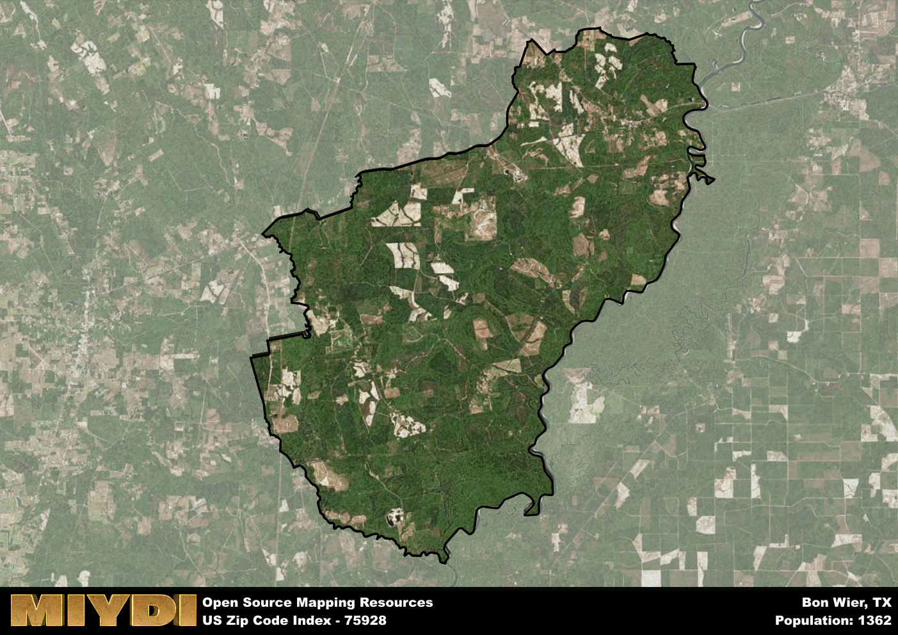

**Area Name:** Bon Wier

**Zip Code:** 75928

**State:** TX

Bon Wier is a part of the DeRidder - LA Micro Area, and makes up  of the Metro's population.  

# Bon Wier: A Hidden Gem in Southeast Texas  

Located in Newton County, Bon Wier is a small unincorporated community within the zip code 75928. Situated near the Texas-Louisiana border, Bon Wier is surrounded by the towns of Merryville and DeRidder in Louisiana, as well as the larger cities of Jasper and Beaumont in Texas. Despite its rural setting, Bon Wier serves as a vital hub for the surrounding agricultural and timber industries, contributing to the economic activity of the region.

Bon Wier has a rich history dating back to the early 20th century when it was established as a sawmill town. The area experienced significant growth during the timber boom, attracting workers and families seeking opportunities in the logging industry. Over the years, Bon Wier has evolved into a close-knit community known for its resilience and strong sense of camaraderie. The name "Bon Wier" is said to be a corruption of the French term "bonne rivière," meaning "good river," reflecting the area's proximity to the Sabine River.

Today, Bon Wier continues to thrive as a charming rural community with a focus on agriculture and forestry. The area boasts a variety of local businesses, including farms, ranches, and small shops that cater to the needs of residents and visitors alike. Outdoor enthusiasts can explore the nearby Sabine National Forest, which offers hiking trails, camping sites, and fishing opportunities. Bon Wier also features historical sites such as the Bon Wier Church, a testament to the area's enduring heritage. With its picturesque landscapes and rich cultural heritage, Bon Wier remains a hidden gem in Southeast Texas.

# Bon Wier Demographics

The population of Bon Wier is 1362.  
Bon Wier has a population density of 13.77 per square mile.  
The area of Bon Wier is 98.9 square miles.  

## Bon Wier Income and Economic Data

These demographic numbers are sourced from IRS return data, providing comprehensive insights into the population dynamics and economic trends within Bon Wier.

**Breakdown of return types for Bon Wier**

The table offers insight into the composition of tax returns filed with the IRS, categorizing them into three main types. Single returns represent filings by individuals, joint returns by married couples, and head of household returns by individuals who qualify as heads of households, typically having dependents. This breakdown provides an understanding of the different filing statuses adopted by taxpayers when submitting their tax documentation.

| Return Types filed for Bon Wier                              | Percentage          |
|----------------------------------------------------------|---------------------|
| Single Returns                                            | 0.47 |
| Joint Returns                                             | 0.33 |
| Head Household Returns                                    | 0.24 |

The income and economic data presented here is sourced from the IRS income brackets, utilized for categorizing tax returns by income levels. This table displays income ranges for both single filers and married couples, along with the corresponding number of returns and the percentage within each bracket, providing valuable insight into the distribution of taxes across various income groups.

| Bracket Name       | Single Filer Income Range | Married Couple Range | Number of Returns | Percentage of Returns |
|--------------------|----------------------------|----------------------|-------------------|-----------------------|
| 10% Bracket        | Up to $10,275              | Up to $20,550        | 260 | 0.51% |
| 12% Bracket        | $10,276 - $41,775          | $20,551 - $83,550    | 120 | 0.24% |
| 22% Bracket        | $41,776 - $89,075          | $83,551 - $178,150   | 60 | 0.12% |
| 24% Bracket        | $89,076 - $170,050         | $178,151 - $340,100  | 40 | 0.08% |
| 32% Bracket        | $170,051 - $215,950        | $340,101 - $431,900  | 30 | 0.06% |
| 35% Bracket        | $215,951 - $539,900        | $431,901 - $647,850  | 0 | 0% |

### Exploring Taxpayer Diversity: A Breakdown of Different Types of Tax Returns in Bon Wier

The table offers insights into various types of tax returns filed, reflecting different aspects of taxpayer activities and demographics. Categories include charitable returns for donations, dependent returns for claimed dependents, educator population, elderly population, real estate returns, self-employment returns, student loan returns, and unemployment returns, providing valuable insights into taxpayer behavior and demographics.

| Bon Wier Filing Types                    | Count | Percentage |
|--------------------------------------|-------|------------|
| Charitable Donations                 | 0 | 0% |
| Dependents Claimed                   | 0 | 0% |
| Educator Residents                   | 0 | 0% |
| Elderly Population                   | 100 | 0.2% |
| Farming Population                   | 50 | 0.098% |
| Real Estate Transactions             | 0 | 0% |
| Self-Employed Individuals            | 50 | 0.098% |
| Student Loan Cases                   | 0 | 0% |
| Unemployment Benefit Filings         | 100 | 0.2% |

## Bon Wier AI and Census Variables

The values presented in this dataset for Bon Wier are AI-optimized, streamlined, and categorized into relevant buckets for enhanced utility in AI and mapping programs. These simplified values have been optimized to facilitate efficient analysis and integration into various technological applications, offering users accessible and actionable insights into demographics within the Bon Wier area.

| AI Variables for Bon Wier | Value |
|-------------|-------|
| Shape Area | 347388602.699219 |
| Shape Length | 111082.685619967 |
| CBSA Federal Processing Standard Code | 19760 |

## How to use this free AI optimized Geo-Spatial Data for Bon Wier, TX

This data is made freely available under the Creative Commons license, allowing for unrestricted use for any purpose. Users can access static resources directly from GitHub or leverage more advanced functionalities by utilizing the GeoJSON files. All datasets originate from official government or private sector sources and are meticulously compiled into relevant datasets within QGIS. However, the versatility of the data ensures compatibility with any mapping application.

## Data Accuracy Disclaimer
It's important to note that the data provided here may contain errors or discrepancies and should be considered as 'close enough' for business applications and AI rather than a definitive source of truth. This data is aggregated from multiple sources, some of which publish information on wildly different intervals, leading to potential inconsistencies. Additionally, certain data points may not be corrected for Covid-related changes, further impacting accuracy. Moreover, the assumption that demographic trends are consistent throughout a region may lead to discrepancies, as trends often concentrate in areas of highest population density. As a result, dense areas may be slightly underrepresented, while rural areas may be slightly overrepresented, resulting in a more conservative dataset. Furthermore, the focus primarily on areas within US Major and Minor Statistical areas means that approximately 40 million Americans living outside of these areas may not be fully represented. Lastly, the historical background and area descriptions generated using AI are susceptible to potential mistakes, so users should exercise caution when interpreting the information provided.
