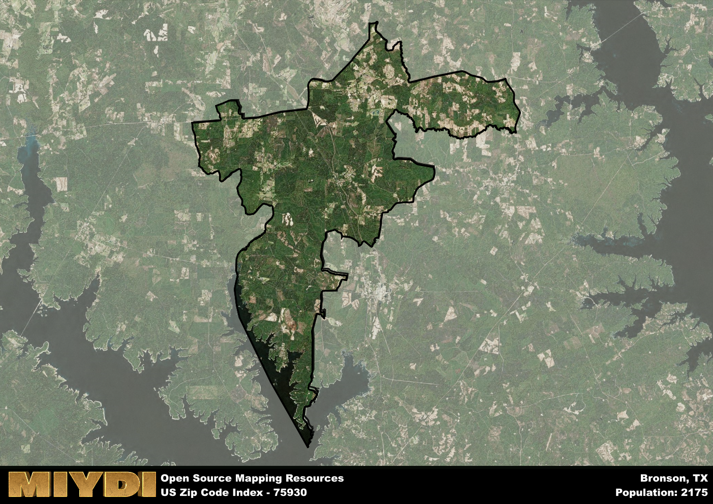

**Area Name:** Bronson

**Zip Code:** 75930

**State:** TX

# Bronson: A Charming Community in East Texas

Located in the heart of East Texas, the zip code 75930 area encompasses the quaint neighborhood of Bronson. Situated within the larger metropolitan area of Nacogdoches, Bronson is a peaceful residential community that offers a serene escape from the bustling city life. Surrounded by lush greenery and rolling hills, Bronson is a close-knit community that values its small-town charm while being just a short drive away from major urban centers.

Bronson has a rich historical narrative that dates back to its early settlement by pioneers in the 19th century. Originally established as a trading post along the historic El Camino Real de los Tejas, Bronson grew into a thriving agricultural community known for its cotton and timber industries. The area was named after one of its prominent early settlers, and over the years, Bronson has evolved into a peaceful residential neighborhood with a strong sense of community pride.

Today, Bronson is a vibrant community with a mix of residential homes, local businesses, and recreational amenities. Residents enjoy access to parks, playgrounds, and community events that foster a sense of camaraderie among neighbors. The area is known for its friendly atmosphere and family-friendly environment, making it a popular choice for those seeking a peaceful retreat in the East Texas countryside. Additionally, Bronson boasts a variety of local shops and restaurants that cater to the needs of its residents, further enhancing its small-town charm and appeal.

# Bronson Demographics

The population of Bronson is 2175.  
Bronson has a population density of 13.69 per square mile.  
The area of Bronson is 158.93 square miles.  

## Bronson Income and Economic Data

These demographic numbers are sourced from IRS return data, providing comprehensive insights into the population dynamics and economic trends within Bronson.

**Breakdown of return types for Bronson**

The table offers insight into the composition of tax returns filed with the IRS, categorizing them into three main types. Single returns represent filings by individuals, joint returns by married couples, and head of household returns by individuals who qualify as heads of households, typically having dependents. This breakdown provides an understanding of the different filing statuses adopted by taxpayers when submitting their tax documentation.

| Return Types filed for Bronson                              | Percentage          |
|----------------------------------------------------------|---------------------|
| Single Returns                                            | 0.41 |
| Joint Returns                                             | 0.45 |
| Head Household Returns                                    | 0.12 |

The income and economic data presented here is sourced from the IRS income brackets, utilized for categorizing tax returns by income levels. This table displays income ranges for both single filers and married couples, along with the corresponding number of returns and the percentage within each bracket, providing valuable insight into the distribution of taxes across various income groups.

| Bracket Name       | Single Filer Income Range | Married Couple Range | Number of Returns | Percentage of Returns |
|--------------------|----------------------------|----------------------|-------------------|-----------------------|
| 10% Bracket        | Up to $10,275              | Up to $20,550        | 290 | 0.4% |
| 12% Bracket        | $10,276 - $41,775          | $20,551 - $83,550    | 180 | 0.25% |
| 22% Bracket        | $41,776 - $89,075          | $83,551 - $178,150   | 110 | 0.15% |
| 24% Bracket        | $89,076 - $170,050         | $178,151 - $340,100  | 80 | 0.11% |
| 32% Bracket        | $170,051 - $215,950        | $340,101 - $431,900  | 70 | 0.1% |
| 35% Bracket        | $215,951 - $539,900        | $431,901 - $647,850  | 0 | 0% |

### Exploring Taxpayer Diversity: A Breakdown of Different Types of Tax Returns in Bronson

The table offers insights into various types of tax returns filed, reflecting different aspects of taxpayer activities and demographics. Categories include charitable returns for donations, dependent returns for claimed dependents, educator population, elderly population, real estate returns, self-employment returns, student loan returns, and unemployment returns, providing valuable insights into taxpayer behavior and demographics.

| Bronson Filing Types                    | Count | Percentage |
|--------------------------------------|-------|------------|
| Charitable Donations                 | 0 | 0% |
| Dependents Claimed                   | 0 | 0% |
| Educator Residents                   | 0 | 0% |
| Elderly Population                   | 190 | 0.26% |
| Farming Population                   | 80 | 0.11% |
| Real Estate Transactions             | 0 | 0% |
| Self-Employed Individuals            | 70 | 0.096% |
| Student Loan Cases                   | 0 | 0% |
| Unemployment Benefit Filings         | 120 | 0.16% |

## Bronson AI and Census Variables

The values presented in this dataset for Bronson are AI-optimized, streamlined, and categorized into relevant buckets for enhanced utility in AI and mapping programs. These simplified values have been optimized to facilitate efficient analysis and integration into various technological applications, offering users accessible and actionable insights into demographics within the Bronson area.

| AI Variables for Bronson | Value |
|-------------|-------|
| Shape Area | 565991658.941406 |
| Shape Length | 207007.307063645 |

## How to use this free AI optimized Geo-Spatial Data for Bronson, TX

This data is made freely available under the Creative Commons license, allowing for unrestricted use for any purpose. Users can access static resources directly from GitHub or leverage more advanced functionalities by utilizing the GeoJSON files. All datasets originate from official government or private sector sources and are meticulously compiled into relevant datasets within QGIS. However, the versatility of the data ensures compatibility with any mapping application.

## Data Accuracy Disclaimer
It's important to note that the data provided here may contain errors or discrepancies and should be considered as 'close enough' for business applications and AI rather than a definitive source of truth. This data is aggregated from multiple sources, some of which publish information on wildly different intervals, leading to potential inconsistencies. Additionally, certain data points may not be corrected for Covid-related changes, further impacting accuracy. Moreover, the assumption that demographic trends are consistent throughout a region may lead to discrepancies, as trends often concentrate in areas of highest population density. As a result, dense areas may be slightly underrepresented, while rural areas may be slightly overrepresented, resulting in a more conservative dataset. Furthermore, the focus primarily on areas within US Major and Minor Statistical areas means that approximately 40 million Americans living outside of these areas may not be fully represented. Lastly, the historical background and area descriptions generated using AI are susceptible to potential mistakes, so users should exercise caution when interpreting the information provided.
