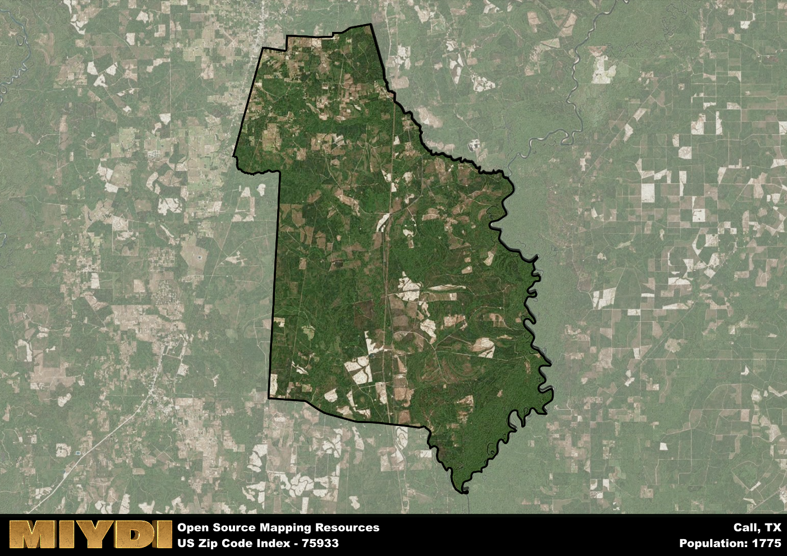

**Area Name:** Call

**Zip Code:** 75933

**State:** TX

Call is a part of the DeRidder - LA Micro Area, and makes up  of the Metro's population.  

# Call: A Historic Neighborhood in East Texas  
Located in the heart of East Texas, the zip code 75933 corresponds to the charming neighborhood of Call. Bordered by lush forests and rolling hills, Call seamlessly integrates with the nearby city of Carthage, offering residents a peaceful retreat from the hustle and bustle of urban life. Situated within close proximity to major transportation routes, Call enjoys easy access to neighboring towns and cities, making it a desirable location for those seeking a tranquil yet connected community.

Founded in the 19th century, Call has a rich historical narrative that dates back to the days of early settlers and pioneers. Originally established as a trading post along a well-traveled route, the neighborhood quickly grew into a thriving hub of commerce and agriculture. Over the years, Call has retained its small-town charm and close-knit community spirit, with many of its historic buildings and landmarks still standing as a testament to its storied past.

Today, Call maintains its rural character while offering modern amenities and services to its residents. The area boasts a diverse economy supported by agriculture, small businesses, and tourism. Residents and visitors alike can enjoy recreational activities such as hiking, fishing, and exploring the numerous parks and natural attractions that dot the landscape. With a strong sense of community pride and a commitment to preserving its heritage, Call continues to be a hidden gem in East Texas, welcoming all who seek a tranquil and welcoming place to call home.

# Call Demographics

The population of Call is 1775.  
Call has a population density of 12.73 per square mile.  
The area of Call is 139.48 square miles.  

## Call Income and Economic Data

These demographic numbers are sourced from IRS return data, providing comprehensive insights into the population dynamics and economic trends within Call.

**Breakdown of return types for Call**

The table offers insight into the composition of tax returns filed with the IRS, categorizing them into three main types. Single returns represent filings by individuals, joint returns by married couples, and head of household returns by individuals who qualify as heads of households, typically having dependents. This breakdown provides an understanding of the different filing statuses adopted by taxpayers when submitting their tax documentation.

| Return Types filed for Call                              | Percentage          |
|----------------------------------------------------------|---------------------|
| Single Returns                                            | 0.37 |
| Joint Returns                                             | 0.42 |
| Head Household Returns                                    | 0.18 |

The income and economic data presented here is sourced from the IRS income brackets, utilized for categorizing tax returns by income levels. This table displays income ranges for both single filers and married couples, along with the corresponding number of returns and the percentage within each bracket, providing valuable insight into the distribution of taxes across various income groups.

| Bracket Name       | Single Filer Income Range | Married Couple Range | Number of Returns | Percentage of Returns |
|--------------------|----------------------------|----------------------|-------------------|-----------------------|
| 10% Bracket        | Up to $10,275              | Up to $20,550        | 230 | 0.37% |
| 12% Bracket        | $10,276 - $41,775          | $20,551 - $83,550    | 150 | 0.24% |
| 22% Bracket        | $41,776 - $89,075          | $83,551 - $178,150   | 90 | 0.15% |
| 24% Bracket        | $89,076 - $170,050         | $178,151 - $340,100  | 60 | 0.1% |
| 32% Bracket        | $170,051 - $215,950        | $340,101 - $431,900  | 90 | 0.15% |
| 35% Bracket        | $215,951 - $539,900        | $431,901 - $647,850  | 0 | 0% |

### Exploring Taxpayer Diversity: A Breakdown of Different Types of Tax Returns in Call

The table offers insights into various types of tax returns filed, reflecting different aspects of taxpayer activities and demographics. Categories include charitable returns for donations, dependent returns for claimed dependents, educator population, elderly population, real estate returns, self-employment returns, student loan returns, and unemployment returns, providing valuable insights into taxpayer behavior and demographics.

| Call Filing Types                    | Count | Percentage |
|--------------------------------------|-------|------------|
| Charitable Donations                 | 0 | 0% |
| Dependents Claimed                   | 0 | 0% |
| Educator Residents                   | 0 | 0% |
| Elderly Population                   | 150 | 0.24% |
| Farming Population                   | 70 | 0.113% |
| Real Estate Transactions             | 0 | 0% |
| Self-Employed Individuals            | 50 | 0.081% |
| Student Loan Cases                   | 0 | 0% |
| Unemployment Benefit Filings         | 150 | 0.24% |

## Call AI and Census Variables

The values presented in this dataset for Call are AI-optimized, streamlined, and categorized into relevant buckets for enhanced utility in AI and mapping programs. These simplified values have been optimized to facilitate efficient analysis and integration into various technological applications, offering users accessible and actionable insights into demographics within the Call area.

| AI Variables for Call | Value |
|-------------|-------|
| Shape Area | 488379155.230469 |
| Shape Length | 124418.623247843 |
| CBSA Federal Processing Standard Code | 19760 |

## How to use this free AI optimized Geo-Spatial Data for Call, TX

This data is made freely available under the Creative Commons license, allowing for unrestricted use for any purpose. Users can access static resources directly from GitHub or leverage more advanced functionalities by utilizing the GeoJSON files. All datasets originate from official government or private sector sources and are meticulously compiled into relevant datasets within QGIS. However, the versatility of the data ensures compatibility with any mapping application.

## Data Accuracy Disclaimer
It's important to note that the data provided here may contain errors or discrepancies and should be considered as 'close enough' for business applications and AI rather than a definitive source of truth. This data is aggregated from multiple sources, some of which publish information on wildly different intervals, leading to potential inconsistencies. Additionally, certain data points may not be corrected for Covid-related changes, further impacting accuracy. Moreover, the assumption that demographic trends are consistent throughout a region may lead to discrepancies, as trends often concentrate in areas of highest population density. As a result, dense areas may be slightly underrepresented, while rural areas may be slightly overrepresented, resulting in a more conservative dataset. Furthermore, the focus primarily on areas within US Major and Minor Statistical areas means that approximately 40 million Americans living outside of these areas may not be fully represented. Lastly, the historical background and area descriptions generated using AI are susceptible to potential mistakes, so users should exercise caution when interpreting the information provided.
