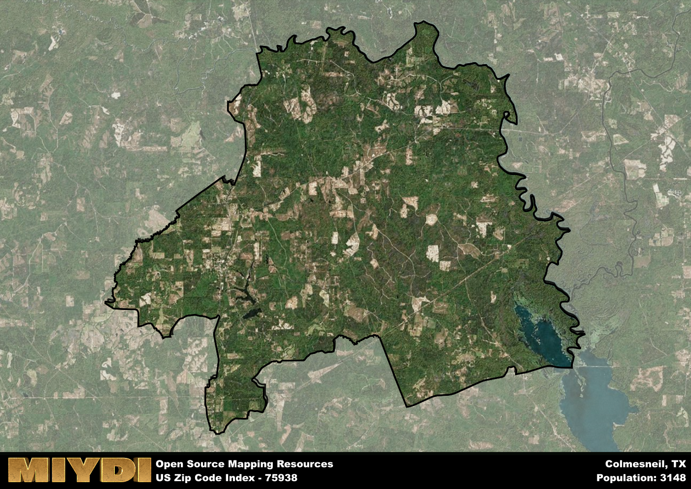

**Area Name:** Colmesneil

**Zip Code:** 75938

**State:** TX

# Discover the Charming Community of Colmesneil, 75938

Colmesneil, located in zip code 75938, is a picturesque community situated in East Texas. Bordered by the Angelina National Forest to the east and surrounded by rolling hills, Colmesneil is a small town that seamlessly integrates with the natural beauty of the region. The area is located approximately 20 miles north of Woodville and 30 miles south of Jasper, making it a central point within the East Texas landscape.

The history of Colmesneil dates back to the mid-19th century when settlers began to establish homesteads in the area. The town was officially founded in 1881 and named after one of its early residents, Joseph Colmesneil. Over the years, Colmesneil has grown into a close-knit community known for its friendly residents and rich heritage. The town's historical markers and preserved buildings offer a glimpse into its past, showcasing a history of resilience and community spirit.

Today, Colmesneil is a thriving community with a mix of residential neighborhoods, local businesses, and recreational opportunities. The town's economy is supported by agriculture, small businesses, and tourism, with residents enjoying a variety of services and amenities. Colmesneil is home to parks, hiking trails, and historic sites that attract visitors from near and far. With its quaint charm and welcoming atmosphere, Colmesneil continues to be a beloved gem in East Texas.

# Colmesneil Demographics

The population of Colmesneil is 3148.  
Colmesneil has a population density of 19.77 per square mile.  
The area of Colmesneil is 159.26 square miles.  

## Colmesneil Income and Economic Data

These demographic numbers are sourced from IRS return data, providing comprehensive insights into the population dynamics and economic trends within Colmesneil.

**Breakdown of return types for Colmesneil**

The table offers insight into the composition of tax returns filed with the IRS, categorizing them into three main types. Single returns represent filings by individuals, joint returns by married couples, and head of household returns by individuals who qualify as heads of households, typically having dependents. This breakdown provides an understanding of the different filing statuses adopted by taxpayers when submitting their tax documentation.

| Return Types filed for Colmesneil                              | Percentage          |
|----------------------------------------------------------|---------------------|
| Single Returns                                            | 0.37 |
| Joint Returns                                             | 0.51 |
| Head Household Returns                                    | 0.11 |

The income and economic data presented here is sourced from the IRS income brackets, utilized for categorizing tax returns by income levels. This table displays income ranges for both single filers and married couples, along with the corresponding number of returns and the percentage within each bracket, providing valuable insight into the distribution of taxes across various income groups.

| Bracket Name       | Single Filer Income Range | Married Couple Range | Number of Returns | Percentage of Returns |
|--------------------|----------------------------|----------------------|-------------------|-----------------------|
| 10% Bracket        | Up to $10,275              | Up to $20,550        | 390 | 0.35% |
| 12% Bracket        | $10,276 - $41,775          | $20,551 - $83,550    | 270 | 0.25% |
| 22% Bracket        | $41,776 - $89,075          | $83,551 - $178,150   | 180 | 0.16% |
| 24% Bracket        | $89,076 - $170,050         | $178,151 - $340,100  | 110 | 0.1% |
| 32% Bracket        | $170,051 - $215,950        | $340,101 - $431,900  | 150 | 0.14% |
| 35% Bracket        | $215,951 - $539,900        | $431,901 - $647,850  | 0 | 0% |

### Exploring Taxpayer Diversity: A Breakdown of Different Types of Tax Returns in Colmesneil

The table offers insights into various types of tax returns filed, reflecting different aspects of taxpayer activities and demographics. Categories include charitable returns for donations, dependent returns for claimed dependents, educator population, elderly population, real estate returns, self-employment returns, student loan returns, and unemployment returns, providing valuable insights into taxpayer behavior and demographics.

| Colmesneil Filing Types                    | Count | Percentage |
|--------------------------------------|-------|------------|
| Charitable Donations                 | 0 | 0% |
| Dependents Claimed                   | 0 | 0% |
| Educator Residents                   | 30 | 0.027% |
| Elderly Population                   | 340 | 0.31% |
| Farming Population                   | 100 | 0.091% |
| Real Estate Transactions             | 0 | 0% |
| Self-Employed Individuals            | 110 | 0.1% |
| Student Loan Cases                   | 50 | 0.045% |
| Unemployment Benefit Filings         | 190 | 0.17% |

## Colmesneil AI and Census Variables

The values presented in this dataset for Colmesneil are AI-optimized, streamlined, and categorized into relevant buckets for enhanced utility in AI and mapping programs. These simplified values have been optimized to facilitate efficient analysis and integration into various technological applications, offering users accessible and actionable insights into demographics within the Colmesneil area.

| AI Variables for Colmesneil | Value |
|-------------|-------|
| Shape Area | 562337825.980469 |
| Shape Length | 160786.534967243 |

## How to use this free AI optimized Geo-Spatial Data for Colmesneil, TX

This data is made freely available under the Creative Commons license, allowing for unrestricted use for any purpose. Users can access static resources directly from GitHub or leverage more advanced functionalities by utilizing the GeoJSON files. All datasets originate from official government or private sector sources and are meticulously compiled into relevant datasets within QGIS. However, the versatility of the data ensures compatibility with any mapping application.

## Data Accuracy Disclaimer
It's important to note that the data provided here may contain errors or discrepancies and should be considered as 'close enough' for business applications and AI rather than a definitive source of truth. This data is aggregated from multiple sources, some of which publish information on wildly different intervals, leading to potential inconsistencies. Additionally, certain data points may not be corrected for Covid-related changes, further impacting accuracy. Moreover, the assumption that demographic trends are consistent throughout a region may lead to discrepancies, as trends often concentrate in areas of highest population density. As a result, dense areas may be slightly underrepresented, while rural areas may be slightly overrepresented, resulting in a more conservative dataset. Furthermore, the focus primarily on areas within US Major and Minor Statistical areas means that approximately 40 million Americans living outside of these areas may not be fully represented. Lastly, the historical background and area descriptions generated using AI are susceptible to potential mistakes, so users should exercise caution when interpreting the information provided.
