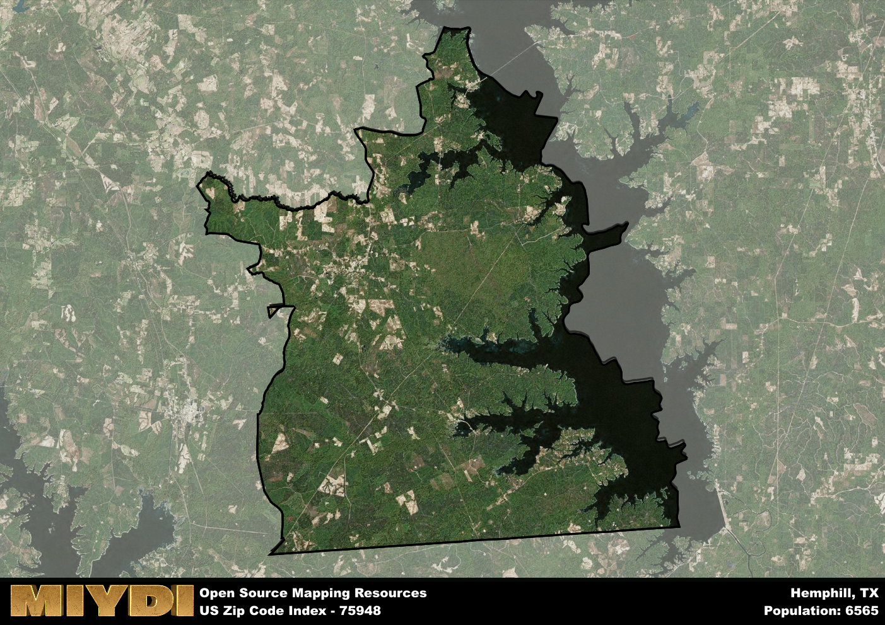

**Area Name:** Hemphill

**Zip Code:** 75948

**State:** TX

# Exploring Hemphill: A Historic Community in East Texas  

Hemphill, located in zip code 75948, is a charming community nestled in the heart of East Texas. Situated in Sabine County, Hemphill is surrounded by the natural beauty of the Toledo Bend Reservoir and the Sabine National Forest. It is conveniently located near major highways, providing easy access to nearby cities such as Lufkin and Shreveport, Louisiana. Hemphill seamlessly integrates with the surrounding rural landscape while offering a peaceful retreat from the hustle and bustle of urban life.

Originally settled in the mid-19th century, Hemphill was named after John Hemphill, a former Texas Supreme Court justice. The area experienced significant growth with the construction of the Toledo Bend Dam in the 1960s, which created the Toledo Bend Reservoir. This led to an influx of residents and tourists seeking outdoor recreational activities such as fishing, boating, and hiking. Hemphill's rich history is still evident today through its well-preserved historic buildings and landmarks.

Today, Hemphill is a vibrant community with a mix of local businesses, restaurants, and services catering to residents and visitors alike. The area's economy is driven by tourism, agriculture, and forestry, with many residents working in these industries. Hemphill offers a variety of recreational amenities, including parks, campgrounds, and water sports facilities. The community takes pride in its cultural heritage, hosting events and festivals that celebrate its unique history. Hemphill is not just a place to live, but a destination that offers a peaceful and idyllic way of life in East Texas.

# Hemphill Demographics

The population of Hemphill is 6565.  
Hemphill has a population density of 22.62 per square mile.  
The area of Hemphill is 290.2 square miles.  

## Hemphill Income and Economic Data

These demographic numbers are sourced from IRS return data, providing comprehensive insights into the population dynamics and economic trends within Hemphill.

**Breakdown of return types for Hemphill**

The table offers insight into the composition of tax returns filed with the IRS, categorizing them into three main types. Single returns represent filings by individuals, joint returns by married couples, and head of household returns by individuals who qualify as heads of households, typically having dependents. This breakdown provides an understanding of the different filing statuses adopted by taxpayers when submitting their tax documentation.

| Return Types filed for Hemphill                              | Percentage          |
|----------------------------------------------------------|---------------------|
| Single Returns                                            | 0.4 |
| Joint Returns                                             | 0.48 |
| Head Household Returns                                    | 0.12 |

The income and economic data presented here is sourced from the IRS income brackets, utilized for categorizing tax returns by income levels. This table displays income ranges for both single filers and married couples, along with the corresponding number of returns and the percentage within each bracket, providing valuable insight into the distribution of taxes across various income groups.

| Bracket Name       | Single Filer Income Range | Married Couple Range | Number of Returns | Percentage of Returns |
|--------------------|----------------------------|----------------------|-------------------|-----------------------|
| 10% Bracket        | Up to $10,275              | Up to $20,550        | 920 | 0.37% |
| 12% Bracket        | $10,276 - $41,775          | $20,551 - $83,550    | 540 | 0.22% |
| 22% Bracket        | $41,776 - $89,075          | $83,551 - $178,150   | 360 | 0.15% |
| 24% Bracket        | $89,076 - $170,050         | $178,151 - $340,100  | 230 | 0.09% |
| 32% Bracket        | $170,051 - $215,950        | $340,101 - $431,900  | 350 | 0.14% |
| 35% Bracket        | $215,951 - $539,900        | $431,901 - $647,850  | 80 | 0.03% |

### Exploring Taxpayer Diversity: A Breakdown of Different Types of Tax Returns in Hemphill

The table offers insights into various types of tax returns filed, reflecting different aspects of taxpayer activities and demographics. Categories include charitable returns for donations, dependent returns for claimed dependents, educator population, elderly population, real estate returns, self-employment returns, student loan returns, and unemployment returns, providing valuable insights into taxpayer behavior and demographics.

| Hemphill Filing Types                    | Count | Percentage |
|--------------------------------------|-------|------------|
| Charitable Donations                 | 60 | 0.024% |
| Dependents Claimed                   | 20 | 0.008% |
| Educator Residents                   | 50 | 0.02% |
| Elderly Population                   | 1090 | 0.44% |
| Farming Population                   | 120 | 0.048% |
| Real Estate Transactions             | 60 | 0.024% |
| Self-Employed Individuals            | 290 | 0.117% |
| Student Loan Cases                   | 40 | 0.016% |
| Unemployment Benefit Filings         | 360 | 0.15% |

## Hemphill AI and Census Variables

The values presented in this dataset for Hemphill are AI-optimized, streamlined, and categorized into relevant buckets for enhanced utility in AI and mapping programs. These simplified values have been optimized to facilitate efficient analysis and integration into various technological applications, offering users accessible and actionable insights into demographics within the Hemphill area.

| AI Variables for Hemphill | Value |
|-------------|-------|
| Shape Area | 1032559901.70313 |
| Shape Length | 205205.543745522 |

## How to use this free AI optimized Geo-Spatial Data for Hemphill, TX

This data is made freely available under the Creative Commons license, allowing for unrestricted use for any purpose. Users can access static resources directly from GitHub or leverage more advanced functionalities by utilizing the GeoJSON files. All datasets originate from official government or private sector sources and are meticulously compiled into relevant datasets within QGIS. However, the versatility of the data ensures compatibility with any mapping application.

## Data Accuracy Disclaimer
It's important to note that the data provided here may contain errors or discrepancies and should be considered as 'close enough' for business applications and AI rather than a definitive source of truth. This data is aggregated from multiple sources, some of which publish information on wildly different intervals, leading to potential inconsistencies. Additionally, certain data points may not be corrected for Covid-related changes, further impacting accuracy. Moreover, the assumption that demographic trends are consistent throughout a region may lead to discrepancies, as trends often concentrate in areas of highest population density. As a result, dense areas may be slightly underrepresented, while rural areas may be slightly overrepresented, resulting in a more conservative dataset. Furthermore, the focus primarily on areas within US Major and Minor Statistical areas means that approximately 40 million Americans living outside of these areas may not be fully represented. Lastly, the historical background and area descriptions generated using AI are susceptible to potential mistakes, so users should exercise caution when interpreting the information provided.
