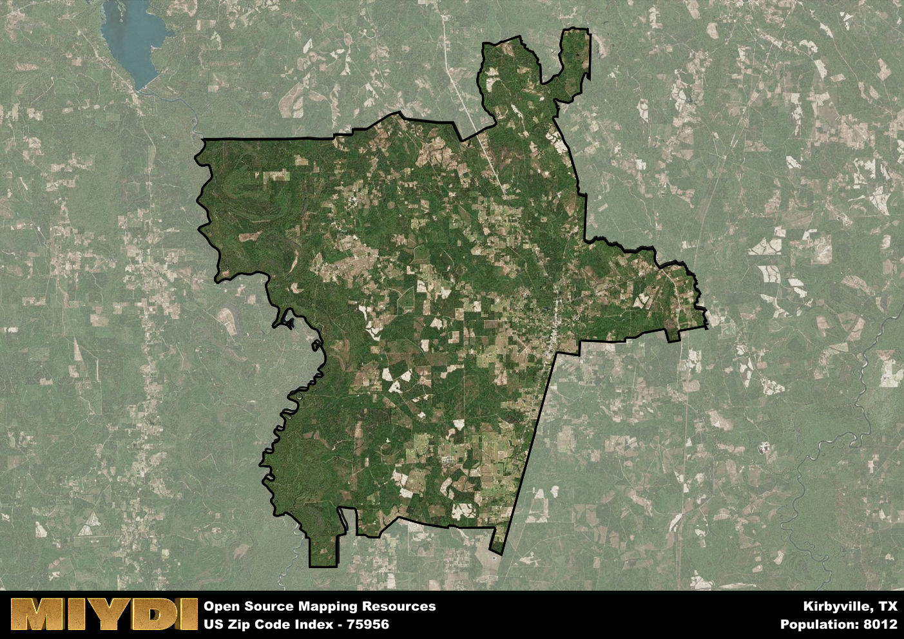

**Area Name:** Kirbyville

**Zip Code:** 75956

**State:** TX

# Kirbyville: A Snapshot of Zip Code 75956

Nestled in the heart of East Texas, zip code 75956 encompasses the charming town of Kirbyville. Bordered by the sprawling Angelina National Forest to the north and the bustling city of Beaumont to the south, Kirbyville serves as a gateway to the natural beauty of the region while maintaining close ties to urban centers. This zip code area is an integral part of the larger metropolitan context, providing a small-town respite for residents while offering easy access to the amenities of nearby cities.

Kirbyville has a rich historical narrative that dates back to its establishment in the late 19th century. Originally a hub for the timber industry, the town saw rapid growth with the arrival of the railroad, becoming a vital transportation center for the region. Through the years, Kirbyville has weathered economic shifts and natural disasters, shaping its resilient spirit and close-knit community. The town's name pays homage to John Henry Kirby, a prominent figure in the area's development and a champion of East Texas industries.

Today, Kirbyville is a vibrant community that blends its historic roots with modern amenities. The town boasts a variety of local businesses, from quaint shops to family-owned restaurants, that cater to residents and visitors alike. Outdoor enthusiasts can explore the nearby national forest, while history buffs can visit local museums and landmarks that showcase Kirbyville's heritage. With a strong sense of community pride and a focus on preserving its past, zip code 75956 continues to thrive as a unique destination in East Texas.

# Kirbyville Demographics

The population of Kirbyville is 8012.  
Kirbyville has a population density of 35.18 per square mile.  
The area of Kirbyville is 227.73 square miles.  

## Kirbyville Income and Economic Data

These demographic numbers are sourced from IRS return data, providing comprehensive insights into the population dynamics and economic trends within Kirbyville.

**Breakdown of return types for Kirbyville**

The table offers insight into the composition of tax returns filed with the IRS, categorizing them into three main types. Single returns represent filings by individuals, joint returns by married couples, and head of household returns by individuals who qualify as heads of households, typically having dependents. This breakdown provides an understanding of the different filing statuses adopted by taxpayers when submitting their tax documentation.

| Return Types filed for Kirbyville                              | Percentage          |
|----------------------------------------------------------|---------------------|
| Single Returns                                            | 0.39 |
| Joint Returns                                             | 0.44 |
| Head Household Returns                                    | 0.16 |

The income and economic data presented here is sourced from the IRS income brackets, utilized for categorizing tax returns by income levels. This table displays income ranges for both single filers and married couples, along with the corresponding number of returns and the percentage within each bracket, providing valuable insight into the distribution of taxes across various income groups.

| Bracket Name       | Single Filer Income Range | Married Couple Range | Number of Returns | Percentage of Returns |
|--------------------|----------------------------|----------------------|-------------------|-----------------------|
| 10% Bracket        | Up to $10,275              | Up to $20,550        | 1160 | 0.38% |
| 12% Bracket        | $10,276 - $41,775          | $20,551 - $83,550    | 730 | 0.24% |
| 22% Bracket        | $41,776 - $89,075          | $83,551 - $178,150   | 400 | 0.13% |
| 24% Bracket        | $89,076 - $170,050         | $178,151 - $340,100  | 280 | 0.09% |
| 32% Bracket        | $170,051 - $215,950        | $340,101 - $431,900  | 400 | 0.13% |
| 35% Bracket        | $215,951 - $539,900        | $431,901 - $647,850  | 60 | 0.02% |

### Exploring Taxpayer Diversity: A Breakdown of Different Types of Tax Returns in Kirbyville

The table offers insights into various types of tax returns filed, reflecting different aspects of taxpayer activities and demographics. Categories include charitable returns for donations, dependent returns for claimed dependents, educator population, elderly population, real estate returns, self-employment returns, student loan returns, and unemployment returns, providing valuable insights into taxpayer behavior and demographics.

| Kirbyville Filing Types                    | Count | Percentage |
|--------------------------------------|-------|------------|
| Charitable Donations                 | 80 | 0.026% |
| Dependents Claimed                   | 50 | 0.017% |
| Educator Residents                   | 60 | 0.02% |
| Elderly Population                   | 840 | 0.28% |
| Farming Population                   | 300 | 0.099% |
| Real Estate Transactions             | 70 | 0.023% |
| Self-Employed Individuals            | 320 | 0.106% |
| Student Loan Cases                   | 60 | 0.02% |
| Unemployment Benefit Filings         | 560 | 0.18% |

## Kirbyville AI and Census Variables

The values presented in this dataset for Kirbyville are AI-optimized, streamlined, and categorized into relevant buckets for enhanced utility in AI and mapping programs. These simplified values have been optimized to facilitate efficient analysis and integration into various technological applications, offering users accessible and actionable insights into demographics within the Kirbyville area.

| AI Variables for Kirbyville | Value |
|-------------|-------|
| Shape Area | 799928471.054688 |
| Shape Length | 204857.895538674 |

## How to use this free AI optimized Geo-Spatial Data for Kirbyville, TX

This data is made freely available under the Creative Commons license, allowing for unrestricted use for any purpose. Users can access static resources directly from GitHub or leverage more advanced functionalities by utilizing the GeoJSON files. All datasets originate from official government or private sector sources and are meticulously compiled into relevant datasets within QGIS. However, the versatility of the data ensures compatibility with any mapping application.

## Data Accuracy Disclaimer
It's important to note that the data provided here may contain errors or discrepancies and should be considered as 'close enough' for business applications and AI rather than a definitive source of truth. This data is aggregated from multiple sources, some of which publish information on wildly different intervals, leading to potential inconsistencies. Additionally, certain data points may not be corrected for Covid-related changes, further impacting accuracy. Moreover, the assumption that demographic trends are consistent throughout a region may lead to discrepancies, as trends often concentrate in areas of highest population density. As a result, dense areas may be slightly underrepresented, while rural areas may be slightly overrepresented, resulting in a more conservative dataset. Furthermore, the focus primarily on areas within US Major and Minor Statistical areas means that approximately 40 million Americans living outside of these areas may not be fully represented. Lastly, the historical background and area descriptions generated using AI are susceptible to potential mistakes, so users should exercise caution when interpreting the information provided.
