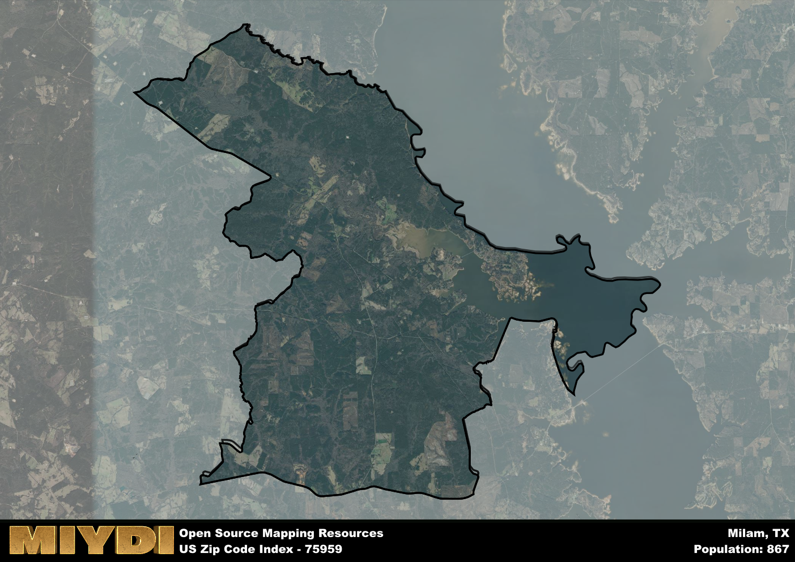

**Area Name:** Milam

**Zip Code:** 75959

**State:** TX

# Exploring Milam: A Historic and Vibrant Community in Zip Code 75959

Nestled in the heart of East Texas, Milam encompasses the zip code 75959 and is located within Sabine County. Bordered by the Sabine National Forest to the east and Toledo Bend Reservoir to the west, Milam is a quaint community that integrates seamlessly with the natural beauty of the surrounding area. Situated within a larger rural context, Milam is approximately 30 miles northeast of Jasper and 40 miles southwest of Many, Louisiana, making it a peaceful retreat from the bustle of urban life.

Milam has a rich historical past, dating back to its establishment in the early 19th century. Originally settled as a trading post on the Sabine River, the area flourished with the construction of sawmills and the development of the logging industry. The community was named after Benjamin Rush Milam, a prominent figure in Texas history known for his role in the Texas Revolution. Over the years, Milam has retained its small-town charm while adapting to modern times, becoming a hub for outdoor enthusiasts and history buffs alike.

Today, Milam offers a blend of economic activities, from agriculture and forestry to tourism and outdoor recreation. Local businesses cater to residents and visitors alike, providing essential services and unique shopping opportunities. The community boasts access to Toledo Bend Reservoir, offering fishing, boating, and camping options for outdoor enthusiasts. Milam is also home to historical sites such as the Milam Settlers Day Festival, celebrating the area's pioneer heritage. With its scenic beauty, rich history, and welcoming community, Milam stands out as a hidden gem within the East Texas landscape.

# Milam Demographics

The population of Milam is 867.  
Milam has a population density of 11.09 per square mile.  
The area of Milam is 78.18 square miles.  

## Milam Income and Economic Data

These demographic numbers are sourced from IRS return data, providing comprehensive insights into the population dynamics and economic trends within Milam.

**Breakdown of return types for Milam**

The table offers insight into the composition of tax returns filed with the IRS, categorizing them into three main types. Single returns represent filings by individuals, joint returns by married couples, and head of household returns by individuals who qualify as heads of households, typically having dependents. This breakdown provides an understanding of the different filing statuses adopted by taxpayers when submitting their tax documentation.

| Return Types filed for Milam                              | Percentage          |
|----------------------------------------------------------|---------------------|
| Single Returns                                            | 0.39 |
| Joint Returns                                             | 0.47 |
| Head Household Returns                                    | 0.11 |

The income and economic data presented here is sourced from the IRS income brackets, utilized for categorizing tax returns by income levels. This table displays income ranges for both single filers and married couples, along with the corresponding number of returns and the percentage within each bracket, providing valuable insight into the distribution of taxes across various income groups.

| Bracket Name       | Single Filer Income Range | Married Couple Range | Number of Returns | Percentage of Returns |
|--------------------|----------------------------|----------------------|-------------------|-----------------------|
| 10% Bracket        | Up to $10,275              | Up to $20,550        | 140 | 0.37% |
| 12% Bracket        | $10,276 - $41,775          | $20,551 - $83,550    | 80 | 0.21% |
| 22% Bracket        | $41,776 - $89,075          | $83,551 - $178,150   | 60 | 0.16% |
| 24% Bracket        | $89,076 - $170,050         | $178,151 - $340,100  | 40 | 0.11% |
| 32% Bracket        | $170,051 - $215,950        | $340,101 - $431,900  | 60 | 0.16% |
| 35% Bracket        | $215,951 - $539,900        | $431,901 - $647,850  | 0 | 0% |

### Exploring Taxpayer Diversity: A Breakdown of Different Types of Tax Returns in Milam

The table offers insights into various types of tax returns filed, reflecting different aspects of taxpayer activities and demographics. Categories include charitable returns for donations, dependent returns for claimed dependents, educator population, elderly population, real estate returns, self-employment returns, student loan returns, and unemployment returns, providing valuable insights into taxpayer behavior and demographics.

| Milam Filing Types                    | Count | Percentage |
|--------------------------------------|-------|------------|
| Charitable Donations                 | 0 | 0% |
| Dependents Claimed                   | 0 | 0% |
| Educator Residents                   | 0 | 0% |
| Elderly Population                   | 170 | 0.45% |
| Farming Population                   | 30 | 0.079% |
| Real Estate Transactions             | 0 | 0% |
| Self-Employed Individuals            | 60 | 0.158% |
| Student Loan Cases                   | 0 | 0% |
| Unemployment Benefit Filings         | 70 | 0.18% |

## Milam AI and Census Variables

The values presented in this dataset for Milam are AI-optimized, streamlined, and categorized into relevant buckets for enhanced utility in AI and mapping programs. These simplified values have been optimized to facilitate efficient analysis and integration into various technological applications, offering users accessible and actionable insights into demographics within the Milam area.

| AI Variables for Milam | Value |
|-------------|-------|
| Shape Area | 279457012.660156 |
| Shape Length | 124026.658830494 |

## How to use this free AI optimized Geo-Spatial Data for Milam, TX

This data is made freely available under the Creative Commons license, allowing for unrestricted use for any purpose. Users can access static resources directly from GitHub or leverage more advanced functionalities by utilizing the GeoJSON files. All datasets originate from official government or private sector sources and are meticulously compiled into relevant datasets within QGIS. However, the versatility of the data ensures compatibility with any mapping application.

## Data Accuracy Disclaimer
It's important to note that the data provided here may contain errors or discrepancies and should be considered as 'close enough' for business applications and AI rather than a definitive source of truth. This data is aggregated from multiple sources, some of which publish information on wildly different intervals, leading to potential inconsistencies. Additionally, certain data points may not be corrected for Covid-related changes, further impacting accuracy. Moreover, the assumption that demographic trends are consistent throughout a region may lead to discrepancies, as trends often concentrate in areas of highest population density. As a result, dense areas may be slightly underrepresented, while rural areas may be slightly overrepresented, resulting in a more conservative dataset. Furthermore, the focus primarily on areas within US Major and Minor Statistical areas means that approximately 40 million Americans living outside of these areas may not be fully represented. Lastly, the historical background and area descriptions generated using AI are susceptible to potential mistakes, so users should exercise caution when interpreting the information provided.
