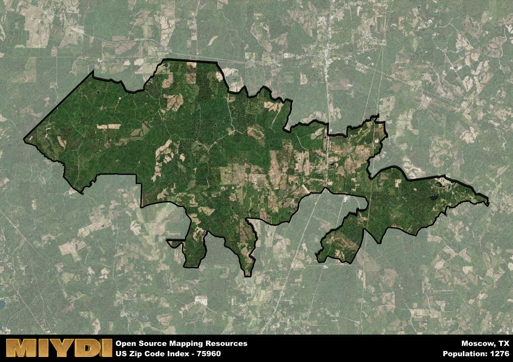

**Area Name:** Moscow

**Zip Code:** 75960

**State:** TX

# Moscow: A Historical and Vibrant Neighborhood in East Texas

Located in the heart of East Texas, the zip code 75960 area encompasses the charming neighborhood of Moscow. Situated near the city of Nacogdoches, Moscow is known for its picturesque landscapes and close-knit community. The area is bordered by lush forests and rolling hills, providing residents with a serene and peaceful environment. Moscow seamlessly integrates with the surrounding districts, serving as a residential retreat for those seeking a quieter pace of life while still having access to urban amenities in nearby cities.

Founded in the early 19th century, Moscow has a rich historical narrative that traces back to its early settlement by pioneers and homesteaders. The area experienced significant growth during the Texas oil boom, attracting new residents and businesses seeking opportunities in the burgeoning industry. Over the years, Moscow has evolved into a vibrant community with a mix of historic architecture and modern developments. The neighborhood's name pays homage to the Russian city, reflecting the diverse cultural influences that have shaped its identity.

Today, Moscow is a thriving neighborhood with a mix of residential, commercial, and recreational offerings. The area boasts a variety of locally-owned businesses, including shops, restaurants, and services that cater to the needs of residents. Moscow is also home to several parks and green spaces, providing opportunities for outdoor activities and leisure. Residents and visitors alike can explore the area's historical sites, such as the Old Moscow Cemetery, which offers a glimpse into the neighborhood's past. With its unique blend of history and modernity, Moscow continues to be a beloved community in East Texas.

# Moscow Demographics

The population of Moscow is 1276.  
Moscow has a population density of 13.56 per square mile.  
The area of Moscow is 94.12 square miles.  

## Moscow Income and Economic Data

These demographic numbers are sourced from IRS return data, providing comprehensive insights into the population dynamics and economic trends within Moscow.

**Breakdown of return types for Moscow**

The table offers insight into the composition of tax returns filed with the IRS, categorizing them into three main types. Single returns represent filings by individuals, joint returns by married couples, and head of household returns by individuals who qualify as heads of households, typically having dependents. This breakdown provides an understanding of the different filing statuses adopted by taxpayers when submitting their tax documentation.

| Return Types filed for Moscow                              | Percentage          |
|----------------------------------------------------------|---------------------|
| Single Returns                                            | 0.46 |
| Joint Returns                                             | 0.38 |
| Head Household Returns                                    | 0.14 |

The income and economic data presented here is sourced from the IRS income brackets, utilized for categorizing tax returns by income levels. This table displays income ranges for both single filers and married couples, along with the corresponding number of returns and the percentage within each bracket, providing valuable insight into the distribution of taxes across various income groups.

| Bracket Name       | Single Filer Income Range | Married Couple Range | Number of Returns | Percentage of Returns |
|--------------------|----------------------------|----------------------|-------------------|-----------------------|
| 10% Bracket        | Up to $10,275              | Up to $20,550        | 140 | 0.38% |
| 12% Bracket        | $10,276 - $41,775          | $20,551 - $83,550    | 100 | 0.27% |
| 22% Bracket        | $41,776 - $89,075          | $83,551 - $178,150   | 60 | 0.16% |
| 24% Bracket        | $89,076 - $170,050         | $178,151 - $340,100  | 30 | 0.08% |
| 32% Bracket        | $170,051 - $215,950        | $340,101 - $431,900  | 40 | 0.11% |
| 35% Bracket        | $215,951 - $539,900        | $431,901 - $647,850  | 0 | 0% |

### Exploring Taxpayer Diversity: A Breakdown of Different Types of Tax Returns in Moscow

The table offers insights into various types of tax returns filed, reflecting different aspects of taxpayer activities and demographics. Categories include charitable returns for donations, dependent returns for claimed dependents, educator population, elderly population, real estate returns, self-employment returns, student loan returns, and unemployment returns, providing valuable insights into taxpayer behavior and demographics.

| Moscow Filing Types                    | Count | Percentage |
|--------------------------------------|-------|------------|
| Charitable Donations                 | 0 | 0% |
| Dependents Claimed                   | 0 | 0% |
| Educator Residents                   | 0 | 0% |
| Elderly Population                   | 100 | 0.27% |
| Farming Population                   | 40 | 0.108% |
| Real Estate Transactions             | 0 | 0% |
| Self-Employed Individuals            | 20 | 0.054% |
| Student Loan Cases                   | 0 | 0% |
| Unemployment Benefit Filings         | 40 | 0.11% |

## Moscow AI and Census Variables

The values presented in this dataset for Moscow are AI-optimized, streamlined, and categorized into relevant buckets for enhanced utility in AI and mapping programs. These simplified values have been optimized to facilitate efficient analysis and integration into various technological applications, offering users accessible and actionable insights into demographics within the Moscow area.

| AI Variables for Moscow | Value |
|-------------|-------|
| Shape Area | 332309864.003906 |
| Shape Length | 165792.084985137 |

## How to use this free AI optimized Geo-Spatial Data for Moscow, TX

This data is made freely available under the Creative Commons license, allowing for unrestricted use for any purpose. Users can access static resources directly from GitHub or leverage more advanced functionalities by utilizing the GeoJSON files. All datasets originate from official government or private sector sources and are meticulously compiled into relevant datasets within QGIS. However, the versatility of the data ensures compatibility with any mapping application.

## Data Accuracy Disclaimer
It's important to note that the data provided here may contain errors or discrepancies and should be considered as 'close enough' for business applications and AI rather than a definitive source of truth. This data is aggregated from multiple sources, some of which publish information on wildly different intervals, leading to potential inconsistencies. Additionally, certain data points may not be corrected for Covid-related changes, further impacting accuracy. Moreover, the assumption that demographic trends are consistent throughout a region may lead to discrepancies, as trends often concentrate in areas of highest population density. As a result, dense areas may be slightly underrepresented, while rural areas may be slightly overrepresented, resulting in a more conservative dataset. Furthermore, the focus primarily on areas within US Major and Minor Statistical areas means that approximately 40 million Americans living outside of these areas may not be fully represented. Lastly, the historical background and area descriptions generated using AI are susceptible to potential mistakes, so users should exercise caution when interpreting the information provided.
