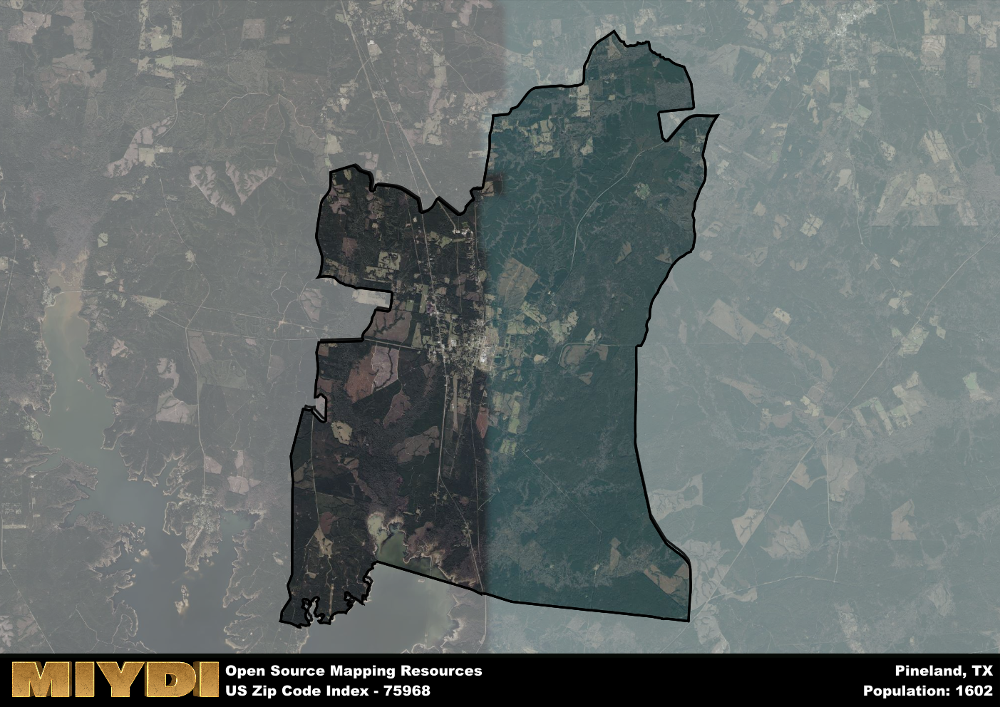

**Area Name:** Pineland

**Zip Code:** 75968

**State:** TX

# Pineland: A Charming Community in Deep East Texas  

Located in the heart of Deep East Texas, the zip code 75968 area of Pineland is a quaint and picturesque community nestled among the towering pine trees. Bordered by the Sam Rayburn Reservoir to the south and the Sabine National Forest to the north, Pineland seamlessly integrates with the surrounding natural landscape. While the area is primarily rural, it is within driving distance of larger cities such as Lufkin and Nacogdoches, allowing residents to enjoy the tranquility of small-town living while still having access to urban amenities.

Once a bustling lumber town in the late 19th and early 20th centuries, Pineland's history is deeply rooted in the timber industry. The town saw significant growth during this time, attracting settlers and businesses looking to capitalize on the abundant natural resources. The name "Pineland" itself reflects the area's lush pine forests that have long been a vital part of the local economy. Over the years, Pineland has evolved into a tight-knit community with a rich history and a strong sense of pride in its heritage.

Today, Pineland offers residents and visitors a peaceful retreat from the hustle and bustle of city life. The economy is primarily driven by agriculture, forestry, and tourism, with outdoor enthusiasts flocking to the area for fishing, hunting, and hiking opportunities. The town boasts a range of local businesses, including quaint shops and family-owned restaurants that contribute to its charming atmosphere. Additionally, Pineland is home to historical sites like the Pineland Railroad Depot Museum, which preserves the town's past for future generations to appreciate. With its natural beauty and close-knit community, Pineland continues to be a hidden gem in Deep East Texas.

# Pineland Demographics

The population of Pineland is 1602.  
Pineland has a population density of 23.12 per square mile.  
The area of Pineland is 69.29 square miles.  

## Pineland Income and Economic Data

These demographic numbers are sourced from IRS return data, providing comprehensive insights into the population dynamics and economic trends within Pineland.

**Breakdown of return types for Pineland**

The table offers insight into the composition of tax returns filed with the IRS, categorizing them into three main types. Single returns represent filings by individuals, joint returns by married couples, and head of household returns by individuals who qualify as heads of households, typically having dependents. This breakdown provides an understanding of the different filing statuses adopted by taxpayers when submitting their tax documentation.

| Return Types filed for Pineland                              | Percentage          |
|----------------------------------------------------------|---------------------|
| Single Returns                                            | 0.39 |
| Joint Returns                                             | 0.4 |
| Head Household Returns                                    | 0.2 |

The income and economic data presented here is sourced from the IRS income brackets, utilized for categorizing tax returns by income levels. This table displays income ranges for both single filers and married couples, along with the corresponding number of returns and the percentage within each bracket, providing valuable insight into the distribution of taxes across various income groups.

| Bracket Name       | Single Filer Income Range | Married Couple Range | Number of Returns | Percentage of Returns |
|--------------------|----------------------------|----------------------|-------------------|-----------------------|
| 10% Bracket        | Up to $10,275              | Up to $20,550        | 310 | 0.41% |
| 12% Bracket        | $10,276 - $41,775          | $20,551 - $83,550    | 190 | 0.25% |
| 22% Bracket        | $41,776 - $89,075          | $83,551 - $178,150   | 90 | 0.12% |
| 24% Bracket        | $89,076 - $170,050         | $178,151 - $340,100  | 70 | 0.09% |
| 32% Bracket        | $170,051 - $215,950        | $340,101 - $431,900  | 90 | 0.12% |
| 35% Bracket        | $215,951 - $539,900        | $431,901 - $647,850  | 0 | 0% |

### Exploring Taxpayer Diversity: A Breakdown of Different Types of Tax Returns in Pineland

The table offers insights into various types of tax returns filed, reflecting different aspects of taxpayer activities and demographics. Categories include charitable returns for donations, dependent returns for claimed dependents, educator population, elderly population, real estate returns, self-employment returns, student loan returns, and unemployment returns, providing valuable insights into taxpayer behavior and demographics.

| Pineland Filing Types                    | Count | Percentage |
|--------------------------------------|-------|------------|
| Charitable Donations                 | 0 | 0% |
| Dependents Claimed                   | 0 | 0% |
| Educator Residents                   | 20 | 0.027% |
| Elderly Population                   | 180 | 0.24% |
| Farming Population                   | 40 | 0.053% |
| Real Estate Transactions             | 0 | 0% |
| Self-Employed Individuals            | 70 | 0.093% |
| Student Loan Cases                   | 0 | 0% |
| Unemployment Benefit Filings         | 150 | 0.2% |

## Pineland AI and Census Variables

The values presented in this dataset for Pineland are AI-optimized, streamlined, and categorized into relevant buckets for enhanced utility in AI and mapping programs. These simplified values have been optimized to facilitate efficient analysis and integration into various technological applications, offering users accessible and actionable insights into demographics within the Pineland area.

| AI Variables for Pineland | Value |
|-------------|-------|
| Shape Area | 246287130.402344 |
| Shape Length | 98019.9795942333 |

## How to use this free AI optimized Geo-Spatial Data for Pineland, TX

This data is made freely available under the Creative Commons license, allowing for unrestricted use for any purpose. Users can access static resources directly from GitHub or leverage more advanced functionalities by utilizing the GeoJSON files. All datasets originate from official government or private sector sources and are meticulously compiled into relevant datasets within QGIS. However, the versatility of the data ensures compatibility with any mapping application.

## Data Accuracy Disclaimer
It's important to note that the data provided here may contain errors or discrepancies and should be considered as 'close enough' for business applications and AI rather than a definitive source of truth. This data is aggregated from multiple sources, some of which publish information on wildly different intervals, leading to potential inconsistencies. Additionally, certain data points may not be corrected for Covid-related changes, further impacting accuracy. Moreover, the assumption that demographic trends are consistent throughout a region may lead to discrepancies, as trends often concentrate in areas of highest population density. As a result, dense areas may be slightly underrepresented, while rural areas may be slightly overrepresented, resulting in a more conservative dataset. Furthermore, the focus primarily on areas within US Major and Minor Statistical areas means that approximately 40 million Americans living outside of these areas may not be fully represented. Lastly, the historical background and area descriptions generated using AI are susceptible to potential mistakes, so users should exercise caution when interpreting the information provided.
