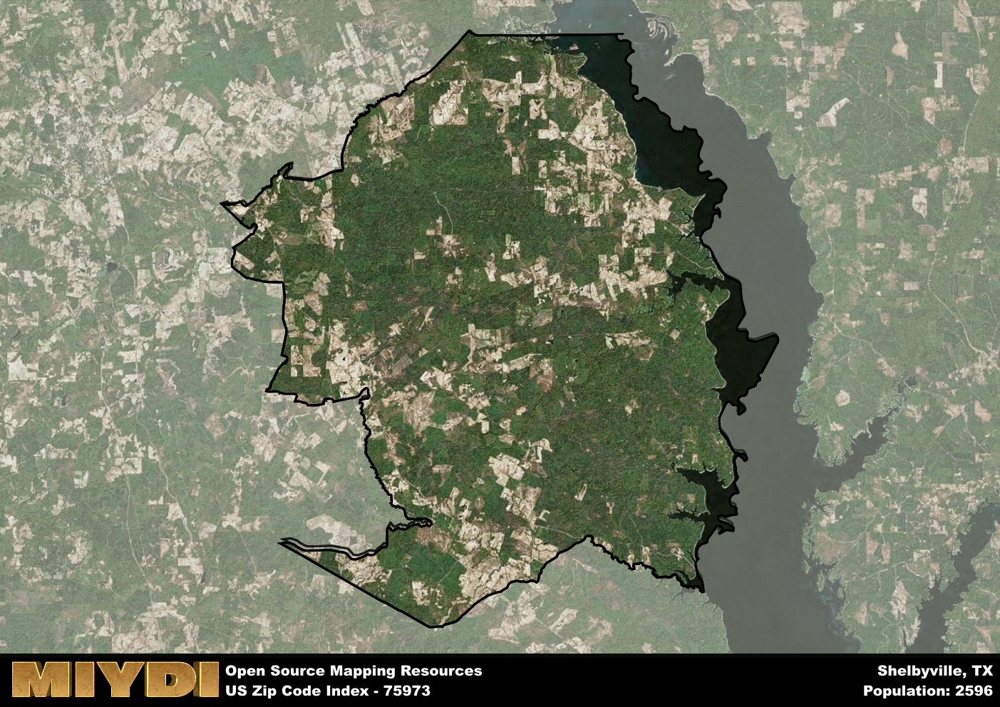

**Area Name:** Shelbyville

**Zip Code:** 75973

**State:** TX

# Shelbyville: A Charming Small Town in East Texas  
Located in East Texas, zip code 75973 corresponds to the quaint town of Shelbyville. Situated within Shelby County, this area is surrounded by the communities of Center to the north, San Augustine to the east, and Tenaha to the west. Shelbyville is a part of the larger East Texas region, known for its pine forests, rolling hills, and historic small towns. The town is easily accessible via State Highway 87, making it a convenient stop for travelers exploring the area.

Originally settled in the early 19th century, Shelbyville was named after Isaac Shelby, a hero of the American Revolution and the first governor of Kentucky. The town grew steadily due to its location along a major trade route and the establishment of a post office in the mid-1800s. Shelbyville became known for its timber industry, with sawmills playing a crucial role in the local economy. Over time, the town developed a tight-knit community with a rich cultural heritage, evident in its annual festivals and historic sites.

Today, Shelbyville remains a close-knit community with a focus on preserving its heritage while embracing modern amenities. The town's economy is diversified, with agriculture, forestry, and tourism playing prominent roles. Residents and visitors alike can enjoy outdoor activities such as fishing, hiking, and hunting in the surrounding natural beauty. Shelbyville also boasts a number of locally-owned businesses, restaurants, and shops that cater to both locals and tourists. Historic landmarks like the Shelby County Courthouse and the Shelbyville Cemetery offer a glimpse into the town's past, adding to its charm and character.

# Shelbyville Demographics

The population of Shelbyville is 2596.  
Shelbyville has a population density of 12.03 per square mile.  
The area of Shelbyville is 215.86 square miles.  

## Shelbyville Income and Economic Data

These demographic numbers are sourced from IRS return data, providing comprehensive insights into the population dynamics and economic trends within Shelbyville.

**Breakdown of return types for Shelbyville**

The table offers insight into the composition of tax returns filed with the IRS, categorizing them into three main types. Single returns represent filings by individuals, joint returns by married couples, and head of household returns by individuals who qualify as heads of households, typically having dependents. This breakdown provides an understanding of the different filing statuses adopted by taxpayers when submitting their tax documentation.

| Return Types filed for Shelbyville                              | Percentage          |
|----------------------------------------------------------|---------------------|
| Single Returns                                            | 0.43 |
| Joint Returns                                             | 0.42 |
| Head Household Returns                                    | 0.15 |

The income and economic data presented here is sourced from the IRS income brackets, utilized for categorizing tax returns by income levels. This table displays income ranges for both single filers and married couples, along with the corresponding number of returns and the percentage within each bracket, providing valuable insight into the distribution of taxes across various income groups.

| Bracket Name       | Single Filer Income Range | Married Couple Range | Number of Returns | Percentage of Returns |
|--------------------|----------------------------|----------------------|-------------------|-----------------------|
| 10% Bracket        | Up to $10,275              | Up to $20,550        | 400 | 0.38% |
| 12% Bracket        | $10,276 - $41,775          | $20,551 - $83,550    | 280 | 0.26% |
| 22% Bracket        | $41,776 - $89,075          | $83,551 - $178,150   | 160 | 0.15% |
| 24% Bracket        | $89,076 - $170,050         | $178,151 - $340,100  | 100 | 0.09% |
| 32% Bracket        | $170,051 - $215,950        | $340,101 - $431,900  | 100 | 0.09% |
| 35% Bracket        | $215,951 - $539,900        | $431,901 - $647,850  | 20 | 0.02% |

### Exploring Taxpayer Diversity: A Breakdown of Different Types of Tax Returns in Shelbyville

The table offers insights into various types of tax returns filed, reflecting different aspects of taxpayer activities and demographics. Categories include charitable returns for donations, dependent returns for claimed dependents, educator population, elderly population, real estate returns, self-employment returns, student loan returns, and unemployment returns, providing valuable insights into taxpayer behavior and demographics.

| Shelbyville Filing Types                    | Count | Percentage |
|--------------------------------------|-------|------------|
| Charitable Donations                 | 20 | 0.019% |
| Dependents Claimed                   | 0 | 0% |
| Educator Residents                   | 20 | 0.019% |
| Elderly Population                   | 330 | 0.31% |
| Farming Population                   | 140 | 0.132% |
| Real Estate Transactions             | 0 | 0% |
| Self-Employed Individuals            | 120 | 0.113% |
| Student Loan Cases                   | 0 | 0% |
| Unemployment Benefit Filings         | 140 | 0.13% |

## Shelbyville AI and Census Variables

The values presented in this dataset for Shelbyville are AI-optimized, streamlined, and categorized into relevant buckets for enhanced utility in AI and mapping programs. These simplified values have been optimized to facilitate efficient analysis and integration into various technological applications, offering users accessible and actionable insights into demographics within the Shelbyville area.

| AI Variables for Shelbyville | Value |
|-------------|-------|
| Shape Area | 774852038.179688 |
| Shape Length | 177499.960521665 |

## How to use this free AI optimized Geo-Spatial Data for Shelbyville, TX

This data is made freely available under the Creative Commons license, allowing for unrestricted use for any purpose. Users can access static resources directly from GitHub or leverage more advanced functionalities by utilizing the GeoJSON files. All datasets originate from official government or private sector sources and are meticulously compiled into relevant datasets within QGIS. However, the versatility of the data ensures compatibility with any mapping application.

## Data Accuracy Disclaimer
It's important to note that the data provided here may contain errors or discrepancies and should be considered as 'close enough' for business applications and AI rather than a definitive source of truth. This data is aggregated from multiple sources, some of which publish information on wildly different intervals, leading to potential inconsistencies. Additionally, certain data points may not be corrected for Covid-related changes, further impacting accuracy. Moreover, the assumption that demographic trends are consistent throughout a region may lead to discrepancies, as trends often concentrate in areas of highest population density. As a result, dense areas may be slightly underrepresented, while rural areas may be slightly overrepresented, resulting in a more conservative dataset. Furthermore, the focus primarily on areas within US Major and Minor Statistical areas means that approximately 40 million Americans living outside of these areas may not be fully represented. Lastly, the historical background and area descriptions generated using AI are susceptible to potential mistakes, so users should exercise caution when interpreting the information provided.
