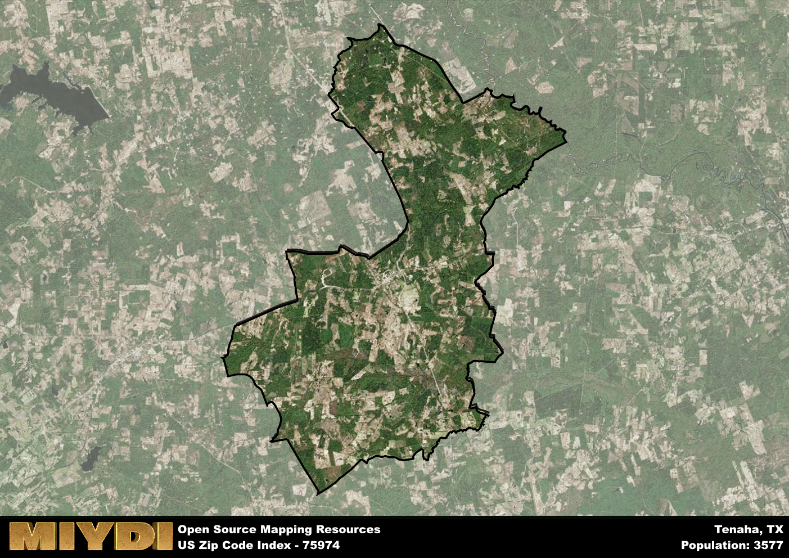

**Area Name:** Tenaha

**Zip Code:** 75974

**State:** TX

# Tenaha: A Charming Zip Code in East Texas

Located in East Texas, zip code 75974 encompasses the quaint town of Tenaha. Situated in Shelby County, Tenaha is surrounded by lush forests and rolling hills, providing a picturesque backdrop for its residents. The town is conveniently located near major highways, allowing for easy access to nearby cities like Center and Carthage. Despite its rural setting, Tenaha is an integral part of the larger East Texas region, contributing to the cultural and economic tapestry of the area.

Tenaha has a rich historical background, dating back to its founding in the early 19th century. Originally settled as a trading post, the town quickly grew into a thriving community thanks to its strategic location along important trade routes. The name "Tenaha" is believed to be derived from a Native American word meaning "meeting place," reflecting the town's role as a hub for commerce and social interaction. Over the years, Tenaha has preserved its historical charm, with many of its original buildings and landmarks still standing today.

Today, Tenaha boasts a mix of residential neighborhoods, local businesses, and recreational opportunities. The town's economy is driven by agriculture, forestry, and small businesses, providing residents with a strong sense of community and economic stability. Tenaha is home to various parks, trails, and outdoor spaces, offering ample opportunities for outdoor recreation. Additionally, the town has a number of cultural and historic sites, including museums and heritage centers, that celebrate its unique heritage. With its small-town charm and vibrant community spirit, Tenaha continues to be a beloved destination in East Texas.

# Tenaha Demographics

The population of Tenaha is 3577.  
Tenaha has a population density of 39.38 per square mile.  
The area of Tenaha is 90.83 square miles.  

## Tenaha Income and Economic Data

These demographic numbers are sourced from IRS return data, providing comprehensive insights into the population dynamics and economic trends within Tenaha.

**Breakdown of return types for Tenaha**

The table offers insight into the composition of tax returns filed with the IRS, categorizing them into three main types. Single returns represent filings by individuals, joint returns by married couples, and head of household returns by individuals who qualify as heads of households, typically having dependents. This breakdown provides an understanding of the different filing statuses adopted by taxpayers when submitting their tax documentation.

| Return Types filed for Tenaha                              | Percentage          |
|----------------------------------------------------------|---------------------|
| Single Returns                                            | 0.38 |
| Joint Returns                                             | 0.38 |
| Head Household Returns                                    | 0.22 |

The income and economic data presented here is sourced from the IRS income brackets, utilized for categorizing tax returns by income levels. This table displays income ranges for both single filers and married couples, along with the corresponding number of returns and the percentage within each bracket, providing valuable insight into the distribution of taxes across various income groups.

| Bracket Name       | Single Filer Income Range | Married Couple Range | Number of Returns | Percentage of Returns |
|--------------------|----------------------------|----------------------|-------------------|-----------------------|
| 10% Bracket        | Up to $10,275              | Up to $20,550        | 490 | 0.39% |
| 12% Bracket        | $10,276 - $41,775          | $20,551 - $83,550    | 380 | 0.3% |
| 22% Bracket        | $41,776 - $89,075          | $83,551 - $178,150   | 170 | 0.14% |
| 24% Bracket        | $89,076 - $170,050         | $178,151 - $340,100  | 80 | 0.06% |
| 32% Bracket        | $170,051 - $215,950        | $340,101 - $431,900  | 130 | 0.1% |
| 35% Bracket        | $215,951 - $539,900        | $431,901 - $647,850  | 0 | 0% |

### Exploring Taxpayer Diversity: A Breakdown of Different Types of Tax Returns in Tenaha

The table offers insights into various types of tax returns filed, reflecting different aspects of taxpayer activities and demographics. Categories include charitable returns for donations, dependent returns for claimed dependents, educator population, elderly population, real estate returns, self-employment returns, student loan returns, and unemployment returns, providing valuable insights into taxpayer behavior and demographics.

| Tenaha Filing Types                    | Count | Percentage |
|--------------------------------------|-------|------------|
| Charitable Donations                 | 20 | 0.016% |
| Dependents Claimed                   | 0 | 0% |
| Educator Residents                   | 20 | 0.016% |
| Elderly Population                   | 270 | 0.22% |
| Farming Population                   | 110 | 0.088% |
| Real Estate Transactions             | 0 | 0% |
| Self-Employed Individuals            | 150 | 0.12% |
| Student Loan Cases                   | 20 | 0.016% |
| Unemployment Benefit Filings         | 170 | 0.14% |

## Tenaha AI and Census Variables

The values presented in this dataset for Tenaha are AI-optimized, streamlined, and categorized into relevant buckets for enhanced utility in AI and mapping programs. These simplified values have been optimized to facilitate efficient analysis and integration into various technological applications, offering users accessible and actionable insights into demographics within the Tenaha area.

| AI Variables for Tenaha | Value |
|-------------|-------|
| Shape Area | 327687404.027344 |
| Shape Length | 122724.773394994 |

## How to use this free AI optimized Geo-Spatial Data for Tenaha, TX

This data is made freely available under the Creative Commons license, allowing for unrestricted use for any purpose. Users can access static resources directly from GitHub or leverage more advanced functionalities by utilizing the GeoJSON files. All datasets originate from official government or private sector sources and are meticulously compiled into relevant datasets within QGIS. However, the versatility of the data ensures compatibility with any mapping application.

## Data Accuracy Disclaimer
It's important to note that the data provided here may contain errors or discrepancies and should be considered as 'close enough' for business applications and AI rather than a definitive source of truth. This data is aggregated from multiple sources, some of which publish information on wildly different intervals, leading to potential inconsistencies. Additionally, certain data points may not be corrected for Covid-related changes, further impacting accuracy. Moreover, the assumption that demographic trends are consistent throughout a region may lead to discrepancies, as trends often concentrate in areas of highest population density. As a result, dense areas may be slightly underrepresented, while rural areas may be slightly overrepresented, resulting in a more conservative dataset. Furthermore, the focus primarily on areas within US Major and Minor Statistical areas means that approximately 40 million Americans living outside of these areas may not be fully represented. Lastly, the historical background and area descriptions generated using AI are susceptible to potential mistakes, so users should exercise caution when interpreting the information provided.
