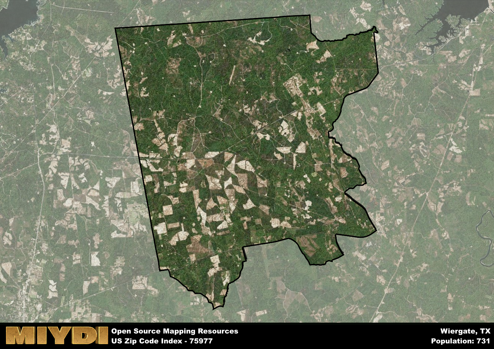

**Area Name:** Wiergate

**Zip Code:** 75977

**State:** TX

# Wiergate: A Hidden Gem in East Texas  

Located in the heart of East Texas, the zip code 75977 area encompasses the charming neighborhood of Wiergate. Situated within Newton County, Wiergate is surrounded by the vast, lush pine forests that East Texas is known for. The area is a rural community, with its closest neighbor being the city of Jasper, approximately 30 miles to the south. Despite its small size, Wiergate plays an important role in the timber industry that is prevalent in the region.

Wiergate has a rich history dating back to the early 20th century when the area was primarily used for logging operations. The town was named after the Wier Longleaf Lumber Company, which operated a sawmill in the area. Over the years, Wiergate has maintained its close-knit community feel, with many families tracing their roots back several generations. The town has weathered economic ups and downs but has remained resilient, preserving its unique identity.

Today, Wiergate is a peaceful community that offers residents a tranquil way of life away from the hustle and bustle of urban centers. The economy is primarily driven by the timber industry, with many locals working in logging and forestry. The town boasts a few small businesses, including a general store and a local diner, providing essential services to residents. In terms of recreational activities, Wiergate is surrounded by natural beauty, making it an ideal spot for outdoor enthusiasts. The area is also home to historical sites that showcase its logging heritage, adding to the town's charm and character.

# Wiergate Demographics

The population of Wiergate is 731.  
Wiergate has a population density of 4.61 per square mile.  
The area of Wiergate is 158.74 square miles.  

## Wiergate Income and Economic Data

These demographic numbers are sourced from IRS return data, providing comprehensive insights into the population dynamics and economic trends within Wiergate.

**Breakdown of return types for Wiergate**

The table offers insight into the composition of tax returns filed with the IRS, categorizing them into three main types. Single returns represent filings by individuals, joint returns by married couples, and head of household returns by individuals who qualify as heads of households, typically having dependents. This breakdown provides an understanding of the different filing statuses adopted by taxpayers when submitting their tax documentation.

| Return Types filed for Wiergate                              | Percentage          |
|----------------------------------------------------------|---------------------|
| Single Returns                                            | 0.38 |
| Joint Returns                                             | 0.35 |
| Head Household Returns                                    | 0.23 |

The income and economic data presented here is sourced from the IRS income brackets, utilized for categorizing tax returns by income levels. This table displays income ranges for both single filers and married couples, along with the corresponding number of returns and the percentage within each bracket, providing valuable insight into the distribution of taxes across various income groups.

| Bracket Name       | Single Filer Income Range | Married Couple Range | Number of Returns | Percentage of Returns |
|--------------------|----------------------------|----------------------|-------------------|-----------------------|
| 10% Bracket        | Up to $10,275              | Up to $20,550        | 120 | 0.46% |
| 12% Bracket        | $10,276 - $41,775          | $20,551 - $83,550    | 60 | 0.23% |
| 22% Bracket        | $41,776 - $89,075          | $83,551 - $178,150   | 50 | 0.19% |
| 24% Bracket        | $89,076 - $170,050         | $178,151 - $340,100  | 0 | 0% |
| 32% Bracket        | $170,051 - $215,950        | $340,101 - $431,900  | 30 | 0.12% |
| 35% Bracket        | $215,951 - $539,900        | $431,901 - $647,850  | 0 | 0% |

### Exploring Taxpayer Diversity: A Breakdown of Different Types of Tax Returns in Wiergate

The table offers insights into various types of tax returns filed, reflecting different aspects of taxpayer activities and demographics. Categories include charitable returns for donations, dependent returns for claimed dependents, educator population, elderly population, real estate returns, self-employment returns, student loan returns, and unemployment returns, providing valuable insights into taxpayer behavior and demographics.

| Wiergate Filing Types                    | Count | Percentage |
|--------------------------------------|-------|------------|
| Charitable Donations                 | 0 | 0% |
| Dependents Claimed                   | 0 | 0% |
| Educator Residents                   | 0 | 0% |
| Elderly Population                   | 80 | 0.31% |
| Farming Population                   | 40 | 0.154% |
| Real Estate Transactions             | 0 | 0% |
| Self-Employed Individuals            | 0 | 0% |
| Student Loan Cases                   | 0 | 0% |
| Unemployment Benefit Filings         | 40 | 0.15% |

## Wiergate AI and Census Variables

The values presented in this dataset for Wiergate are AI-optimized, streamlined, and categorized into relevant buckets for enhanced utility in AI and mapping programs. These simplified values have been optimized to facilitate efficient analysis and integration into various technological applications, offering users accessible and actionable insights into demographics within the Wiergate area.

| AI Variables for Wiergate | Value |
|-------------|-------|
| Shape Area | 562151690.050781 |
| Shape Length | 120052.03398498 |

## How to use this free AI optimized Geo-Spatial Data for Wiergate, TX

This data is made freely available under the Creative Commons license, allowing for unrestricted use for any purpose. Users can access static resources directly from GitHub or leverage more advanced functionalities by utilizing the GeoJSON files. All datasets originate from official government or private sector sources and are meticulously compiled into relevant datasets within QGIS. However, the versatility of the data ensures compatibility with any mapping application.

## Data Accuracy Disclaimer
It's important to note that the data provided here may contain errors or discrepancies and should be considered as 'close enough' for business applications and AI rather than a definitive source of truth. This data is aggregated from multiple sources, some of which publish information on wildly different intervals, leading to potential inconsistencies. Additionally, certain data points may not be corrected for Covid-related changes, further impacting accuracy. Moreover, the assumption that demographic trends are consistent throughout a region may lead to discrepancies, as trends often concentrate in areas of highest population density. As a result, dense areas may be slightly underrepresented, while rural areas may be slightly overrepresented, resulting in a more conservative dataset. Furthermore, the focus primarily on areas within US Major and Minor Statistical areas means that approximately 40 million Americans living outside of these areas may not be fully represented. Lastly, the historical background and area descriptions generated using AI are susceptible to potential mistakes, so users should exercise caution when interpreting the information provided.
