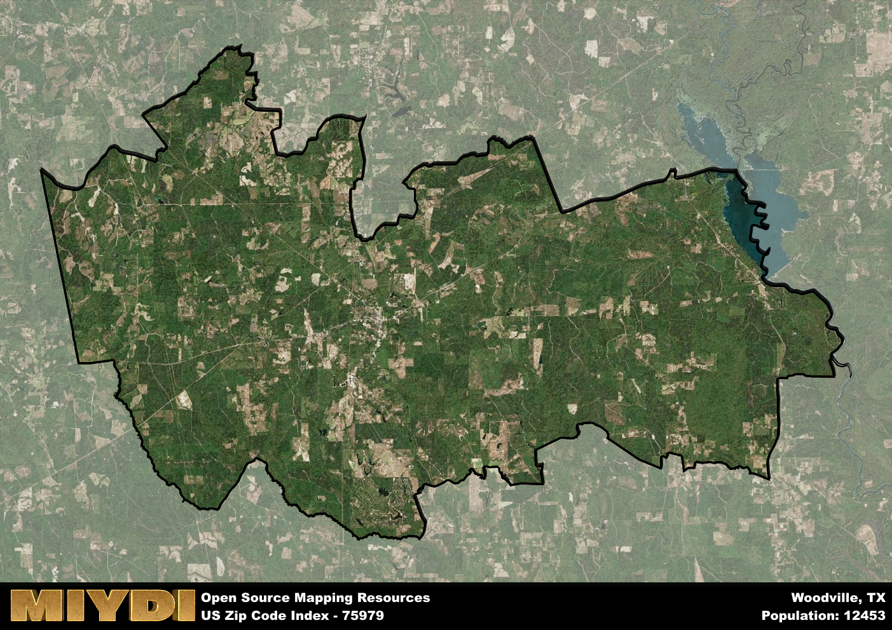

**Area Name:** Woodville

**Zip Code:** 75979

**State:** TX

# Woodville: A Quaint Community in East Texas  
Woodville, located in zip code 75979, is a charming town situated in Tyler County in East Texas. Bordered by the Davy Crockett National Forest to the east and the Angelina National Forest to the south, Woodville serves as a gateway to the natural beauty of the region. It is approximately 100 miles northeast of Houston and 60 miles north of Beaumont, making it a convenient retreat for those seeking a peaceful escape from the bustling city life.

With a history dating back to the early 19th century, Woodville was established as a trading post in the piney woods of East Texas. The town flourished due to its strategic location along the Old San Antonio Road, which connected East Texas to the Gulf Coast. The area was named after George Tyler Wood, the second Governor of Texas, and has preserved its small-town charm while evolving into a vibrant community with a rich cultural heritage. Woodville is known for its historic courthouse square, which features a mix of architectural styles reflecting its diverse past.

Today, Woodville continues to thrive as a hub for agriculture, timber production, and tourism. The town offers a variety of local shops, restaurants, and services that cater to both residents and visitors. Outdoor enthusiasts can explore the nearby national forests, go fishing in the numerous lakes and rivers, or enjoy hiking and camping in the picturesque surroundings. Woodville also hosts annual events such as the Tyler County Dogwood Festival, showcasing the town's natural beauty and community spirit. With its blend of history, nature, and Southern hospitality, Woodville remains a hidden gem in the heart of East Texas.

# Woodville Demographics

The population of Woodville is 12453.  
Woodville has a population density of 41.77 per square mile.  
The area of Woodville is 298.1 square miles.  

## Woodville Income and Economic Data

These demographic numbers are sourced from IRS return data, providing comprehensive insights into the population dynamics and economic trends within Woodville.

**Breakdown of return types for Woodville**

The table offers insight into the composition of tax returns filed with the IRS, categorizing them into three main types. Single returns represent filings by individuals, joint returns by married couples, and head of household returns by individuals who qualify as heads of households, typically having dependents. This breakdown provides an understanding of the different filing statuses adopted by taxpayers when submitting their tax documentation.

| Return Types filed for Woodville                              | Percentage          |
|----------------------------------------------------------|---------------------|
| Single Returns                                            | 0.44 |
| Joint Returns                                             | 0.39 |
| Head Household Returns                                    | 0.15 |

The income and economic data presented here is sourced from the IRS income brackets, utilized for categorizing tax returns by income levels. This table displays income ranges for both single filers and married couples, along with the corresponding number of returns and the percentage within each bracket, providing valuable insight into the distribution of taxes across various income groups.

| Bracket Name       | Single Filer Income Range | Married Couple Range | Number of Returns | Percentage of Returns |
|--------------------|----------------------------|----------------------|-------------------|-----------------------|
| 10% Bracket        | Up to $10,275              | Up to $20,550        | 1490 | 0.42% |
| 12% Bracket        | $10,276 - $41,775          | $20,551 - $83,550    | 900 | 0.25% |
| 22% Bracket        | $41,776 - $89,075          | $83,551 - $178,150   | 490 | 0.14% |
| 24% Bracket        | $89,076 - $170,050         | $178,151 - $340,100  | 270 | 0.08% |
| 32% Bracket        | $170,051 - $215,950        | $340,101 - $431,900  | 330 | 0.09% |
| 35% Bracket        | $215,951 - $539,900        | $431,901 - $647,850  | 70 | 0.02% |

### Exploring Taxpayer Diversity: A Breakdown of Different Types of Tax Returns in Woodville

The table offers insights into various types of tax returns filed, reflecting different aspects of taxpayer activities and demographics. Categories include charitable returns for donations, dependent returns for claimed dependents, educator population, elderly population, real estate returns, self-employment returns, student loan returns, and unemployment returns, providing valuable insights into taxpayer behavior and demographics.

| Woodville Filing Types                    | Count | Percentage |
|--------------------------------------|-------|------------|
| Charitable Donations                 | 90 | 0.025% |
| Dependents Claimed                   | 70 | 0.02% |
| Educator Residents                   | 60 | 0.017% |
| Elderly Population                   | 1100 | 0.31% |
| Farming Population                   | 180 | 0.051% |
| Real Estate Transactions             | 80 | 0.023% |
| Self-Employed Individuals            | 470 | 0.132% |
| Student Loan Cases                   | 100 | 0.028% |
| Unemployment Benefit Filings         | 500 | 0.14% |

## Woodville AI and Census Variables

The values presented in this dataset for Woodville are AI-optimized, streamlined, and categorized into relevant buckets for enhanced utility in AI and mapping programs. These simplified values have been optimized to facilitate efficient analysis and integration into various technological applications, offering users accessible and actionable insights into demographics within the Woodville area.

| AI Variables for Woodville | Value |
|-------------|-------|
| Shape Area | 1049348099.95313 |
| Shape Length | 231044.560419269 |

## How to use this free AI optimized Geo-Spatial Data for Woodville, TX

This data is made freely available under the Creative Commons license, allowing for unrestricted use for any purpose. Users can access static resources directly from GitHub or leverage more advanced functionalities by utilizing the GeoJSON files. All datasets originate from official government or private sector sources and are meticulously compiled into relevant datasets within QGIS. However, the versatility of the data ensures compatibility with any mapping application.

## Data Accuracy Disclaimer
It's important to note that the data provided here may contain errors or discrepancies and should be considered as 'close enough' for business applications and AI rather than a definitive source of truth. This data is aggregated from multiple sources, some of which publish information on wildly different intervals, leading to potential inconsistencies. Additionally, certain data points may not be corrected for Covid-related changes, further impacting accuracy. Moreover, the assumption that demographic trends are consistent throughout a region may lead to discrepancies, as trends often concentrate in areas of highest population density. As a result, dense areas may be slightly underrepresented, while rural areas may be slightly overrepresented, resulting in a more conservative dataset. Furthermore, the focus primarily on areas within US Major and Minor Statistical areas means that approximately 40 million Americans living outside of these areas may not be fully represented. Lastly, the historical background and area descriptions generated using AI are susceptible to potential mistakes, so users should exercise caution when interpreting the information provided.
