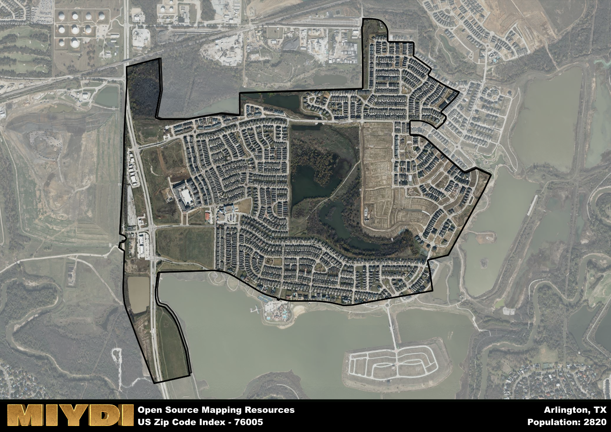

**Area Name:** Arlington

**Zip Code:** 76005

**State:** TX

Arlington is a part of the Dallas-Fort Worth-Arlington - TX Metro Area, and makes up 0.04% of the Metro's population.  

# Arlington's Vibrant Zip Code 76005

Zip code 76005 corresponds to the area of Viridian, located in Arlington, Texas. Situated in the northern part of the city, Viridian is bordered by the Trinity River to the west and is in close proximity to the major cities of Dallas and Fort Worth. This zip code area seamlessly integrates with the larger urban fabric of the Dallas-Fort Worth metroplex, providing residents with easy access to a variety of cultural, economic, and recreational opportunities.

Viridian has a rich historical narrative that dates back to its early settlement by pioneers seeking fertile land for farming and ranching. Over the years, the area experienced rapid growth due to its strategic location along major transportation routes, attracting businesses and families looking to establish roots in a thriving community. The name "Viridian" was chosen to reflect the lush greenery and natural beauty of the landscape, symbolizing the area's commitment to sustainability and environmental conservation.

Today, Viridian is a bustling neighborhood known for its diverse economic activities, including retail, healthcare, and technology sectors. Residents enjoy a wide range of neighborhood-specific services such as schools, parks, and community centers, fostering a strong sense of belonging and camaraderie. The area boasts an array of recreational amenities, including hiking trails, sports facilities, and green spaces, making it an ideal place for outdoor enthusiasts. Additionally, Viridian is home to several cultural and historic sites that showcase the area's unique heritage and charm, further enhancing its appeal within the larger Arlington community.

# Arlington Demographics

The population of Arlington is 2820.  
Arlington has a population density of 2186.05 per square mile.  
The area of Arlington is 1.29 square miles.  

### Exploring Real Estate Trends: A Comprehensive Analysis of the Arlington Area and its Neighbors

This table contains an in-depth examination of the real estate market in the Arlington area. Sourced from trusted real estate market firms, this dataset provides a wealth of raw data detailing the local real estate landscape, along with comparative analyses juxtaposing the market dynamics with those of neighboring areas. Explore the intricacies of the Arlington real estate market and gain valuable insights into its relationship with adjacent regions.

| Real Estate Data for Arlington                       | Value    |
|------------------------------------------------|----------|
| Average Listing Price for Arlington               | 581921 |
| Median Listing Price for Arlington                | 568500 |
| Median Days on Market for Arlington               | 34 |
| Median Listing Price per Square Foot for Arlington| 34 |
| Median Square Feet for Arlington                  | 2434 |
| Real Estate Prices to Income Ratio           | 145.23% |
| Price per Square Foot Ratio                  | 105.49% |
| Price Median Ratio                           | 113.22% |
| Market Sales Speed Ratio                     | 79.6% |

This table offers essential real estate data for the Arlington area, including average and median listing prices, median days on market, and property size. It also presents ratio metrics as percentages, providing insights into how the local market compares to the surrounding region. A ratio of 100% signifies performance in line with the regional average, while values above or below indicate overperformance or underperformance, respectively, relative to expectations.

## Arlington Sports and Recreation Data

#### Annual Youth Sports Spending for Arlington

This table provides fundamental insights into the Sports and Recreation data for the Arlington area, detailing the estimated annual expenditure on Youth Athletics. This includes estimated spending by the major consumer brackets. 
| Sports Spending for Arlington| Value |
|-------------------------|-------|
| Athlete Spending Compared to the region | 9.29% |
| Total Youth Athlete Spending | 83,367 |
| Athletic Spending - Essential Focused Consumer | 6,369 |
| Athletic Spending - Typical Consumer | 9,524 |
| Athletic Spending - Affluent Consumers | 37,382 |

#### Youth Coaching Estimates for Arlington

This table presents the estimated number of coaches for the Arlington area, derived from comprehensive national coaching surveys and athletic participation rates by state. It offers valuable insights into the vital role of coaching personnel in fostering athletic development and facilitating sports participation within the local community.

| Coaching Data for Arlington | Value |
|-------------|-------|
| Total Coaches | 46 |
| Paid Coaches | 12 |
| Volunteer Coaches | 34 |

#### Youth Athlete Participation for Arlington

This table shows the estimated total number of youth athletes in the Arlington area, sourced from comprehensive national coaching surveys and athletic participation rates by state.

| Total YA Athletes in Arlington | Value |
|-------------|-------|
| Total High School Athletes | 70 |
| Total Youth Athletes | 211 |
| Total Young Adult Athletes | 141 |
| Total Athletes to Age 25 | 423 |

#### High School Age Athletes - Breakdown by Sport for Arlington

This table shows insights regarding high school age estimated players by sport in the Arlington area, derived from national and state-level athletic participation trends. 

| HS Players by Sport in Arlington | Value |
|-------------|-------|
| Football Players | 16 |
| Basketball Players | 10 |
| Soccer Players | 8 |
| Volleyball Players | 5 |
| Baseball Players | 8 |
| Tennis Players | 4 |
| Track Athletes | 12 |
| Golf Players | 2 |
| Swimming Athletes | 2 |
| Wrestling Competitors | 2 |
| Lacrosse Players | 0 |

Estimating the number of younger athletes presents unique challenges due to their varied starting ages, typically beginning around six years old, and a gradual decline in participation rates as they age. Unlike high school-aged athletes, younger athletes are less likely to switch sports as they grow older, contributing to the stability of participation numbers within specific sports at younger ages.  

As a general trend, the total number of younger athletes is approximately three times the number of high school-aged athletes, underscoring the significant presence of youth athletes in sports programs and highlighting the importance of early engagement in athletic activities.

## Arlington AI and Census Variables

The values presented in this dataset for Arlington are AI-optimized, streamlined, and categorized into relevant buckets for enhanced utility in AI and mapping programs. These simplified values have been optimized to facilitate efficient analysis and integration into various technological applications, offering users accessible and actionable insights into demographics within the Arlington area.

| AI Variables for Arlington | Value |
|-------------|-------|
| Shape Area | 4740107.12890625 |
| Shape Length | 13316.121644014 |
| CBSA Federal Processing Standard Code | 19100 |
| RE Price per Square Foot Ratio | 105.49% |
| RE Price Average Ratio | 94.03% |
| RE Speed Ratio | 79.6% |
| RE Income Ratio | 145.23% |
| RE Affordability Index Flag | 4 |
| Income Bracket Flag | 2 |
| RE Income Flag | 4 |
| RE Median Square Footage Price Flag | 5 |
| RE Median Square Footage Size Flag | 6 |
| RE Activity Flag | 3 |
| Poverty Line Risk Flag | 7 |

## How to use this free AI optimized Geo-Spatial Data for Arlington, TX

This data is made freely available under the Creative Commons license, allowing for unrestricted use for any purpose. Users can access static resources directly from GitHub or leverage more advanced functionalities by utilizing the GeoJSON files. All datasets originate from official government or private sector sources and are meticulously compiled into relevant datasets within QGIS. However, the versatility of the data ensures compatibility with any mapping application.

## Data Accuracy Disclaimer
It's important to note that the data provided here may contain errors or discrepancies and should be considered as 'close enough' for business applications and AI rather than a definitive source of truth. This data is aggregated from multiple sources, some of which publish information on wildly different intervals, leading to potential inconsistencies. Additionally, certain data points may not be corrected for Covid-related changes, further impacting accuracy. Moreover, the assumption that demographic trends are consistent throughout a region may lead to discrepancies, as trends often concentrate in areas of highest population density. As a result, dense areas may be slightly underrepresented, while rural areas may be slightly overrepresented, resulting in a more conservative dataset. Furthermore, the focus primarily on areas within US Major and Minor Statistical areas means that approximately 40 million Americans living outside of these areas may not be fully represented. Lastly, the historical background and area descriptions generated using AI are susceptible to potential mistakes, so users should exercise caution when interpreting the information provided.
