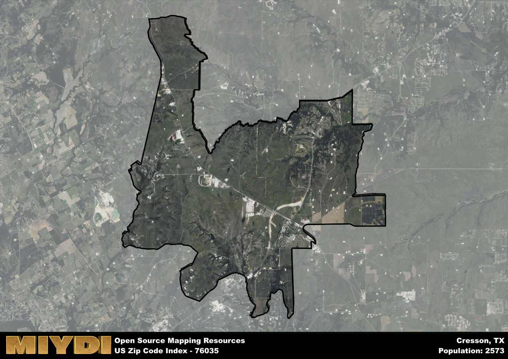

**Area Name:** Cresson

**Zip Code:** 76035

**State:** TX

Cresson is a part of the Dallas-Fort Worth-Arlington - TX Metro Area, and makes up  of the Metro's population.  

# Cresson: A Charming Historic Town in Texas  

Located in zip code 76035, Cresson is a small town in Texas situated southwest of Fort Worth. The area is bordered by Granbury to the south and Aledo to the east, making it a part of the greater Dallas-Fort Worth metropolitan area. Cresson serves as a peaceful residential community with easy access to major highways, providing residents with a tranquil retreat while remaining connected to urban amenities.

Cresson was originally settled in the mid-1800s and was named after John Cresson, a prominent local landowner. The town experienced growth during the railroad boom of the late 19th century, serving as a crucial transportation hub for the region. Over the years, Cresson has maintained its small-town charm and historic character, attracting visitors with its quaint downtown area and well-preserved architecture.

Today, Cresson boasts a mix of residential neighborhoods, local businesses, and recreational opportunities. The town is known for its equestrian facilities, attracting horse enthusiasts from across the state. In addition to horseback riding, residents and visitors can enjoy hiking at nearby parks or exploring the town's historic sites. With a focus on community spirit and preserving its heritage, Cresson continues to thrive as a unique destination within the Dallas-Fort Worth metropolitan area.

# Cresson Demographics

The population of Cresson is 2573.  
Cresson has a population density of 68.36 per square mile.  
The area of Cresson is 37.64 square miles.  

## Cresson Income and Economic Data

These demographic numbers are sourced from IRS return data, providing comprehensive insights into the population dynamics and economic trends within Cresson.

**Breakdown of return types for Cresson**

The table offers insight into the composition of tax returns filed with the IRS, categorizing them into three main types. Single returns represent filings by individuals, joint returns by married couples, and head of household returns by individuals who qualify as heads of households, typically having dependents. This breakdown provides an understanding of the different filing statuses adopted by taxpayers when submitting their tax documentation.

| Return Types filed for Cresson                              | Percentage          |
|----------------------------------------------------------|---------------------|
| Single Returns                                            | 0.39 |
| Joint Returns                                             | 0.44 |
| Head Household Returns                                    | 0.18 |

The income and economic data presented here is sourced from the IRS income brackets, utilized for categorizing tax returns by income levels. This table displays income ranges for both single filers and married couples, along with the corresponding number of returns and the percentage within each bracket, providing valuable insight into the distribution of taxes across various income groups.

| Bracket Name       | Single Filer Income Range | Married Couple Range | Number of Returns | Percentage of Returns |
|--------------------|----------------------------|----------------------|-------------------|-----------------------|
| 10% Bracket        | Up to $10,275              | Up to $20,550        | 400 | 0.34% |
| 12% Bracket        | $10,276 - $41,775          | $20,551 - $83,550    | 280 | 0.24% |
| 22% Bracket        | $41,776 - $89,075          | $83,551 - $178,150   | 130 | 0.11% |
| 24% Bracket        | $89,076 - $170,050         | $178,151 - $340,100  | 90 | 0.08% |
| 32% Bracket        | $170,051 - $215,950        | $340,101 - $431,900  | 190 | 0.16% |
| 35% Bracket        | $215,951 - $539,900        | $431,901 - $647,850  | 100 | 0.08% |

### Exploring Taxpayer Diversity: A Breakdown of Different Types of Tax Returns in Cresson

The table offers insights into various types of tax returns filed, reflecting different aspects of taxpayer activities and demographics. Categories include charitable returns for donations, dependent returns for claimed dependents, educator population, elderly population, real estate returns, self-employment returns, student loan returns, and unemployment returns, providing valuable insights into taxpayer behavior and demographics.

| Cresson Filing Types                    | Count | Percentage |
|--------------------------------------|-------|------------|
| Charitable Donations                 | 120 | 0.101% |
| Dependents Claimed                   | 30 | 0.025% |
| Educator Residents                   | 0 | 0% |
| Elderly Population                   | 280 | 0.24% |
| Farming Population                   | 40 | 0.034% |
| Real Estate Transactions             | 130 | 0.109% |
| Self-Employed Individuals            | 190 | 0.16% |
| Student Loan Cases                   | 40 | 0.034% |
| Unemployment Benefit Filings         | 170 | 0.14% |

## Cresson AI and Census Variables

The values presented in this dataset for Cresson are AI-optimized, streamlined, and categorized into relevant buckets for enhanced utility in AI and mapping programs. These simplified values have been optimized to facilitate efficient analysis and integration into various technological applications, offering users accessible and actionable insights into demographics within the Cresson area.

| AI Variables for Cresson | Value |
|-------------|-------|
| Shape Area | 137594920.859375 |
| Shape Length | 87914.5281255732 |
| CBSA Federal Processing Standard Code | 19100 |

## How to use this free AI optimized Geo-Spatial Data for Cresson, TX

This data is made freely available under the Creative Commons license, allowing for unrestricted use for any purpose. Users can access static resources directly from GitHub or leverage more advanced functionalities by utilizing the GeoJSON files. All datasets originate from official government or private sector sources and are meticulously compiled into relevant datasets within QGIS. However, the versatility of the data ensures compatibility with any mapping application.

## Data Accuracy Disclaimer
It's important to note that the data provided here may contain errors or discrepancies and should be considered as 'close enough' for business applications and AI rather than a definitive source of truth. This data is aggregated from multiple sources, some of which publish information on wildly different intervals, leading to potential inconsistencies. Additionally, certain data points may not be corrected for Covid-related changes, further impacting accuracy. Moreover, the assumption that demographic trends are consistent throughout a region may lead to discrepancies, as trends often concentrate in areas of highest population density. As a result, dense areas may be slightly underrepresented, while rural areas may be slightly overrepresented, resulting in a more conservative dataset. Furthermore, the focus primarily on areas within US Major and Minor Statistical areas means that approximately 40 million Americans living outside of these areas may not be fully represented. Lastly, the historical background and area descriptions generated using AI are susceptible to potential mistakes, so users should exercise caution when interpreting the information provided.
