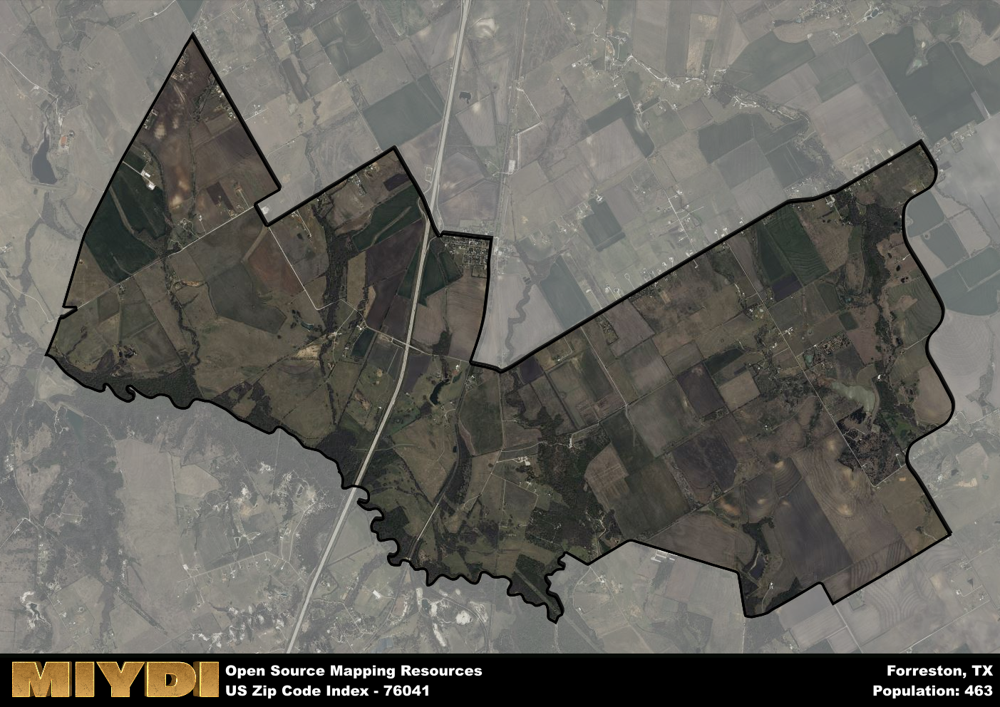

**Area Name:** Forreston

**Zip Code:** 76041

**State:** TX

Forreston is a part of the Dallas-Fort Worth-Arlington - TX Metro Area, and makes up  of the Metro's population.  

# Forreston: A Historic and Vibrant Zip Code Area in Texas

Located in Ellis County, Texas, zip code 76041 encompasses the charming rural community of Forreston. Bordered by Waxahachie to the north and Italy to the south, Forreston is a small but integral part of the Dallas-Fort Worth metropolitan area. With its close proximity to major highways, residents have easy access to urban amenities while enjoying the peaceful countryside setting.

Forreston has a rich historical background, dating back to the mid-19th century when settlers began to establish farms in the area. The town was officially founded in 1854 and named after John Wesley Forrest, a prominent local landowner. Over the years, Forreston experienced growth as agriculture and ranching became the main economic activities. The town's historic buildings and landmarks serve as a reminder of its pioneer past.

Today, Forreston maintains its rural charm while offering modern conveniences to its residents. The area is known for its thriving agriculture industry, with many farms producing crops and livestock. Local businesses cater to the community's needs, including grocery stores, restaurants, and small shops. Forreston also boasts recreational facilities such as parks and sports fields, providing opportunities for outdoor activities. With its historic sites and strong sense of community, Forreston is a unique and welcoming place to call home in the Dallas-Fort Worth area.

# Forreston Demographics

The population of Forreston is 463.  
Forreston has a population density of 34.79 per square mile.  
The area of Forreston is 13.31 square miles.  

## Forreston Income and Economic Data

These demographic numbers are sourced from IRS return data, providing comprehensive insights into the population dynamics and economic trends within Forreston.

**Breakdown of return types for Forreston**

The table offers insight into the composition of tax returns filed with the IRS, categorizing them into three main types. Single returns represent filings by individuals, joint returns by married couples, and head of household returns by individuals who qualify as heads of households, typically having dependents. This breakdown provides an understanding of the different filing statuses adopted by taxpayers when submitting their tax documentation.

| Return Types filed for Forreston                              | Percentage          |
|----------------------------------------------------------|---------------------|
| Single Returns                                            | 0.4 |
| Joint Returns                                             | 0.45 |
| Head Household Returns                                    | 0.1 |

The income and economic data presented here is sourced from the IRS income brackets, utilized for categorizing tax returns by income levels. This table displays income ranges for both single filers and married couples, along with the corresponding number of returns and the percentage within each bracket, providing valuable insight into the distribution of taxes across various income groups.

| Bracket Name       | Single Filer Income Range | Married Couple Range | Number of Returns | Percentage of Returns |
|--------------------|----------------------------|----------------------|-------------------|-----------------------|
| 10% Bracket        | Up to $10,275              | Up to $20,550        | 60 | 0.3% |
| 12% Bracket        | $10,276 - $41,775          | $20,551 - $83,550    | 60 | 0.3% |
| 22% Bracket        | $41,776 - $89,075          | $83,551 - $178,150   | 50 | 0.25% |
| 24% Bracket        | $89,076 - $170,050         | $178,151 - $340,100  | 0 | 0% |
| 32% Bracket        | $170,051 - $215,950        | $340,101 - $431,900  | 30 | 0.15% |
| 35% Bracket        | $215,951 - $539,900        | $431,901 - $647,850  | 0 | 0% |

### Exploring Taxpayer Diversity: A Breakdown of Different Types of Tax Returns in Forreston

The table offers insights into various types of tax returns filed, reflecting different aspects of taxpayer activities and demographics. Categories include charitable returns for donations, dependent returns for claimed dependents, educator population, elderly population, real estate returns, self-employment returns, student loan returns, and unemployment returns, providing valuable insights into taxpayer behavior and demographics.

| Forreston Filing Types                    | Count | Percentage |
|--------------------------------------|-------|------------|
| Charitable Donations                 | 0 | 0% |
| Dependents Claimed                   | 0 | 0% |
| Educator Residents                   | 0 | 0% |
| Elderly Population                   | 50 | 0.25% |
| Farming Population                   | 0 | 0% |
| Real Estate Transactions             | 0 | 0% |
| Self-Employed Individuals            | 0 | 0% |
| Student Loan Cases                   | 0 | 0% |
| Unemployment Benefit Filings         | 20 | 0.1% |

## Forreston AI and Census Variables

The values presented in this dataset for Forreston are AI-optimized, streamlined, and categorized into relevant buckets for enhanced utility in AI and mapping programs. These simplified values have been optimized to facilitate efficient analysis and integration into various technological applications, offering users accessible and actionable insights into demographics within the Forreston area.

| AI Variables for Forreston | Value |
|-------------|-------|
| Shape Area | 48315119.6953125 |
| Shape Length | 45807.3676753659 |
| CBSA Federal Processing Standard Code | 19100 |

## How to use this free AI optimized Geo-Spatial Data for Forreston, TX

This data is made freely available under the Creative Commons license, allowing for unrestricted use for any purpose. Users can access static resources directly from GitHub or leverage more advanced functionalities by utilizing the GeoJSON files. All datasets originate from official government or private sector sources and are meticulously compiled into relevant datasets within QGIS. However, the versatility of the data ensures compatibility with any mapping application.

## Data Accuracy Disclaimer
It's important to note that the data provided here may contain errors or discrepancies and should be considered as 'close enough' for business applications and AI rather than a definitive source of truth. This data is aggregated from multiple sources, some of which publish information on wildly different intervals, leading to potential inconsistencies. Additionally, certain data points may not be corrected for Covid-related changes, further impacting accuracy. Moreover, the assumption that demographic trends are consistent throughout a region may lead to discrepancies, as trends often concentrate in areas of highest population density. As a result, dense areas may be slightly underrepresented, while rural areas may be slightly overrepresented, resulting in a more conservative dataset. Furthermore, the focus primarily on areas within US Major and Minor Statistical areas means that approximately 40 million Americans living outside of these areas may not be fully represented. Lastly, the historical background and area descriptions generated using AI are susceptible to potential mistakes, so users should exercise caution when interpreting the information provided.
