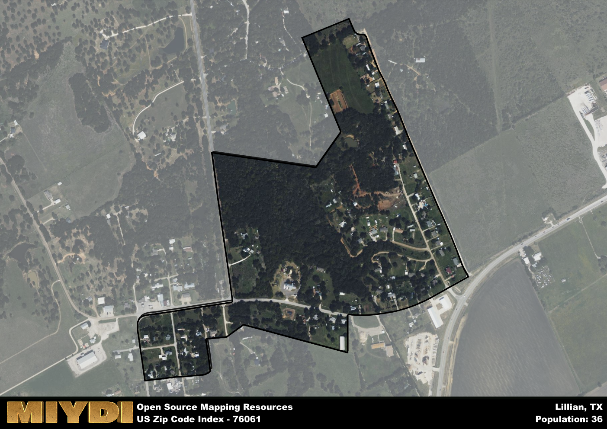

**Area Name:** Lillian

**Zip Code:** 76061

**State:** TX

Lillian is a part of the Dallas-Fort Worth-Arlington - TX Metro Area, and makes up  of the Metro's population.  

# Lillian: A Charming Neighborhood in the Heart of Texas  

Located within the zip code 76061, Lillian is a quaint neighborhood situated in Johnson County, Texas. Bordering the cities of Mansfield and Burleson, Lillian is an integral part of the Dallas-Fort Worth metropolitan area. With easy access to major highways and close proximity to urban centers, Lillian offers a peaceful retreat while still being well-connected to the bustling cities nearby.

Originally settled in the late 19th century, Lillian has a rich history of agriculture and ranching, with many families still maintaining these traditions today. The area was named after Lillian Christenson, the daughter of a local landowner, and has since grown into a tight-knit community known for its friendly residents and welcoming atmosphere. Over the years, Lillian has seen steady growth while preserving its small-town charm, making it a desirable place to live for those looking for a peaceful suburban lifestyle.

Today, Lillian boasts a mix of residential neighborhoods, local businesses, and recreational facilities. The area is known for its equestrian culture, with many residents owning horses and participating in local riding clubs. Lillian also offers a variety of parks and outdoor spaces, perfect for hiking, picnicking, and enjoying the Texas sunshine. With a strong sense of community and a focus on preserving its heritage, Lillian continues to thrive as a hidden gem in the Dallas-Fort Worth metropolitan area.

# Lillian Demographics

The population of Lillian is 36.  
Lillian has a population density of 200 per square mile.  
The area of Lillian is 0.18 square miles.  

## Lillian Income and Economic Data

These demographic numbers are sourced from IRS return data, providing comprehensive insights into the population dynamics and economic trends within Lillian.

**Breakdown of return types for Lillian**

The table offers insight into the composition of tax returns filed with the IRS, categorizing them into three main types. Single returns represent filings by individuals, joint returns by married couples, and head of household returns by individuals who qualify as heads of households, typically having dependents. This breakdown provides an understanding of the different filing statuses adopted by taxpayers when submitting their tax documentation.

| Return Types filed for Lillian                              | Percentage          |
|----------------------------------------------------------|---------------------|
| Single Returns                                            | 0.38 |
| Joint Returns                                             | 0.46 |
| Head Household Returns                                    | 0.13 |

The income and economic data presented here is sourced from the IRS income brackets, utilized for categorizing tax returns by income levels. This table displays income ranges for both single filers and married couples, along with the corresponding number of returns and the percentage within each bracket, providing valuable insight into the distribution of taxes across various income groups.

| Bracket Name       | Single Filer Income Range | Married Couple Range | Number of Returns | Percentage of Returns |
|--------------------|----------------------------|----------------------|-------------------|-----------------------|
| 10% Bracket        | Up to $10,275              | Up to $20,550        | 70 | 0.29% |
| 12% Bracket        | $10,276 - $41,775          | $20,551 - $83,550    | 70 | 0.29% |
| 22% Bracket        | $41,776 - $89,075          | $83,551 - $178,150   | 30 | 0.13% |
| 24% Bracket        | $89,076 - $170,050         | $178,151 - $340,100  | 20 | 0.08% |
| 32% Bracket        | $170,051 - $215,950        | $340,101 - $431,900  | 50 | 0.21% |
| 35% Bracket        | $215,951 - $539,900        | $431,901 - $647,850  | 0 | 0% |

### Exploring Taxpayer Diversity: A Breakdown of Different Types of Tax Returns in Lillian

The table offers insights into various types of tax returns filed, reflecting different aspects of taxpayer activities and demographics. Categories include charitable returns for donations, dependent returns for claimed dependents, educator population, elderly population, real estate returns, self-employment returns, student loan returns, and unemployment returns, providing valuable insights into taxpayer behavior and demographics.

| Lillian Filing Types                    | Count | Percentage |
|--------------------------------------|-------|------------|
| Charitable Donations                 | 0 | 0% |
| Dependents Claimed                   | 0 | 0% |
| Educator Residents                   | 0 | 0% |
| Elderly Population                   | 100 | 0.42% |
| Farming Population                   | 20 | 0.083% |
| Real Estate Transactions             | 0 | 0% |
| Self-Employed Individuals            | 30 | 0.125% |
| Student Loan Cases                   | 0 | 0% |
| Unemployment Benefit Filings         | 30 | 0.13% |

## Lillian AI and Census Variables

The values presented in this dataset for Lillian are AI-optimized, streamlined, and categorized into relevant buckets for enhanced utility in AI and mapping programs. These simplified values have been optimized to facilitate efficient analysis and integration into various technological applications, offering users accessible and actionable insights into demographics within the Lillian area.

| AI Variables for Lillian | Value |
|-------------|-------|
| Shape Area | 649664.85546875 |
| Shape Length | 4702.83652984054 |
| CBSA Federal Processing Standard Code | 19100 |

## How to use this free AI optimized Geo-Spatial Data for Lillian, TX

This data is made freely available under the Creative Commons license, allowing for unrestricted use for any purpose. Users can access static resources directly from GitHub or leverage more advanced functionalities by utilizing the GeoJSON files. All datasets originate from official government or private sector sources and are meticulously compiled into relevant datasets within QGIS. However, the versatility of the data ensures compatibility with any mapping application.

## Data Accuracy Disclaimer
It's important to note that the data provided here may contain errors or discrepancies and should be considered as 'close enough' for business applications and AI rather than a definitive source of truth. This data is aggregated from multiple sources, some of which publish information on wildly different intervals, leading to potential inconsistencies. Additionally, certain data points may not be corrected for Covid-related changes, further impacting accuracy. Moreover, the assumption that demographic trends are consistent throughout a region may lead to discrepancies, as trends often concentrate in areas of highest population density. As a result, dense areas may be slightly underrepresented, while rural areas may be slightly overrepresented, resulting in a more conservative dataset. Furthermore, the focus primarily on areas within US Major and Minor Statistical areas means that approximately 40 million Americans living outside of these areas may not be fully represented. Lastly, the historical background and area descriptions generated using AI are susceptible to potential mistakes, so users should exercise caution when interpreting the information provided.
