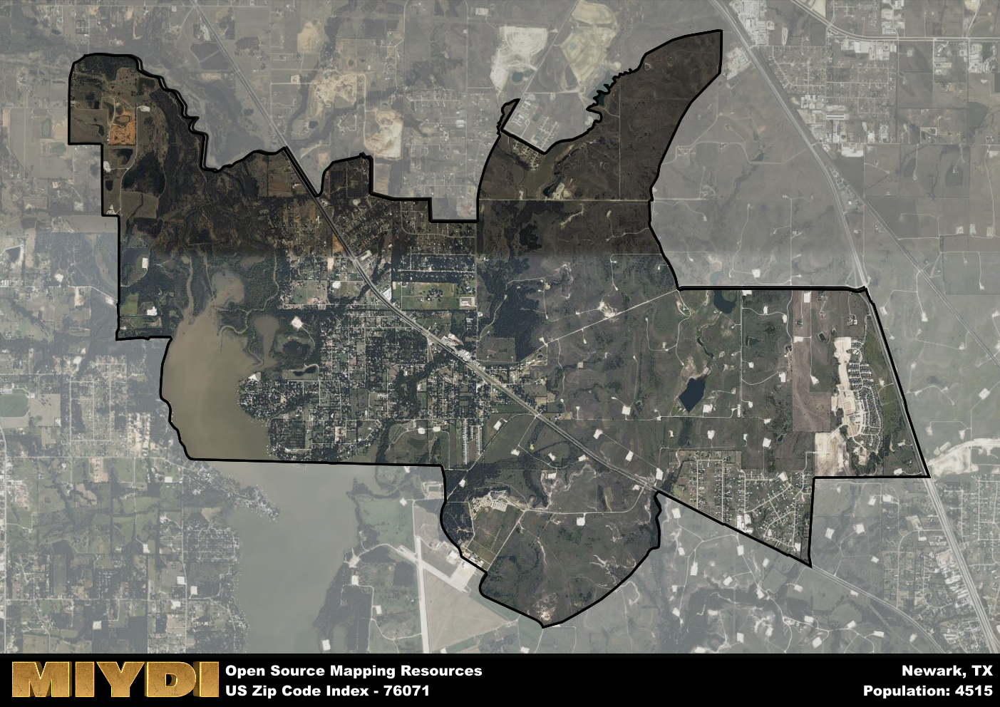

**Area Name:** Newark

**Zip Code:** 76071

**State:** TX

Newark is a part of the Dallas-Fort Worth-Arlington - TX Metro Area, and makes up  of the Metro's population.  

# Newark, Texas - Zip Code 76071

Located in the northern part of Texas, zip code 76071 corresponds to the neighborhood of Newark. Situated within the Dallas-Fort Worth metroplex, Newark is bordered by the cities of Rhome to the west and Boyd to the east. It is conveniently connected to major highways such as Interstate 35W, providing easy access to neighboring towns and urban centers. Newark functions as a residential community within the larger urban fabric, offering a tranquil retreat from the bustling cities while remaining within a commutable distance to employment opportunities and amenities.

Newark has a rich historical narrative dating back to the mid-19th century when it was first settled by pioneers seeking new opportunities in the Texas frontier. Originally known as Caddo Village, the area was later renamed Newark in honor of the city in New Jersey. The town experienced growth with the arrival of the railroad in the late 1800s, attracting new residents and businesses to establish roots in the area. Over the years, Newark has maintained its small-town charm while adapting to modern developments, preserving its history through local landmarks and community events.

Presently, Newark boasts a mix of residential and agricultural landscapes, with a focus on fostering a close-knit community spirit. The area is home to local businesses serving the needs of residents, ranging from grocery stores to restaurants. Residents can enjoy recreational activities at the nearby Eagle Mountain Lake or explore the historic downtown area, which features quaint shops and eateries. Newark prides itself on its strong community ties, with events like the annual Newark Founders Day celebration bringing together neighbors to celebrate the town's heritage.

# Newark Demographics

The population of Newark is 4515.  
Newark has a population density of 353.29 per square mile.  
The area of Newark is 12.78 square miles.  

## Newark Income and Economic Data

These demographic numbers are sourced from IRS return data, providing comprehensive insights into the population dynamics and economic trends within Newark.

**Breakdown of return types for Newark**

The table offers insight into the composition of tax returns filed with the IRS, categorizing them into three main types. Single returns represent filings by individuals, joint returns by married couples, and head of household returns by individuals who qualify as heads of households, typically having dependents. This breakdown provides an understanding of the different filing statuses adopted by taxpayers when submitting their tax documentation.

| Return Types filed for Newark                              | Percentage          |
|----------------------------------------------------------|---------------------|
| Single Returns                                            | 0.42 |
| Joint Returns                                             | 0.42 |
| Head Household Returns                                    | 0.14 |

The income and economic data presented here is sourced from the IRS income brackets, utilized for categorizing tax returns by income levels. This table displays income ranges for both single filers and married couples, along with the corresponding number of returns and the percentage within each bracket, providing valuable insight into the distribution of taxes across various income groups.

| Bracket Name       | Single Filer Income Range | Married Couple Range | Number of Returns | Percentage of Returns |
|--------------------|----------------------------|----------------------|-------------------|-----------------------|
| 10% Bracket        | Up to $10,275              | Up to $20,550        | 620 | 0.3% |
| 12% Bracket        | $10,276 - $41,775          | $20,551 - $83,550    | 500 | 0.24% |
| 22% Bracket        | $41,776 - $89,075          | $83,551 - $178,150   | 330 | 0.16% |
| 24% Bracket        | $89,076 - $170,050         | $178,151 - $340,100  | 200 | 0.1% |
| 32% Bracket        | $170,051 - $215,950        | $340,101 - $431,900  | 320 | 0.16% |
| 35% Bracket        | $215,951 - $539,900        | $431,901 - $647,850  | 80 | 0.04% |

### Exploring Taxpayer Diversity: A Breakdown of Different Types of Tax Returns in Newark

The table offers insights into various types of tax returns filed, reflecting different aspects of taxpayer activities and demographics. Categories include charitable returns for donations, dependent returns for claimed dependents, educator population, elderly population, real estate returns, self-employment returns, student loan returns, and unemployment returns, providing valuable insights into taxpayer behavior and demographics.

| Newark Filing Types                    | Count | Percentage |
|--------------------------------------|-------|------------|
| Charitable Donations                 | 120 | 0.059% |
| Dependents Claimed                   | 70 | 0.034% |
| Educator Residents                   | 30 | 0.015% |
| Elderly Population                   | 380 | 0.19% |
| Farming Population                   | 20 | 0.01% |
| Real Estate Transactions             | 120 | 0.059% |
| Self-Employed Individuals            | 290 | 0.141% |
| Student Loan Cases                   | 120 | 0.059% |
| Unemployment Benefit Filings         | 340 | 0.17% |

## Newark AI and Census Variables

The values presented in this dataset for Newark are AI-optimized, streamlined, and categorized into relevant buckets for enhanced utility in AI and mapping programs. These simplified values have been optimized to facilitate efficient analysis and integration into various technological applications, offering users accessible and actionable insights into demographics within the Newark area.

| AI Variables for Newark | Value |
|-------------|-------|
| Shape Area | 47197398.6171875 |
| Shape Length | 46003.5367194384 |
| CBSA Federal Processing Standard Code | 19100 |

## How to use this free AI optimized Geo-Spatial Data for Newark, TX

This data is made freely available under the Creative Commons license, allowing for unrestricted use for any purpose. Users can access static resources directly from GitHub or leverage more advanced functionalities by utilizing the GeoJSON files. All datasets originate from official government or private sector sources and are meticulously compiled into relevant datasets within QGIS. However, the versatility of the data ensures compatibility with any mapping application.

## Data Accuracy Disclaimer
It's important to note that the data provided here may contain errors or discrepancies and should be considered as 'close enough' for business applications and AI rather than a definitive source of truth. This data is aggregated from multiple sources, some of which publish information on wildly different intervals, leading to potential inconsistencies. Additionally, certain data points may not be corrected for Covid-related changes, further impacting accuracy. Moreover, the assumption that demographic trends are consistent throughout a region may lead to discrepancies, as trends often concentrate in areas of highest population density. As a result, dense areas may be slightly underrepresented, while rural areas may be slightly overrepresented, resulting in a more conservative dataset. Furthermore, the focus primarily on areas within US Major and Minor Statistical areas means that approximately 40 million Americans living outside of these areas may not be fully represented. Lastly, the historical background and area descriptions generated using AI are susceptible to potential mistakes, so users should exercise caution when interpreting the information provided.
