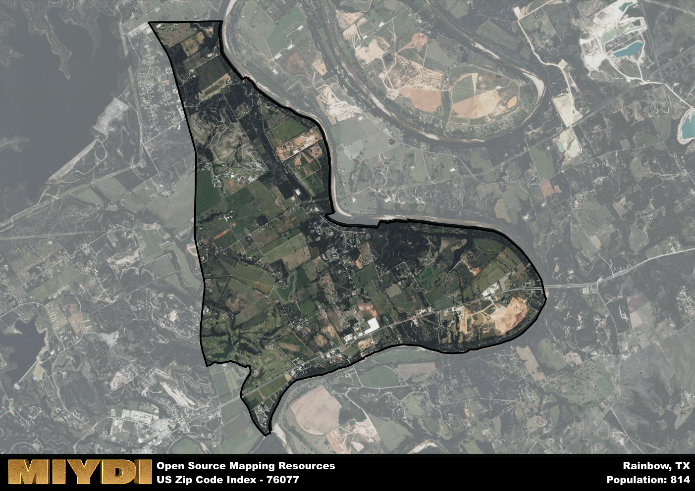

**Area Name:** Rainbow

**Zip Code:** 76077

**State:** TX

# Rainbow: A Quaint Neighborhood in the Heart of the Metroplex

Situated within the bustling metropolitan area of Dallas-Fort Worth, zip code 76077 corresponds to the charming neighborhood of Rainbow. Bordered by the thriving cities of Arlington and Grand Prairie, Rainbow seamlessly integrates into the urban fabric of the region. With easy access to major highways and public transportation, residents of Rainbow enjoy the convenience of city living while still maintaining a sense of community and tranquility.

Originally settled in the late 19th century as a farming community, Rainbow has since evolved into a vibrant residential area with a rich historical background. The neighborhood's name is said to have originated from the colorful sunsets that stretch across the horizon, creating a picturesque backdrop for its residents. Over the years, Rainbow has experienced steady growth, attracting families looking for a peaceful retreat from the fast-paced city life.

Today, Rainbow boasts a diverse economy supported by local businesses, restaurants, and shops that cater to the needs of its residents. The neighborhood is home to well-maintained parks and recreational facilities, providing ample opportunities for outdoor activities and community gatherings. Visitors can explore the historic landmarks scattered throughout Rainbow, offering a glimpse into its past while embracing its promising future as a thriving neighborhood in the heart of the Metroplex.

# Rainbow Demographics

The population of Rainbow is 814.  
Rainbow has a population density of 87.72 per square mile.  
The area of Rainbow is 9.28 square miles.  

## Rainbow Income and Economic Data

These demographic numbers are sourced from IRS return data, providing comprehensive insights into the population dynamics and economic trends within Rainbow.

**Breakdown of return types for Rainbow**

The table offers insight into the composition of tax returns filed with the IRS, categorizing them into three main types. Single returns represent filings by individuals, joint returns by married couples, and head of household returns by individuals who qualify as heads of households, typically having dependents. This breakdown provides an understanding of the different filing statuses adopted by taxpayers when submitting their tax documentation.

| Return Types filed for Rainbow                              | Percentage          |
|----------------------------------------------------------|---------------------|
| Single Returns                                            | 0.39 |
| Joint Returns                                             | 0.5 |
| Head Household Returns                                    | 0.11 |

The income and economic data presented here is sourced from the IRS income brackets, utilized for categorizing tax returns by income levels. This table displays income ranges for both single filers and married couples, along with the corresponding number of returns and the percentage within each bracket, providing valuable insight into the distribution of taxes across various income groups.

| Bracket Name       | Single Filer Income Range | Married Couple Range | Number of Returns | Percentage of Returns |
|--------------------|----------------------------|----------------------|-------------------|-----------------------|
| 10% Bracket        | Up to $10,275              | Up to $20,550        | 80 | 0.29% |
| 12% Bracket        | $10,276 - $41,775          | $20,551 - $83,550    | 60 | 0.21% |
| 22% Bracket        | $41,776 - $89,075          | $83,551 - $178,150   | 40 | 0.14% |
| 24% Bracket        | $89,076 - $170,050         | $178,151 - $340,100  | 30 | 0.11% |
| 32% Bracket        | $170,051 - $215,950        | $340,101 - $431,900  | 70 | 0.25% |
| 35% Bracket        | $215,951 - $539,900        | $431,901 - $647,850  | 0 | 0% |

### Exploring Taxpayer Diversity: A Breakdown of Different Types of Tax Returns in Rainbow

The table offers insights into various types of tax returns filed, reflecting different aspects of taxpayer activities and demographics. Categories include charitable returns for donations, dependent returns for claimed dependents, educator population, elderly population, real estate returns, self-employment returns, student loan returns, and unemployment returns, providing valuable insights into taxpayer behavior and demographics.

| Rainbow Filing Types                    | Count | Percentage |
|--------------------------------------|-------|------------|
| Charitable Donations                 | 0 | 0% |
| Dependents Claimed                   | 0 | 0% |
| Educator Residents                   | 0 | 0% |
| Elderly Population                   | 100 | 0.36% |
| Farming Population                   | 20 | 0.071% |
| Real Estate Transactions             | 0 | 0% |
| Self-Employed Individuals            | 40 | 0.143% |
| Student Loan Cases                   | 0 | 0% |
| Unemployment Benefit Filings         | 30 | 0.11% |

## Rainbow AI and Census Variables

The values presented in this dataset for Rainbow are AI-optimized, streamlined, and categorized into relevant buckets for enhanced utility in AI and mapping programs. These simplified values have been optimized to facilitate efficient analysis and integration into various technological applications, offering users accessible and actionable insights into demographics within the Rainbow area.

| AI Variables for Rainbow | Value |
|-------------|-------|
| Shape Area | 33710864.703125 |
| Shape Length | 32216.8495670931 |

## How to use this free AI optimized Geo-Spatial Data for Rainbow, TX

This data is made freely available under the Creative Commons license, allowing for unrestricted use for any purpose. Users can access static resources directly from GitHub or leverage more advanced functionalities by utilizing the GeoJSON files. All datasets originate from official government or private sector sources and are meticulously compiled into relevant datasets within QGIS. However, the versatility of the data ensures compatibility with any mapping application.

## Data Accuracy Disclaimer
It's important to note that the data provided here may contain errors or discrepancies and should be considered as 'close enough' for business applications and AI rather than a definitive source of truth. This data is aggregated from multiple sources, some of which publish information on wildly different intervals, leading to potential inconsistencies. Additionally, certain data points may not be corrected for Covid-related changes, further impacting accuracy. Moreover, the assumption that demographic trends are consistent throughout a region may lead to discrepancies, as trends often concentrate in areas of highest population density. As a result, dense areas may be slightly underrepresented, while rural areas may be slightly overrepresented, resulting in a more conservative dataset. Furthermore, the focus primarily on areas within US Major and Minor Statistical areas means that approximately 40 million Americans living outside of these areas may not be fully represented. Lastly, the historical background and area descriptions generated using AI are susceptible to potential mistakes, so users should exercise caution when interpreting the information provided.
