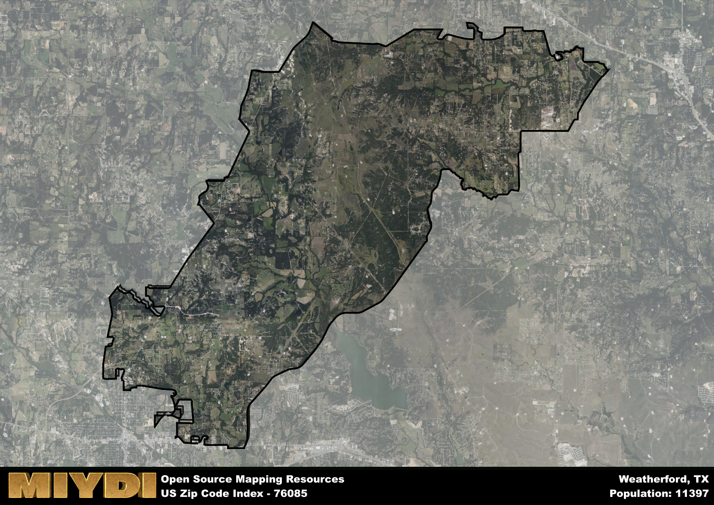

**Area Name:** Weatherford

**Zip Code:** 76085

**State:** TX

Weatherford is a part of the Dallas-Fort Worth-Arlington - TX Metro Area, and makes up  of the Metro's population.  

# Historic Weatherford: A Unique Neighborhood in the Dallas-Fort Worth Metroplex

Located within the Dallas-Fort Worth metropolitan area, the zip code 76085 corresponds to the neighborhood of Weatherford. Situated to the west of Fort Worth, Weatherford serves as a charming suburban enclave that offers a peaceful retreat from the bustling urban centers nearby. Bordered by Aledo to the south and Azle to the north, Weatherford seamlessly integrates with the larger urban fabric while maintaining its distinct character and identity.

Weatherford has a rich historical narrative that dates back to the mid-19th century. Founded in 1858, the area quickly became a hub for settlers heading westward due to its strategic location along the Chisholm Trail. The town experienced rapid growth during the late 1800s, becoming a major agricultural and trade center. Today, Weatherford retains much of its historic charm with well-preserved Victorian architecture and a vibrant downtown area that pays homage to its past.

Presently, Weatherford is a thriving community known for its strong sense of community and family-friendly atmosphere. The neighborhood boasts a diverse economy with a mix of small businesses, farms, and ranches. Residents can enjoy a variety of recreational amenities, including parks, golf courses, and equestrian facilities. Additionally, Weatherford is home to several cultural and historic sites, such as the Parker County Courthouse and the Doss Heritage and Cultural Center, which showcase the area's rich heritage and traditions.

# Weatherford Demographics

The population of Weatherford is 11397.  
Weatherford has a population density of 173.1 per square mile.  
The area of Weatherford is 65.84 square miles.  

## Weatherford Income and Economic Data

These demographic numbers are sourced from IRS return data, providing comprehensive insights into the population dynamics and economic trends within Weatherford.

**Breakdown of return types for Weatherford**

The table offers insight into the composition of tax returns filed with the IRS, categorizing them into three main types. Single returns represent filings by individuals, joint returns by married couples, and head of household returns by individuals who qualify as heads of households, typically having dependents. This breakdown provides an understanding of the different filing statuses adopted by taxpayers when submitting their tax documentation.

| Return Types filed for Weatherford                              | Percentage          |
|----------------------------------------------------------|---------------------|
| Single Returns                                            | 0.41 |
| Joint Returns                                             | 0.47 |
| Head Household Returns                                    | 0.1 |

The income and economic data presented here is sourced from the IRS income brackets, utilized for categorizing tax returns by income levels. This table displays income ranges for both single filers and married couples, along with the corresponding number of returns and the percentage within each bracket, providing valuable insight into the distribution of taxes across various income groups.

| Bracket Name       | Single Filer Income Range | Married Couple Range | Number of Returns | Percentage of Returns |
|--------------------|----------------------------|----------------------|-------------------|-----------------------|
| 10% Bracket        | Up to $10,275              | Up to $20,550        | 1700 | 0.29% |
| 12% Bracket        | $10,276 - $41,775          | $20,551 - $83,550    | 1220 | 0.21% |
| 22% Bracket        | $41,776 - $89,075          | $83,551 - $178,150   | 770 | 0.13% |
| 24% Bracket        | $89,076 - $170,050         | $178,151 - $340,100  | 620 | 0.11% |
| 32% Bracket        | $170,051 - $215,950        | $340,101 - $431,900  | 1160 | 0.2% |
| 35% Bracket        | $215,951 - $539,900        | $431,901 - $647,850  | 300 | 0.05% |

### Exploring Taxpayer Diversity: A Breakdown of Different Types of Tax Returns in Weatherford

The table offers insights into various types of tax returns filed, reflecting different aspects of taxpayer activities and demographics. Categories include charitable returns for donations, dependent returns for claimed dependents, educator population, elderly population, real estate returns, self-employment returns, student loan returns, and unemployment returns, providing valuable insights into taxpayer behavior and demographics.

| Weatherford Filing Types                    | Count | Percentage |
|--------------------------------------|-------|------------|
| Charitable Donations                 | 390 | 0.068% |
| Dependents Claimed                   | 210 | 0.036% |
| Educator Residents                   | 150 | 0.026% |
| Elderly Population                   | 1550 | 0.27% |
| Farming Population                   | 320 | 0.055% |
| Real Estate Transactions             | 420 | 0.073% |
| Self-Employed Individuals            | 830 | 0.144% |
| Student Loan Cases                   | 300 | 0.052% |
| Unemployment Benefit Filings         | 750 | 0.13% |

## Weatherford AI and Census Variables

The values presented in this dataset for Weatherford are AI-optimized, streamlined, and categorized into relevant buckets for enhanced utility in AI and mapping programs. These simplified values have been optimized to facilitate efficient analysis and integration into various technological applications, offering users accessible and actionable insights into demographics within the Weatherford area.

| AI Variables for Weatherford | Value |
|-------------|-------|
| Shape Area | 242286845.648438 |
| Shape Length | 108533.06357557 |
| CBSA Federal Processing Standard Code | 19100 |

## How to use this free AI optimized Geo-Spatial Data for Weatherford, TX

This data is made freely available under the Creative Commons license, allowing for unrestricted use for any purpose. Users can access static resources directly from GitHub or leverage more advanced functionalities by utilizing the GeoJSON files. All datasets originate from official government or private sector sources and are meticulously compiled into relevant datasets within QGIS. However, the versatility of the data ensures compatibility with any mapping application.

## Data Accuracy Disclaimer
It's important to note that the data provided here may contain errors or discrepancies and should be considered as 'close enough' for business applications and AI rather than a definitive source of truth. This data is aggregated from multiple sources, some of which publish information on wildly different intervals, leading to potential inconsistencies. Additionally, certain data points may not be corrected for Covid-related changes, further impacting accuracy. Moreover, the assumption that demographic trends are consistent throughout a region may lead to discrepancies, as trends often concentrate in areas of highest population density. As a result, dense areas may be slightly underrepresented, while rural areas may be slightly overrepresented, resulting in a more conservative dataset. Furthermore, the focus primarily on areas within US Major and Minor Statistical areas means that approximately 40 million Americans living outside of these areas may not be fully represented. Lastly, the historical background and area descriptions generated using AI are susceptible to potential mistakes, so users should exercise caution when interpreting the information provided.
