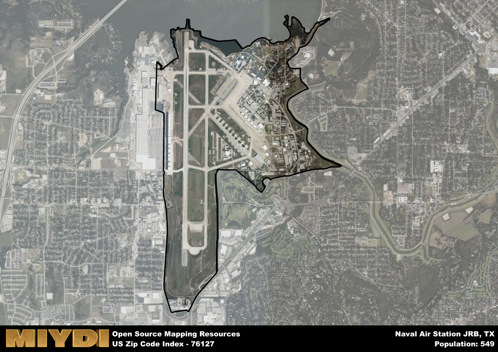

**Area Name:** Naval Air Station JRB

**Zip Code:** 76127

**State:** TX

Naval Air Station JRB is a part of the Dallas-Fort Worth-Arlington - TX Metro Area, and makes up  of the Metro's population.  

# Naval Air Station JRB Zip Code 76127: A Historic Military Hub in Fort Worth

Located in the western part of Fort Worth, Texas, zip code 76127 is home to the Naval Air Station Joint Reserve Base (NAS JRB). Situated near White Settlement and Lake Worth, this area plays a vital role in the defense and aviation industry. It is seamlessly integrated into the larger Fort Worth metropolitan area, providing support to military personnel and their families while also contributing to the economic growth of the region.

Established in 1941, NAS JRB has a rich historical background that dates back to World War II. Originally known as the Hensley Field, it served as a training base for Army Air Corps pilots. Over the years, it evolved into a joint reserve base, accommodating various military branches and units. The base has played a crucial role in national defense and continues to be a significant military installation in the United States.

Today, zip code 76127 is a vibrant community with a mix of military personnel, civilians, and families. The area offers a range of amenities, including shopping centers, schools, and recreational facilities. Residents can enjoy outdoor activities at nearby parks and Lake Worth. Additionally, NAS JRB hosts air shows and events that showcase its aviation heritage. With its strong military presence and close-knit community, zip code 76127 remains an essential part of the fabric of Fort Worth.

# Naval Air Station JRB Demographics

The population of Naval Air Station JRB is 549.  
Naval Air Station JRB has a population density of 160.06 per square mile.  
The area of Naval Air Station JRB is 3.43 square miles.  

## Naval Air Station JRB Income and Economic Data

These demographic numbers are sourced from IRS return data, providing comprehensive insights into the population dynamics and economic trends within Naval Air Station JRB.

**Breakdown of return types for Naval Air Station JRB**

The table offers insight into the composition of tax returns filed with the IRS, categorizing them into three main types. Single returns represent filings by individuals, joint returns by married couples, and head of household returns by individuals who qualify as heads of households, typically having dependents. This breakdown provides an understanding of the different filing statuses adopted by taxpayers when submitting their tax documentation.

| Return Types filed for Naval Air Station JRB                              | Percentage          |
|----------------------------------------------------------|---------------------|
| Single Returns                                            | 0.72 |
| Joint Returns                                             | 0.2 |
| Head Household Returns                                    | 0 |

The income and economic data presented here is sourced from the IRS income brackets, utilized for categorizing tax returns by income levels. This table displays income ranges for both single filers and married couples, along with the corresponding number of returns and the percentage within each bracket, providing valuable insight into the distribution of taxes across various income groups.

| Bracket Name       | Single Filer Income Range | Married Couple Range | Number of Returns | Percentage of Returns |
|--------------------|----------------------------|----------------------|-------------------|-----------------------|
| 10% Bracket        | Up to $10,275              | Up to $20,550        | 100 | 0.4% |
| 12% Bracket        | $10,276 - $41,775          | $20,551 - $83,550    | 90 | 0.36% |
| 22% Bracket        | $41,776 - $89,075          | $83,551 - $178,150   | 40 | 0.16% |
| 24% Bracket        | $89,076 - $170,050         | $178,151 - $340,100  | 0 | 0% |
| 32% Bracket        | $170,051 - $215,950        | $340,101 - $431,900  | 20 | 0.08% |
| 35% Bracket        | $215,951 - $539,900        | $431,901 - $647,850  | 0 | 0% |

### Exploring Taxpayer Diversity: A Breakdown of Different Types of Tax Returns in Naval Air Station JRB

The table offers insights into various types of tax returns filed, reflecting different aspects of taxpayer activities and demographics. Categories include charitable returns for donations, dependent returns for claimed dependents, educator population, elderly population, real estate returns, self-employment returns, student loan returns, and unemployment returns, providing valuable insights into taxpayer behavior and demographics.

| Naval Air Station JRB Filing Types                    | Count | Percentage |
|--------------------------------------|-------|------------|
| Charitable Donations                 | 0 | 0% |
| Dependents Claimed                   | 0 | 0% |
| Educator Residents                   | 0 | 0% |
| Elderly Population                   | 0 | 0% |
| Farming Population                   | 0 | 0% |
| Real Estate Transactions             | 0 | 0% |
| Self-Employed Individuals            | 0 | 0% |
| Student Loan Cases                   | 0 | 0% |
| Unemployment Benefit Filings         | 0 | 0% |

## Naval Air Station JRB AI and Census Variables

The values presented in this dataset for Naval Air Station JRB are AI-optimized, streamlined, and categorized into relevant buckets for enhanced utility in AI and mapping programs. These simplified values have been optimized to facilitate efficient analysis and integration into various technological applications, offering users accessible and actionable insights into demographics within the Naval Air Station JRB area.

| AI Variables for Naval Air Station JRB | Value |
|-------------|-------|
| Shape Area | 12613537.0585938 |
| Shape Length | 24855.2782047158 |
| CBSA Federal Processing Standard Code | 19100 |

## How to use this free AI optimized Geo-Spatial Data for Naval Air Station JRB, TX

This data is made freely available under the Creative Commons license, allowing for unrestricted use for any purpose. Users can access static resources directly from GitHub or leverage more advanced functionalities by utilizing the GeoJSON files. All datasets originate from official government or private sector sources and are meticulously compiled into relevant datasets within QGIS. However, the versatility of the data ensures compatibility with any mapping application.

## Data Accuracy Disclaimer
It's important to note that the data provided here may contain errors or discrepancies and should be considered as 'close enough' for business applications and AI rather than a definitive source of truth. This data is aggregated from multiple sources, some of which publish information on wildly different intervals, leading to potential inconsistencies. Additionally, certain data points may not be corrected for Covid-related changes, further impacting accuracy. Moreover, the assumption that demographic trends are consistent throughout a region may lead to discrepancies, as trends often concentrate in areas of highest population density. As a result, dense areas may be slightly underrepresented, while rural areas may be slightly overrepresented, resulting in a more conservative dataset. Furthermore, the focus primarily on areas within US Major and Minor Statistical areas means that approximately 40 million Americans living outside of these areas may not be fully represented. Lastly, the historical background and area descriptions generated using AI are susceptible to potential mistakes, so users should exercise caution when interpreting the information provided.
