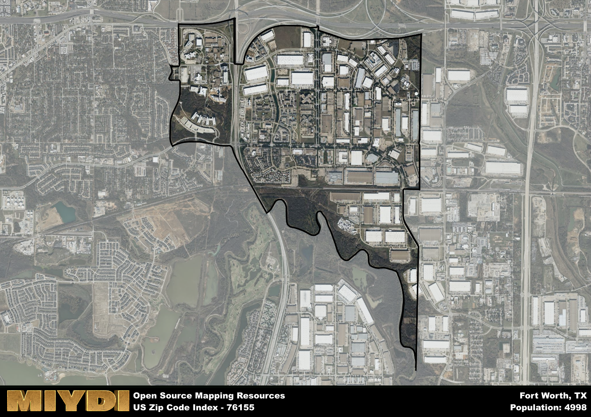

**Area Name:** Fort Worth

**Zip Code:** 76155

**State:** TX

Fort Worth is a part of the Dallas-Fort Worth-Arlington - TX Metro Area, and makes up  of the Metro's population.  

# Richland Hills: A Historic Neighborhood in Fort Worth

Richland Hills, located in the zip code 76155, is a charming neighborhood situated in the northeastern part of Fort Worth, Texas. Bordered by Haltom City to the north and Arlington to the east, Richland Hills forms an integral part of the larger Fort Worth metropolitan area. With easy access to major highways like I-820 and TX-121, residents enjoy seamless connectivity to downtown Fort Worth and the Dallas-Fort Worth International Airport.

Established in the mid-20th century, Richland Hills has a rich historical background that dates back to its early settlement by pioneers in the area. Over the years, the neighborhood has experienced steady growth and development, becoming a sought-after residential area known for its family-friendly atmosphere and well-maintained homes. The name "Richland Hills" reflects the lush greenery and rolling terrain that characterize the landscape of the neighborhood.

Today, Richland Hills boasts a thriving community with a mix of residential and commercial establishments. The area is home to a diverse range of businesses, restaurants, and shops, providing residents with convenient access to everyday amenities. Outdoor enthusiasts can explore the local parks and recreational facilities, while history buffs can visit landmarks such as the Richland Hills Historical Museum. With its blend of modern conveniences and small-town charm, Richland Hills continues to be a welcoming and vibrant neighborhood within the bustling city of Fort Worth.

# Fort Worth Demographics

The population of Fort Worth is 4998.  
Fort Worth has a population density of 1523.78 per square mile.  
The area of Fort Worth is 3.28 square miles.  

## Fort Worth Income and Economic Data

These demographic numbers are sourced from IRS return data, providing comprehensive insights into the population dynamics and economic trends within Fort Worth.

**Breakdown of return types for Fort Worth**

The table offers insight into the composition of tax returns filed with the IRS, categorizing them into three main types. Single returns represent filings by individuals, joint returns by married couples, and head of household returns by individuals who qualify as heads of households, typically having dependents. This breakdown provides an understanding of the different filing statuses adopted by taxpayers when submitting their tax documentation.

| Return Types filed for Fort Worth                              | Percentage          |
|----------------------------------------------------------|---------------------|
| Single Returns                                            | 0.67 |
| Joint Returns                                             | 0.15 |
| Head Household Returns                                    | 0.15 |

The income and economic data presented here is sourced from the IRS income brackets, utilized for categorizing tax returns by income levels. This table displays income ranges for both single filers and married couples, along with the corresponding number of returns and the percentage within each bracket, providing valuable insight into the distribution of taxes across various income groups.

| Bracket Name       | Single Filer Income Range | Married Couple Range | Number of Returns | Percentage of Returns |
|--------------------|----------------------------|----------------------|-------------------|-----------------------|
| 10% Bracket        | Up to $10,275              | Up to $20,550        | 910 | 0.27% |
| 12% Bracket        | $10,276 - $41,775          | $20,551 - $83,550    | 1170 | 0.35% |
| 22% Bracket        | $41,776 - $89,075          | $83,551 - $178,150   | 700 | 0.21% |
| 24% Bracket        | $89,076 - $170,050         | $178,151 - $340,100  | 310 | 0.09% |
| 32% Bracket        | $170,051 - $215,950        | $340,101 - $431,900  | 220 | 0.07% |
| 35% Bracket        | $215,951 - $539,900        | $431,901 - $647,850  | 30 | 0.01% |

### Exploring Taxpayer Diversity: A Breakdown of Different Types of Tax Returns in Fort Worth

The table offers insights into various types of tax returns filed, reflecting different aspects of taxpayer activities and demographics. Categories include charitable returns for donations, dependent returns for claimed dependents, educator population, elderly population, real estate returns, self-employment returns, student loan returns, and unemployment returns, providing valuable insights into taxpayer behavior and demographics.

| Fort Worth Filing Types                    | Count | Percentage |
|--------------------------------------|-------|------------|
| Charitable Donations                 | 90 | 0.027% |
| Dependents Claimed                   | 80 | 0.024% |
| Educator Residents                   | 40 | 0.012% |
| Elderly Population                   | 260 | 0.08% |
| Farming Population                   | 0 | 0% |
| Real Estate Transactions             | 30 | 0.009% |
| Self-Employed Individuals            | 330 | 0.099% |
| Student Loan Cases                   | 270 | 0.081% |
| Unemployment Benefit Filings         | 650 | 0.19% |

## Fort Worth AI and Census Variables

The values presented in this dataset for Fort Worth are AI-optimized, streamlined, and categorized into relevant buckets for enhanced utility in AI and mapping programs. These simplified values have been optimized to facilitate efficient analysis and integration into various technological applications, offering users accessible and actionable insights into demographics within the Fort Worth area.

| AI Variables for Fort Worth | Value |
|-------------|-------|
| Shape Area | 12081492.90625 |
| Shape Length | 21368.4577300537 |
| CBSA Federal Processing Standard Code | 19100 |

## How to use this free AI optimized Geo-Spatial Data for Fort Worth, TX

This data is made freely available under the Creative Commons license, allowing for unrestricted use for any purpose. Users can access static resources directly from GitHub or leverage more advanced functionalities by utilizing the GeoJSON files. All datasets originate from official government or private sector sources and are meticulously compiled into relevant datasets within QGIS. However, the versatility of the data ensures compatibility with any mapping application.

## Data Accuracy Disclaimer
It's important to note that the data provided here may contain errors or discrepancies and should be considered as 'close enough' for business applications and AI rather than a definitive source of truth. This data is aggregated from multiple sources, some of which publish information on wildly different intervals, leading to potential inconsistencies. Additionally, certain data points may not be corrected for Covid-related changes, further impacting accuracy. Moreover, the assumption that demographic trends are consistent throughout a region may lead to discrepancies, as trends often concentrate in areas of highest population density. As a result, dense areas may be slightly underrepresented, while rural areas may be slightly overrepresented, resulting in a more conservative dataset. Furthermore, the focus primarily on areas within US Major and Minor Statistical areas means that approximately 40 million Americans living outside of these areas may not be fully represented. Lastly, the historical background and area descriptions generated using AI are susceptible to potential mistakes, so users should exercise caution when interpreting the information provided.
