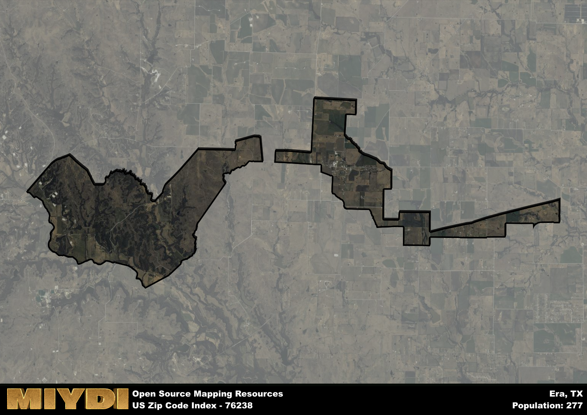

**Area Name:** Era

**Zip Code:** 76238

**State:** TX

Era is a part of the Gainesville - TX Micro Area, and makes up  of the Metro's population.  

# Era, TX 76238: A Snapshot of a Charming Texas Community  

Located in the northeastern part of Texas, the zip code area 76238 corresponds to the charming community of Era. Surrounded by the rolling hills and vast landscapes typical of the Texan countryside, Era is situated in Cooke County, just a short drive away from the city of Gainesville and the larger metropolitan area of the Dallas-Fort Worth Metroplex. Despite its rural setting, Era benefits from its proximity to major transportation routes, making it a convenient and idyllic place to call home for residents seeking a peaceful retreat from the urban hustle and bustle.

Era has a rich historical background that dates back to the mid-19th century when the area was first settled by pioneers and farmers seeking fertile lands for agriculture. The community gradually grew as more families moved to the area, establishing homesteads and small businesses that formed the foundation of Era's identity. Over time, Era became known for its tight-knit community spirit and dedication to preserving its heritage, evident in the well-preserved historic buildings and landmarks that dot the town.

Today, Era remains a close-knit community that prides itself on its agricultural roots and friendly atmosphere. The area continues to be primarily rural, with farming and ranching playing a significant role in the local economy. Residents and visitors can enjoy a variety of outdoor activities, including hiking, fishing, and camping in the nearby state parks and natural areas. Era also boasts a vibrant local culture, with events and festivals celebrating its history and traditions. With its picturesque setting and strong sense of community, Era offers a peaceful and welcoming environment for those looking to experience the beauty of rural Texas.

# Era Demographics

The population of Era is 277.  
Era has a population density of 15.61 per square mile.  
The area of Era is 17.74 square miles.  

## Era Income and Economic Data

These demographic numbers are sourced from IRS return data, providing comprehensive insights into the population dynamics and economic trends within Era.

**Breakdown of return types for Era**

The table offers insight into the composition of tax returns filed with the IRS, categorizing them into three main types. Single returns represent filings by individuals, joint returns by married couples, and head of household returns by individuals who qualify as heads of households, typically having dependents. This breakdown provides an understanding of the different filing statuses adopted by taxpayers when submitting their tax documentation.

| Return Types filed for Era                              | Percentage          |
|----------------------------------------------------------|---------------------|
| Single Returns                                            | 0.32 |
| Joint Returns                                             | 0.55 |
| Head Household Returns                                    | 0 |

The income and economic data presented here is sourced from the IRS income brackets, utilized for categorizing tax returns by income levels. This table displays income ranges for both single filers and married couples, along with the corresponding number of returns and the percentage within each bracket, providing valuable insight into the distribution of taxes across various income groups.

| Bracket Name       | Single Filer Income Range | Married Couple Range | Number of Returns | Percentage of Returns |
|--------------------|----------------------------|----------------------|-------------------|-----------------------|
| 10% Bracket        | Up to $10,275              | Up to $20,550        | 50 | 0.23% |
| 12% Bracket        | $10,276 - $41,775          | $20,551 - $83,550    | 40 | 0.18% |
| 22% Bracket        | $41,776 - $89,075          | $83,551 - $178,150   | 30 | 0.14% |
| 24% Bracket        | $89,076 - $170,050         | $178,151 - $340,100  | 40 | 0.18% |
| 32% Bracket        | $170,051 - $215,950        | $340,101 - $431,900  | 60 | 0.27% |
| 35% Bracket        | $215,951 - $539,900        | $431,901 - $647,850  | 0 | 0% |

### Exploring Taxpayer Diversity: A Breakdown of Different Types of Tax Returns in Era

The table offers insights into various types of tax returns filed, reflecting different aspects of taxpayer activities and demographics. Categories include charitable returns for donations, dependent returns for claimed dependents, educator population, elderly population, real estate returns, self-employment returns, student loan returns, and unemployment returns, providing valuable insights into taxpayer behavior and demographics.

| Era Filing Types                    | Count | Percentage |
|--------------------------------------|-------|------------|
| Charitable Donations                 | 0 | 0% |
| Dependents Claimed                   | 0 | 0% |
| Educator Residents                   | 0 | 0% |
| Elderly Population                   | 70 | 0.32% |
| Farming Population                   | 50 | 0.227% |
| Real Estate Transactions             | 0 | 0% |
| Self-Employed Individuals            | 20 | 0.091% |
| Student Loan Cases                   | 0 | 0% |
| Unemployment Benefit Filings         | 30 | 0.14% |

## Era AI and Census Variables

The values presented in this dataset for Era are AI-optimized, streamlined, and categorized into relevant buckets for enhanced utility in AI and mapping programs. These simplified values have been optimized to facilitate efficient analysis and integration into various technological applications, offering users accessible and actionable insights into demographics within the Era area.

| AI Variables for Era | Value |
|-------------|-------|
| Shape Area | 66240829.8164063 |
| Shape Length | 86269.0481871454 |
| CBSA Federal Processing Standard Code | 23620 |

## How to use this free AI optimized Geo-Spatial Data for Era, TX

This data is made freely available under the Creative Commons license, allowing for unrestricted use for any purpose. Users can access static resources directly from GitHub or leverage more advanced functionalities by utilizing the GeoJSON files. All datasets originate from official government or private sector sources and are meticulously compiled into relevant datasets within QGIS. However, the versatility of the data ensures compatibility with any mapping application.

## Data Accuracy Disclaimer
It's important to note that the data provided here may contain errors or discrepancies and should be considered as 'close enough' for business applications and AI rather than a definitive source of truth. This data is aggregated from multiple sources, some of which publish information on wildly different intervals, leading to potential inconsistencies. Additionally, certain data points may not be corrected for Covid-related changes, further impacting accuracy. Moreover, the assumption that demographic trends are consistent throughout a region may lead to discrepancies, as trends often concentrate in areas of highest population density. As a result, dense areas may be slightly underrepresented, while rural areas may be slightly overrepresented, resulting in a more conservative dataset. Furthermore, the focus primarily on areas within US Major and Minor Statistical areas means that approximately 40 million Americans living outside of these areas may not be fully represented. Lastly, the historical background and area descriptions generated using AI are susceptible to potential mistakes, so users should exercise caution when interpreting the information provided.
