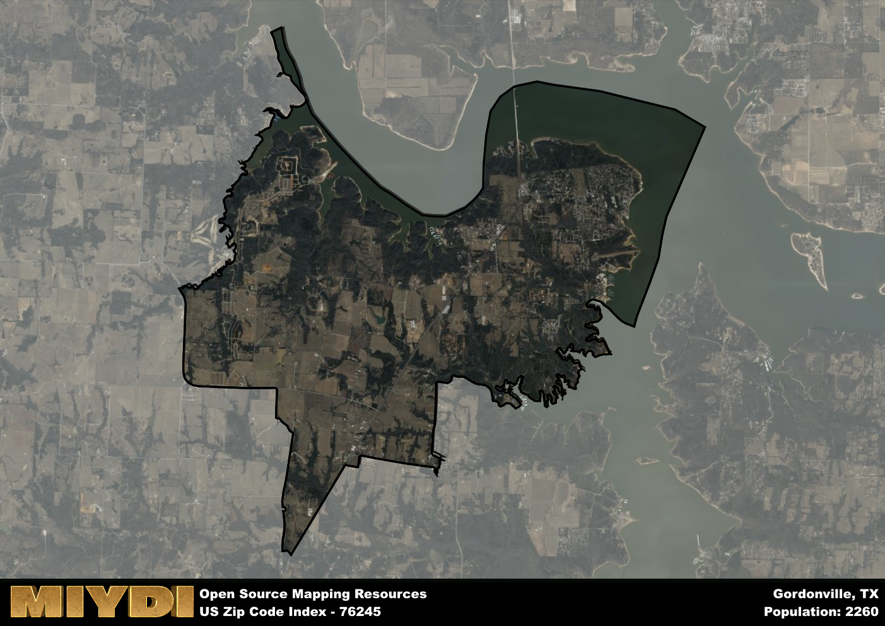

**Area Name:** Gordonville

**Zip Code:** 76245

**State:** TX

Gordonville is a part of the Sherman-Denison - TX Metro Area, and makes up  of the Metro's population.  

# Gordonville: A Quaint Lakeside Community in North Texas  

Gordonville, located in zip code 76245, is a charming lakeside community nestled in the northern region of Texas. Bordered by Lake Texoma to the east and encompassing rolling countryside to the west, Gordonville seamlessly integrates with neighboring towns such as Pottsboro and Whitesboro. This zip code area serves as a recreational haven for residents and visitors alike, with its proximity to the lake offering stunning views and outdoor activities. Additionally, Gordonville is conveniently situated near major highways, providing easy access to the Dallas-Fort Worth metropolitan area.

Established in the mid-19th century, Gordonville has a rich historical background that contributes to its small-town charm. The area was initially settled by pioneers seeking fertile land and opportunities for farming and ranching. Over the years, Gordonville grew as a thriving community, with the construction of schools, churches, and businesses further shaping its identity. The town's name is said to honor an early settler or prominent figure, adding to its historical significance.

Today, Gordonville boasts a mix of residential neighborhoods, local businesses, and recreational amenities that cater to both residents and tourists. The area's economy is primarily driven by tourism, with Lake Texoma drawing visitors for boating, fishing, and camping. Local services include restaurants, marinas, and boutique shops, while historic sites like the Eisenhower State Park offer opportunities for exploration and education. Gordonville's tranquil atmosphere and scenic beauty make it a desirable destination for those seeking a peaceful retreat in the heart of North Texas.

# Gordonville Demographics

The population of Gordonville is 2260.  
Gordonville has a population density of 90.36 per square mile.  
The area of Gordonville is 25.01 square miles.  

## Gordonville Income and Economic Data

These demographic numbers are sourced from IRS return data, providing comprehensive insights into the population dynamics and economic trends within Gordonville.

**Breakdown of return types for Gordonville**

The table offers insight into the composition of tax returns filed with the IRS, categorizing them into three main types. Single returns represent filings by individuals, joint returns by married couples, and head of household returns by individuals who qualify as heads of households, typically having dependents. This breakdown provides an understanding of the different filing statuses adopted by taxpayers when submitting their tax documentation.

| Return Types filed for Gordonville                              | Percentage          |
|----------------------------------------------------------|---------------------|
| Single Returns                                            | 0.4 |
| Joint Returns                                             | 0.49 |
| Head Household Returns                                    | 0.07 |

The income and economic data presented here is sourced from the IRS income brackets, utilized for categorizing tax returns by income levels. This table displays income ranges for both single filers and married couples, along with the corresponding number of returns and the percentage within each bracket, providing valuable insight into the distribution of taxes across various income groups.

| Bracket Name       | Single Filer Income Range | Married Couple Range | Number of Returns | Percentage of Returns |
|--------------------|----------------------------|----------------------|-------------------|-----------------------|
| 10% Bracket        | Up to $10,275              | Up to $20,550        | 300 | 0.31% |
| 12% Bracket        | $10,276 - $41,775          | $20,551 - $83,550    | 250 | 0.26% |
| 22% Bracket        | $41,776 - $89,075          | $83,551 - $178,150   | 150 | 0.15% |
| 24% Bracket        | $89,076 - $170,050         | $178,151 - $340,100  | 80 | 0.08% |
| 32% Bracket        | $170,051 - $215,950        | $340,101 - $431,900  | 140 | 0.14% |
| 35% Bracket        | $215,951 - $539,900        | $431,901 - $647,850  | 50 | 0.05% |

### Exploring Taxpayer Diversity: A Breakdown of Different Types of Tax Returns in Gordonville

The table offers insights into various types of tax returns filed, reflecting different aspects of taxpayer activities and demographics. Categories include charitable returns for donations, dependent returns for claimed dependents, educator population, elderly population, real estate returns, self-employment returns, student loan returns, and unemployment returns, providing valuable insights into taxpayer behavior and demographics.

| Gordonville Filing Types                    | Count | Percentage |
|--------------------------------------|-------|------------|
| Charitable Donations                 | 50 | 0.052% |
| Dependents Claimed                   | 0 | 0% |
| Educator Residents                   | 0 | 0% |
| Elderly Population                   | 400 | 0.41% |
| Farming Population                   | 40 | 0.041% |
| Real Estate Transactions             | 60 | 0.062% |
| Self-Employed Individuals            | 120 | 0.124% |
| Student Loan Cases                   | 20 | 0.021% |
| Unemployment Benefit Filings         | 110 | 0.11% |

## Gordonville AI and Census Variables

The values presented in this dataset for Gordonville are AI-optimized, streamlined, and categorized into relevant buckets for enhanced utility in AI and mapping programs. These simplified values have been optimized to facilitate efficient analysis and integration into various technological applications, offering users accessible and actionable insights into demographics within the Gordonville area.

| AI Variables for Gordonville | Value |
|-------------|-------|
| Shape Area | 94135460.3671875 |
| Shape Length | 78543.1539337972 |
| CBSA Federal Processing Standard Code | 43300 |

## How to use this free AI optimized Geo-Spatial Data for Gordonville, TX

This data is made freely available under the Creative Commons license, allowing for unrestricted use for any purpose. Users can access static resources directly from GitHub or leverage more advanced functionalities by utilizing the GeoJSON files. All datasets originate from official government or private sector sources and are meticulously compiled into relevant datasets within QGIS. However, the versatility of the data ensures compatibility with any mapping application.

## Data Accuracy Disclaimer
It's important to note that the data provided here may contain errors or discrepancies and should be considered as 'close enough' for business applications and AI rather than a definitive source of truth. This data is aggregated from multiple sources, some of which publish information on wildly different intervals, leading to potential inconsistencies. Additionally, certain data points may not be corrected for Covid-related changes, further impacting accuracy. Moreover, the assumption that demographic trends are consistent throughout a region may lead to discrepancies, as trends often concentrate in areas of highest population density. As a result, dense areas may be slightly underrepresented, while rural areas may be slightly overrepresented, resulting in a more conservative dataset. Furthermore, the focus primarily on areas within US Major and Minor Statistical areas means that approximately 40 million Americans living outside of these areas may not be fully represented. Lastly, the historical background and area descriptions generated using AI are susceptible to potential mistakes, so users should exercise caution when interpreting the information provided.
