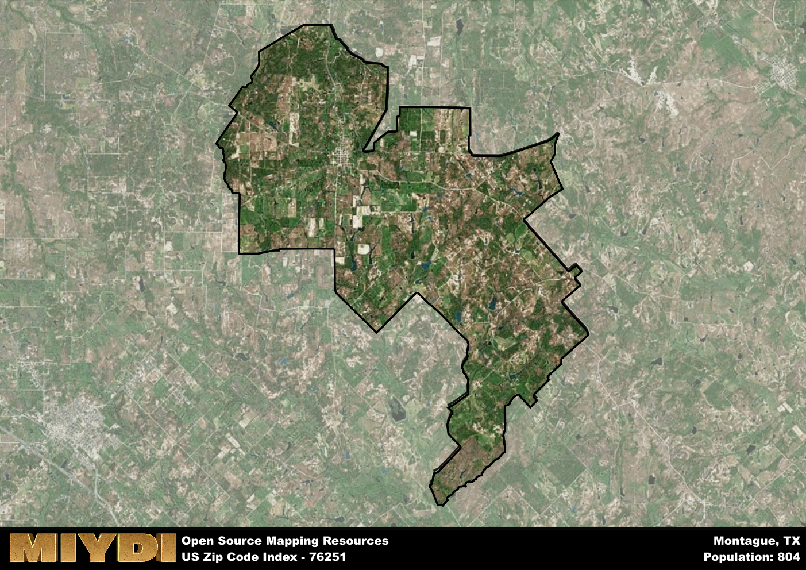

**Area Name:** Montague

**Zip Code:** 76251

**State:** TX

# Montague, TX 76251: A Charming Texan Gem

Located in the heart of Montague, zip code 76251 encompasses a picturesque area in North Texas. The zip code is bordered by rolling hills and lush farmlands, creating a serene and idyllic atmosphere for residents. Montague is situated within close proximity to larger cities such as Denton and Fort Worth, allowing for easy access to urban amenities while maintaining its small-town charm.

Montague has a rich historical narrative, dating back to the mid-1800s when it was established as a trading post along the Chisholm Trail. The area quickly grew into a bustling hub for cattle ranching and agriculture, attracting settlers looking to build a new life in the Texas frontier. The town eventually took on the name of Montague, in honor of Daniel Montague, a local pioneer who played a significant role in the community's development.

Today, Montague, TX 76251 is a thriving community with a strong agricultural presence. The area is known for its vibrant local market, where residents can find fresh produce and homemade goods. In addition to its agricultural roots, Montague offers a variety of recreational activities, including hiking trails, fishing spots, and historic sites that showcase the area's rich heritage. With its charming downtown area and friendly community atmosphere, Montague continues to be a beloved destination for both residents and visitors alike.

# Montague Demographics

The population of Montague is 804.  
Montague has a population density of 15.09 per square mile.  
The area of Montague is 53.29 square miles.  

## Montague Income and Economic Data

These demographic numbers are sourced from IRS return data, providing comprehensive insights into the population dynamics and economic trends within Montague.

**Breakdown of return types for Montague**

The table offers insight into the composition of tax returns filed with the IRS, categorizing them into three main types. Single returns represent filings by individuals, joint returns by married couples, and head of household returns by individuals who qualify as heads of households, typically having dependents. This breakdown provides an understanding of the different filing statuses adopted by taxpayers when submitting their tax documentation.

| Return Types filed for Montague                              | Percentage          |
|----------------------------------------------------------|---------------------|
| Single Returns                                            | 0.35 |
| Joint Returns                                             | 0.47 |
| Head Household Returns                                    | 0.09 |

The income and economic data presented here is sourced from the IRS income brackets, utilized for categorizing tax returns by income levels. This table displays income ranges for both single filers and married couples, along with the corresponding number of returns and the percentage within each bracket, providing valuable insight into the distribution of taxes across various income groups.

| Bracket Name       | Single Filer Income Range | Married Couple Range | Number of Returns | Percentage of Returns |
|--------------------|----------------------------|----------------------|-------------------|-----------------------|
| 10% Bracket        | Up to $10,275              | Up to $20,550        | 110 | 0.32% |
| 12% Bracket        | $10,276 - $41,775          | $20,551 - $83,550    | 70 | 0.21% |
| 22% Bracket        | $41,776 - $89,075          | $83,551 - $178,150   | 70 | 0.21% |
| 24% Bracket        | $89,076 - $170,050         | $178,151 - $340,100  | 40 | 0.12% |
| 32% Bracket        | $170,051 - $215,950        | $340,101 - $431,900  | 50 | 0.15% |
| 35% Bracket        | $215,951 - $539,900        | $431,901 - $647,850  | 0 | 0% |

### Exploring Taxpayer Diversity: A Breakdown of Different Types of Tax Returns in Montague

The table offers insights into various types of tax returns filed, reflecting different aspects of taxpayer activities and demographics. Categories include charitable returns for donations, dependent returns for claimed dependents, educator population, elderly population, real estate returns, self-employment returns, student loan returns, and unemployment returns, providing valuable insights into taxpayer behavior and demographics.

| Montague Filing Types                    | Count | Percentage |
|--------------------------------------|-------|------------|
| Charitable Donations                 | 0 | 0% |
| Dependents Claimed                   | 0 | 0% |
| Educator Residents                   | 0 | 0% |
| Elderly Population                   | 130 | 0.38% |
| Farming Population                   | 80 | 0.235% |
| Real Estate Transactions             | 0 | 0% |
| Self-Employed Individuals            | 60 | 0.176% |
| Student Loan Cases                   | 0 | 0% |
| Unemployment Benefit Filings         | 40 | 0.12% |

## Montague AI and Census Variables

The values presented in this dataset for Montague are AI-optimized, streamlined, and categorized into relevant buckets for enhanced utility in AI and mapping programs. These simplified values have been optimized to facilitate efficient analysis and integration into various technological applications, offering users accessible and actionable insights into demographics within the Montague area.

| AI Variables for Montague | Value |
|-------------|-------|
| Shape Area | 199628896.996094 |
| Shape Length | 94099.1682288846 |

## How to use this free AI optimized Geo-Spatial Data for Montague, TX

This data is made freely available under the Creative Commons license, allowing for unrestricted use for any purpose. Users can access static resources directly from GitHub or leverage more advanced functionalities by utilizing the GeoJSON files. All datasets originate from official government or private sector sources and are meticulously compiled into relevant datasets within QGIS. However, the versatility of the data ensures compatibility with any mapping application.

## Data Accuracy Disclaimer
It's important to note that the data provided here may contain errors or discrepancies and should be considered as 'close enough' for business applications and AI rather than a definitive source of truth. This data is aggregated from multiple sources, some of which publish information on wildly different intervals, leading to potential inconsistencies. Additionally, certain data points may not be corrected for Covid-related changes, further impacting accuracy. Moreover, the assumption that demographic trends are consistent throughout a region may lead to discrepancies, as trends often concentrate in areas of highest population density. As a result, dense areas may be slightly underrepresented, while rural areas may be slightly overrepresented, resulting in a more conservative dataset. Furthermore, the focus primarily on areas within US Major and Minor Statistical areas means that approximately 40 million Americans living outside of these areas may not be fully represented. Lastly, the historical background and area descriptions generated using AI are susceptible to potential mistakes, so users should exercise caution when interpreting the information provided.
