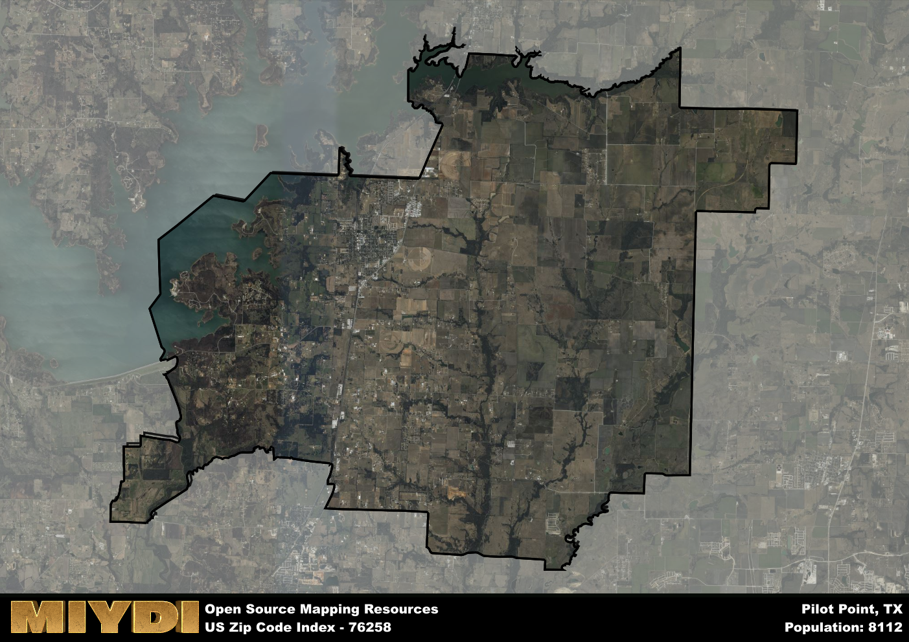

**Area Name:** Pilot Point

**Zip Code:** 76258

**State:** TX

Pilot Point is a part of the Dallas-Fort Worth-Arlington - TX Metro Area, and makes up 7.25% of the Metro's population.  

# Charming Pilot Point: A Historic Gem in North Texas

Located in Denton County, Texas, the zip code area 76258 encompasses the small town of Pilot Point. Situated in the northern part of the county, Pilot Point is bordered by the town of Aubrey to the east and the city of Tioga to the west. While being relatively rural in nature, Pilot Point is within driving distance to the larger urban centers of Denton and Frisco, making it a peaceful residential retreat with easy access to urban amenities.

Pilot Point has a rich historical background dating back to the mid-1800s when it was first settled by pioneers. The town prospered due to its location on the Chisholm Trail, becoming a hub for cattle drivers and traders. The name "Pilot Point" is believed to have come from a prominent hill that served as a landmark for travelers. Today, the town maintains its historic charm with well-preserved buildings and a strong sense of community pride.

Present-day Pilot Point offers a mix of agricultural and residential areas, with a growing emphasis on tourism and small businesses. The town is known for its antique shops, bed and breakfasts, and annual festivals celebrating its heritage. Residents and visitors alike can enjoy outdoor activities at nearby Lake Ray Roberts State Park or explore the historic downtown area with its quaint shops and cafes. Pilot Point truly embodies small-town Texas charm while providing a peaceful escape from the hustle and bustle of city life.

# Pilot Point Demographics

The population of Pilot Point is 8112.  
Pilot Point has a population density of 79.3 per square mile.  
The area of Pilot Point is 102.3 square miles.  

## Pilot Point Income and Economic Data

These demographic numbers are sourced from IRS return data, providing comprehensive insights into the population dynamics and economic trends within Pilot Point.

**Breakdown of return types for Pilot Point**

The table offers insight into the composition of tax returns filed with the IRS, categorizing them into three main types. Single returns represent filings by individuals, joint returns by married couples, and head of household returns by individuals who qualify as heads of households, typically having dependents. This breakdown provides an understanding of the different filing statuses adopted by taxpayers when submitting their tax documentation.

| Return Types filed for Pilot Point                              | Percentage          |
|----------------------------------------------------------|---------------------|
| Single Returns                                            | 0.43 |
| Joint Returns                                             | 0.44 |
| Head Household Returns                                    | 0.11 |

The income and economic data presented here is sourced from the IRS income brackets, utilized for categorizing tax returns by income levels. This table displays income ranges for both single filers and married couples, along with the corresponding number of returns and the percentage within each bracket, providing valuable insight into the distribution of taxes across various income groups.

| Bracket Name       | Single Filer Income Range | Married Couple Range | Number of Returns | Percentage of Returns |
|--------------------|----------------------------|----------------------|-------------------|-----------------------|
| 10% Bracket        | Up to $10,275              | Up to $20,550        | 980 | 0.29% |
| 12% Bracket        | $10,276 - $41,775          | $20,551 - $83,550    | 810 | 0.24% |
| 22% Bracket        | $41,776 - $89,075          | $83,551 - $178,150   | 480 | 0.14% |
| 24% Bracket        | $89,076 - $170,050         | $178,151 - $340,100  | 360 | 0.11% |
| 32% Bracket        | $170,051 - $215,950        | $340,101 - $431,900  | 530 | 0.16% |
| 35% Bracket        | $215,951 - $539,900        | $431,901 - $647,850  | 250 | 0.07% |

### Exploring Taxpayer Diversity: A Breakdown of Different Types of Tax Returns in Pilot Point

The table offers insights into various types of tax returns filed, reflecting different aspects of taxpayer activities and demographics. Categories include charitable returns for donations, dependent returns for claimed dependents, educator population, elderly population, real estate returns, self-employment returns, student loan returns, and unemployment returns, providing valuable insights into taxpayer behavior and demographics.

| Pilot Point Filing Types                    | Count | Percentage |
|--------------------------------------|-------|------------|
| Charitable Donations                 | 290 | 0.085% |
| Dependents Claimed                   | 100 | 0.029% |
| Educator Residents                   | 100 | 0.029% |
| Elderly Population                   | 880 | 0.26% |
| Farming Population                   | 230 | 0.067% |
| Real Estate Transactions             | 300 | 0.088% |
| Self-Employed Individuals            | 570 | 0.167% |
| Student Loan Cases                   | 190 | 0.056% |
| Unemployment Benefit Filings         | 320 | 0.09% |

### Exploring Real Estate Trends: A Comprehensive Analysis of the Pilot Point Area and its Neighbors

This table contains an in-depth examination of the real estate market in the Pilot Point area. Sourced from trusted real estate market firms, this dataset provides a wealth of raw data detailing the local real estate landscape, along with comparative analyses juxtaposing the market dynamics with those of neighboring areas. Explore the intricacies of the Pilot Point real estate market and gain valuable insights into its relationship with adjacent regions.

| Real Estate Data for Pilot Point                       | Value    |
|------------------------------------------------|----------|
| Average Listing Price for Pilot Point               | 1229256 |
| Median Listing Price for Pilot Point                | 428743 |
| Median Days on Market for Pilot Point               | 64 |
| Median Listing Price per Square Foot for Pilot Point| 14 |
| Median Square Feet for Pilot Point                  | 2107 |
| Real Estate Prices to Income Ratio           | 400.58% |
| Price per Square Foot Ratio                  | 101.42% |
| Price Median Ratio                           | 93.78% |
| Market Sales Speed Ratio                     | 84.0% |

This table offers essential real estate data for the Pilot Point area, including average and median listing prices, median days on market, and property size. It also presents ratio metrics as percentages, providing insights into how the local market compares to the surrounding region. A ratio of 100% signifies performance in line with the regional average, while values above or below indicate overperformance or underperformance, respectively, relative to expectations.

## Pilot Point Sports and Recreation Data

#### Annual Youth Sports Spending for Pilot Point

This table provides fundamental insights into the Sports and Recreation data for the Pilot Point area, detailing the estimated annual expenditure on Youth Athletics. This includes estimated spending by the major consumer brackets. 
| Sports Spending for Pilot Point| Value |
|-------------------------|-------|
| Athlete Spending Compared to the region | 112.42% |
| Total Youth Athlete Spending | ,677,008 |
| Athletic Spending - Essential Focused Consumer | 90,790 |
| Athletic Spending - Typical Consumer | 28,608 |
| Athletic Spending - Affluent Consumers | ,257,344 |

#### Youth Coaching Estimates for Pilot Point

This table presents the estimated number of coaches for the Pilot Point area, derived from comprehensive national coaching surveys and athletic participation rates by state. It offers valuable insights into the vital role of coaching personnel in fostering athletic development and facilitating sports participation within the local community.

| Coaching Data for Pilot Point | Value |
|-------------|-------|
| Total Coaches | 133 |
| Paid Coaches | 35 |
| Volunteer Coaches | 98 |

#### Youth Athlete Participation for Pilot Point

This table shows the estimated total number of youth athletes in the Pilot Point area, sourced from comprehensive national coaching surveys and athletic participation rates by state.

| Total YA Athletes in Pilot Point | Value |
|-------------|-------|
| Total High School Athletes | 203 |
| Total Youth Athletes | 608 |
| Total Young Adult Athletes | 405 |
| Total Athletes to Age 25 | 1216 |

#### High School Age Athletes - Breakdown by Sport for Pilot Point

This table shows insights regarding high school age estimated players by sport in the Pilot Point area, derived from national and state-level athletic participation trends. 

| HS Players by Sport in Pilot Point | Value |
|-------------|-------|
| Football Players | 47 |
| Basketball Players | 28 |
| Soccer Players | 22 |
| Volleyball Players | 14 |
| Baseball Players | 24 |
| Tennis Players | 12 |
| Track Athletes | 34 |
| Golf Players | 6 |
| Swimming Athletes | 6 |
| Wrestling Competitors | 6 |
| Lacrosse Players | 0 |

Estimating the number of younger athletes presents unique challenges due to their varied starting ages, typically beginning around six years old, and a gradual decline in participation rates as they age. Unlike high school-aged athletes, younger athletes are less likely to switch sports as they grow older, contributing to the stability of participation numbers within specific sports at younger ages.  

As a general trend, the total number of younger athletes is approximately three times the number of high school-aged athletes, underscoring the significant presence of youth athletes in sports programs and highlighting the importance of early engagement in athletic activities.

## Pilot Point AI and Census Variables

The values presented in this dataset for Pilot Point are AI-optimized, streamlined, and categorized into relevant buckets for enhanced utility in AI and mapping programs. These simplified values have been optimized to facilitate efficient analysis and integration into various technological applications, offering users accessible and actionable insights into demographics within the Pilot Point area.

| AI Variables for Pilot Point | Value |
|-------------|-------|
| Shape Area | 380937185.761719 |
| Shape Length | 136515.609945851 |
| CBSA Federal Processing Standard Code | 19100 |
| RE Price per Square Foot Ratio | 101.42% |
| RE Price Average Ratio | 177.89% |
| RE Speed Ratio | 84.0% |
| RE Income Ratio | 400.58% |
| Single Opportunity Flag | 6 |
| Single Parent Risk Flag | 4 |
| Elderly Opportunity Flag | 4 |
| Farm Opportunity Flag | 3 |
| Unemployment Risk | 1 |
| Educator Opportunity Flag | 4 |
| RE Affordability Index Flag | 7 |
| Income Bracket Flag | 5 |
| RE Income Flag | 7 |
| RE Median Square Footage Price Flag | 5 |
| RE Median Square Footage Size Flag | 5 |
| RE Activity Flag | 4 |
| Poverty Line Risk Flag | 6 |

## How to use this free AI optimized Geo-Spatial Data for Pilot Point, TX

This data is made freely available under the Creative Commons license, allowing for unrestricted use for any purpose. Users can access static resources directly from GitHub or leverage more advanced functionalities by utilizing the GeoJSON files. All datasets originate from official government or private sector sources and are meticulously compiled into relevant datasets within QGIS. However, the versatility of the data ensures compatibility with any mapping application.

## Data Accuracy Disclaimer
It's important to note that the data provided here may contain errors or discrepancies and should be considered as 'close enough' for business applications and AI rather than a definitive source of truth. This data is aggregated from multiple sources, some of which publish information on wildly different intervals, leading to potential inconsistencies. Additionally, certain data points may not be corrected for Covid-related changes, further impacting accuracy. Moreover, the assumption that demographic trends are consistent throughout a region may lead to discrepancies, as trends often concentrate in areas of highest population density. As a result, dense areas may be slightly underrepresented, while rural areas may be slightly overrepresented, resulting in a more conservative dataset. Furthermore, the focus primarily on areas within US Major and Minor Statistical areas means that approximately 40 million Americans living outside of these areas may not be fully represented. Lastly, the historical background and area descriptions generated using AI are susceptible to potential mistakes, so users should exercise caution when interpreting the information provided.
